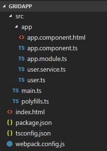
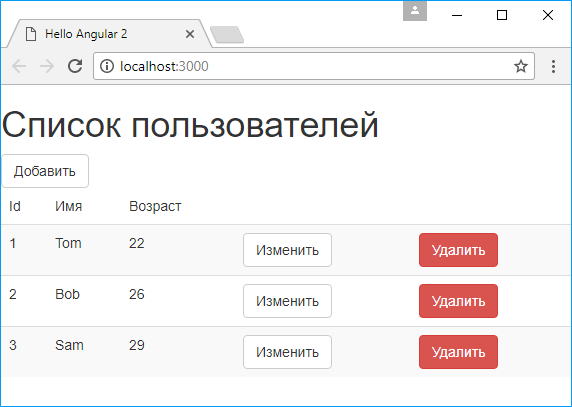
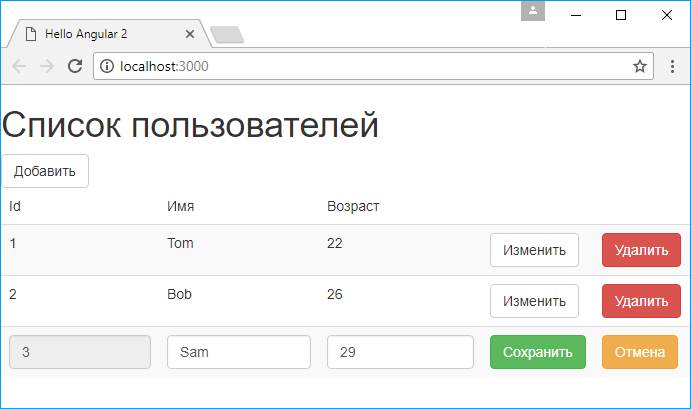

# Grid и CRUD-операции

Рассмотрим, как мы можем создать с помощью Angular подобие грида для вывода данных и совместить его с базовыми операциями по управлению данными.

Вначале создадим новый проект. Определим в проекте файл `package.json`:

```json
{
  "name": "gridapp",
  "version": "1.0.0",
  "description": "Grid Angular 8 Project",
  "author": "metanit.com",
  "scripts": {
    "dev": "webpack-dev-server --hot --open",
    "build": "webpack"
  },
  "dependencies": {
    "@angular/common": "~8.0.0",
    "@angular/compiler": "~8.0.0",
    "@angular/core": "~8.0.0",
    "@angular/forms": "~8.0.0",
    "@angular/platform-browser": "~8.0.0",
    "@angular/platform-browser-dynamic": "~8.0.0",
    "@angular/router": "~8.0.0",
    "core-js": "^3.1.0",
    "rxjs": "^6.5.0",
    "zone.js": "^0.9.0"
  },
  "devDependencies": {
    "@types/node": "^12.0.0",
    "typescript": "^3.5.0",
    "webpack": "^4.33.0",
    "webpack-cli": "^3.3.0",
    "webpack-dev-server": "^3.6.0",
    "angular2-template-loader": "^0.6.2",
    "awesome-typescript-loader": "^5.2.1",
    "html-loader": "^0.5.5"
  }
}
```

И затем установим все пакеты с помощью команды `npm install`.

Далее добавим в проект файл `tsconfig.json` с конфигурацией TypeScript:

```json
{
  "compilerOptions": {
    "target": "es5",
    "module": "es2015",
    "moduleResolution": "node",
    "sourceMap": true,
    "emitDecoratorMetadata": true,
    "experimentalDecorators": true,
    "lib": ["es2015", "dom"],
    "noImplicitAny": true,
    "suppressImplicitAnyIndexErrors": true,
    "typeRoots": ["node_modules/@types/"]
  },
  "exclude": ["node_modules"]
}
```

И также добавим в проект файл `webpack.config.js`:

```js
const path = require('path')
const webpack = require('webpack')
module.exports = {
  entry: {
    polyfills: './src/polyfills.ts',
    app: './src/main.ts',
  },
  output: {
    path: path.resolve(__dirname, './public'), // путь к каталогу выходных файлов — папка public
    publicPath: '/public/',
    filename: '[name].js', // название создаваемого файла
  },
  devServer: {
    historyApiFallback: true,
  },
  resolve: {
    extensions: ['.ts', '.js'],
  },
  module: {
    rules: [
      //загрузчик для ts
      {
        test: /\.ts$/, // определяем тип файлов
        use: [
          {
            loader: 'awesome-typescript-loader',
            options: {
              configFileName: path.resolve(
                __dirname,
                'tsconfig.json'
              ),
            },
          },
          'angular2-template-loader',
        ],
      },
      {
        test: /\.html$/,
        loader: 'html-loader',
      },
    ],
  },
  plugins: [
    new webpack.ContextReplacementPlugin(
      /angular(\\|\/)core/,
      path.resolve(__dirname, 'src'), // каталог с исходными файлами
      {} // карта маршрутов
    ),
  ],
}
```

Затем в проекте создадим папку `src`. А в этой папке создадим каталог `app` и в начале определим в нем файл `user.ts`, который будет описывать используемые данные:

```ts
export class User {
  constructor(
    public id: number,
    public name: string,
    public age: number
  ) {}
}
```

Класс `User` представляет пользователя и содержит три общедоступных поля `id` (уникальный идентификатор), `name` (имя) и `age` (возраст).

Все данные, описываемые классом `User`, будут храниться на сервере в базе данных. Поэтому нам необходим сервис для взаимодействия с сервером. И для этой цели в папке `src/app` создадим новый файл `user.service.ts`, в котором определим класс `UserService`:

```ts
import { Injectable } from '@angular/core'
import {
  HttpClient,
  HttpParams,
} from '@angular/common/http'
import { User } from './user'

@Injectable()
export class UserService {
  private url = 'http://localhost:63333/api/users'
  constructor(private http: HttpClient) {}

  getUsers() {
    return this.http.get(this.url)
  }

  createUser(user: User) {
    return this.http.post(this.url, user)
  }
  updateUser(id: number, user: User) {
    const urlParams = new HttpParams().set(
      'id',
      id.toString()
    )
    return this.http.put(this.url, user, {
      params: urlParams,
    })
  }
  deleteUser(id: number) {
    return this.http.delete(this.url + '/' + id)
  }
}
```

Для сервиса определен `url` для всех запросов. По этому `url` будет запущено приложение сервера. Оно может представлять любую серверную технологию: PHP, Node.js, ASP.NET. Для отправки запросов GET/POST/PUT/DELETE сервис использует соответствующие методы `get()`/`post()`/`put()`/`delete()` из объета `http`.

Далее добавим в папку `src/app` файл компонента `app.component.ts`:

```ts
import { TemplateRef, ViewChild } from '@angular/core'
import { Component, OnInit } from '@angular/core'
import { User } from './user'
import { UserService } from './user.service'
import { Observable } from 'rxjs'

@Component({
  selector: 'my-app',
  templateUrl: './app.component.html',
  providers: [UserService],
})
export class AppComponent implements OnInit {
  //типы шаблонов
  @ViewChild('readOnlyTemplate', { static: false })
  readOnlyTemplate: TemplateRef<any>
  @ViewChild('editTemplate', { static: false })
  editTemplate: TemplateRef<any>

  editedUser: User
  users: Array<User>
  isNewRecord: boolean
  statusMessage: string

  constructor(private serv: UserService) {
    this.users = new Array<User>()
  }

  ngOnInit() {
    this.loadUsers()
  }

  //загрузка пользователей
  private loadUsers() {
    this.serv.getUsers().subscribe((data: User[]) => {
      this.users = data
    })
  }
  // добавление пользователя
  addUser() {
    this.editedUser = new User(0, '', 0)
    this.users.push(this.editedUser)
    this.isNewRecord = true
  }

  // редактирование пользователя
  editUser(user: User) {
    this.editedUser = new User(user.id, user.name, user.age)
  }
  // загружаем один из двух шаблонов
  loadTemplate(user: User) {
    if (this.editedUser && this.editedUser.id == user.id) {
      return this.editTemplate
    } else {
      return this.readOnlyTemplate
    }
  }
  // сохраняем пользователя
  saveUser() {
    if (this.isNewRecord) {
      // добавляем пользователя
      this.serv
        .createUser(this.editedUser)
        .subscribe((data) => {
          ;(this.statusMessage =
            'Данные успешно добавлены'),
            this.loadUsers()
        })
      this.isNewRecord = false
      this.editedUser = null
    } else {
      // изменяем пользователя
      this.serv
        .updateUser(this.editedUser.id, this.editedUser)
        .subscribe((data) => {
          ;(this.statusMessage =
            'Данные успешно обновлены'),
            this.loadUsers()
        })
      this.editedUser = null
    }
  }
  // отмена редактирования
  cancel() {
    // если отмена при добавлении, удаляем последнюю запись
    if (this.isNewRecord) {
      this.users.pop()
      this.isNewRecord = false
    }
    this.editedUser = null
  }
  // удаление пользователя
  deleteUser(user: User) {
    this.serv.deleteUser(user.id).subscribe((data) => {
      ;(this.statusMessage = 'Данные успешно удалены'),
        this.loadUsers()
    })
  }
}
```

Так как каждая строка грида может быть в двух состояниях — в режиме редактирования и в режиме просмотра, то соответственно определяем с помощью декоратора `ViewChild` две переменных `readOnlyTemplate` и `editTemplate`, через которые мы будем ссылаться на используемые для строк шаблоны. Каждая переменная представляет тип `TemplateRef`. `TemplateRef` используется для создания вложенных представлений.

Для хранения редактируемого пользователя определена переменная `editedUser`, а для хранения списка пользователей — переменная `users`.

В методе `ngOnInit` вызывается метод `loadUsers`, в котором происходит загрузка данных с помощью сервиса `UserService` в список `users`.

В методе `addUser()` добавляется новый объект `User`. При этом добавляемый объект помещается в переменную `editedUser` и затем добавляется в массив `users`. И кроме того, для переменной `isNewRecord` устанавливается значение `true`. Это позволит идентифицировать в дальнейшем объект как именно как объект для добавления.

Метод `editUser()` получает объект `User`, который надо отредактировать, и передает его переменной `editedUser`.

Метод `loadTemplate()` позволяет загрузить для определенного объекта `User` нужный шаблон. То есть, как было сказано выше, строка грида может находиться в двух состояниях, и соответственно у нас будет два шаблона: для просмотра и для редактирования. Объект, для которого надо загрузить шаблон, передается в качестве параметра. И если определена переменная `editedUser` и ее свойство `Id` совпадает со значением свойства `Id` у того объекта, для которого надо загрузить шаблон, то выбирается шаблон для редактирования. Иначе же загружается шаблон для просмотра.

В методе `saveUser()` в зависимости от значения переменной `isNewRecord` данные отправляются на сервер либо через запрос типа POST (добавление нового объекта), либо через запрос типа PUT (редактирование объекта).

Метод `cancel()` сбрасывает редактирование.

И метод `deleteUser()` удаляет объект, отправляя через сервис `UserService` запрос к серверу.

И также добавим в проект в папку `src/app` новый файл `app.component.html`, который будет представлять шаблон для компонента `AppComponent` и который будет содержать следующий код:

```html
<h1>Список пользователей</h1>
<input
  type="button"
  value="Добавить"
  class="btn btn-default"
  (click)="addUser()"
/>
<table class="table table-striped">
  <thead>
    <tr>
      <td>Id</td>
      <td>Имя</td>
      <td>Возраст</td>
      <td></td>
      <td></td>
    </tr>
  </thead>
  <tbody>
    <tr *ngFor="let user of users">
      <ng-template
        [ngTemplateOutlet]="loadTemplate(user)"
        [ngTemplateOutletContext]="{ $implicit: user}"
      >
      </ng-template>
    </tr>
  </tbody>
</table>
<div>{{statusMessage}}</div>

<!--шаблон для чтения-->
<ng-template #readOnlyTemplate let-user>
  <td>{{user.id}}</td>
  <td>{{user.name}}</td>
  <td>{{user.age}}</td>
  <td>
    <input
      type="button"
      value="Изменить"
      class="btn btn-default"
      (click)="editUser(user)"
    />
  </td>
  <td>
    <input
      type="button"
      value="Удалить"
      (click)="deleteUser(user)"
      class="btn btn-danger"
    />
  </td>
</ng-template>

<!--шаблон для редактирования-->
<ng-template #editTemplate>
  <td>
    <input
      type="text"
      [(ngModel)]="editedUser.id"
      readonly
      disabled
      class="form-control"
    />
  </td>
  <td>
    <input
      type="text"
      [(ngModel)]="editedUser.name"
      class="form-control"
    />
  </td>
  <td>
    <input
      type="text"
      [(ngModel)]="editedUser.age"
      class="form-control"
    />
  </td>
  <td>
    <input
      type="button"
      value="Сохранить"
      (click)="saveUser()"
      class="btn btn-success"
    />
  </td>
  <td>
    <input
      type="button"
      value="Отмена"
      (click)="cancel()"
      class="btn btn-warning"
    />
  </td>
</ng-template>
```

С помощью директивы `ngFor` для каждого объекта из массива `users` создается строку с нужным шаблоном. Для встраивания шаблона в строку применяется элемент `ng-template`.

```html
<tr *ngFor="let user of users">
  <ng-template
    [ngTemplateOutlet]="loadTemplate(user)"
    [ngTemplateOutletContext]="{ $implicit: user}"
  >
  </ng-template>
</tr>
```

С помощью директивы `ngTemplateOutlet` встраивается шаблон, который представляет объект `TemplateRef`. Эта директива привязана к методу `loadTemplate()`, который определен в классе `AppComponent` и который возвращает определенный шаблон.

А свойство `ngTemplateOutletContext` для передачи контекста в шаблон. С помощью параметра `$implicit` задается передаваемый объект. В данном случае это объект `user`.

В конце файла определены два шаблона для строк грида: `readOnlyTemplate` и `editTemplate`. Для определения шаблонов Angular использует элемент `ng-template`.

Шаблон `readOnlyTemplate` отображает объект `User` в режиме для чтения. Он содержит кнопки для редактирования и удаления объекта. Шаблон `editTemplate` определяет текстовые поля, которые привязаны к свойствам переменной `editedUser` из класса `AppComponent`. И также шаблон содержит кнопки для сохранения и отмены операции.

И также определим в папке `src/app` файл модуля приложения `app.module.ts`:

```ts
import { NgModule } from '@angular/core'
import { BrowserModule } from '@angular/platform-browser'
import { FormsModule } from '@angular/forms'
import { HttpClientModule } from '@angular/common/http'
import { AppComponent } from './app.component'
@NgModule({
  imports: [BrowserModule, FormsModule, HttpClientModule],
  declarations: [AppComponent],
  bootstrap: [AppComponent],
})
export class AppModule {}
```

В папке `src` определим файл `main.ts`:

```ts
import { platformBrowserDynamic } from '@angular/platform-browser-dynamic'
import { AppModule } from './app/app.module'
const platform = platformBrowserDynamic()
platform.bootstrapModule(AppModule)
```

Также добавим в папку `src` файл `polyfills.ts`:

```ts
import 'core-js'
import 'zone.js/dist/zone'
```

И в конце определим в проекте в корневой папке проекта главную веб-страницу `index.html`:

```html
<!DOCTYPE html>
<html>
  <head>
    <title>Hello Angular 8</title>
    <meta charset="UTF-8" />
    <meta
      name="viewport"
      content="width=device-width, initial-scale=1"
    />
    <link
      rel="stylesheet"
      href="https://maxcdn.bootstrapcdn.com/bootstrap/3.3.2/css/bootstrap.min.css"
    />
  </head>
  <body>
    <my-app>Загрузка...</my-app>
    <script src="public/polyfills.js"></script>
    <script src="public/app.js"></script>
  </body>
</html>
```

В итоге весь проект будет выглядеть следующим образом:



Для тестирования я определил приложение на ASP NET Core Web API в виде следующего контроллера:

```c#
using System;
using System.Collections.Generic;
using System.Linq;
using System.Threading.Tasks;
using AngularMvcService.Models;
using Microsoft.AspNetCore.Cors;
using Microsoft.AspNetCore.Mvc;

namespace AngularMvcService.Controllers {
  [Route("api/[controller]")][enablecors("allowallorigin")]
  public class UsersController : Controller {
    ApplicationContext db;

    public UsersController(ApplicationContext context) {
      db = context;
    }

    [HttpGet]
    public IEnumerable<User> Get(){
      return db.Users.ToList();
    }

	// GET api/users/5
	[HttpGet("{id}")]
	public IActionResult Get(int id)
	{
		User user = db.Users.FirstOrDefault(x => x.Id == id);
		if (user == null)
			return NotFound();
		return new ObjectResult(user);
	}

	// POST api/users
	[HttpPost]
	public IActionResult Post([FromBody]User user)
	{
		if (user == null)
		{
			return BadRequest();
		}

		db.Users.Add(user);
		db.SaveChanges();
		return Ok(user);
	}

	// PUT api/users/
	[HttpPut]
	public IActionResult Put([FromBody]User user)
	{
		if (user == null)
		{
			return BadRequest();
		}
		if (!db.Users.Any(x => x.Id == user.Id))
		{
			return NotFound();
		}

		db.Update(user);
		db.SaveChanges();
		return Ok(user);
	}

	// DELETE api/users/5
	[HttpDelete("{id}")]
	public IActionResult Delete(int id)
	{
		User user = db.Users.FirstOrDefault(x => x.Id == id);
		if (user == null)
		{
			return NotFound();
		}
		db.Users.Remove(user);
		db.SaveChanges();
		return Ok(user);
	}
  }
/* используемая модель данных
public class User
{
	public int Id { get; set; }
	public string Name { get; set; }
	public int Age { get; set; }
}*/
}
```

Но естественно для приложения уровня сервера можно использовать любую другую технологию бекэнда: PHP, Node.js, Java и т.д.

Поле запуска приложения на сервере запустим приложение Angular. Если сервер возвратит какие-либо данные, то будут отображены в таблице с помощью шаблона `readOnlyTemplate`:



При нажатии на кнопку "Изменить" для редеринга строка используется шаблон `editTemplate`, и объект становится доступен для редактирования:


