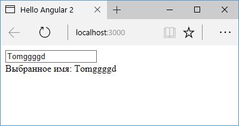

# Привязка к событиям дочернего компонента

Еще одной формой взаимодействия представляет **привязка к событиям дочернего компонента**. Так, определим следующий дочерний компонент:

```typescript
import {
  Component,
  EventEmitter,
  Input,
  Output,
} from '@angular/core'

@Component({
  selector: 'child-comp',
  template: `
    <button (click)="change(true)">+</button>
    <button (click)="change(false)">-</button>
  `,
})
export class ChildComponent {
  @Output() onChanged = new EventEmitter<boolean>()
  change(increased: any) {
    this.onChanged.emit(increased)
  }
}
```

В этом компоненте у кнопки используется событие `click`, которое вызывает метод `change`, передавая ему значение `true` или `false`. Здесь же в дочернем компоненте мы можем и обработать события. Но если мы должны передавать его родительскому компоненту, то для этого нам надо использовать свойство типа `EventEmitter`, коим здесь является свойство `onChanged`. Поскольку мы будем передавать значение типа `true` или `false`, то данное свойство типизируется типом `boolean`. При этом свойство `onChanged` должно быть выходным, поэтому оно помечается с помощью декоратора `@Output`.

Фактически свойство `onChanged` будет представлять собой событие, которое вызывается в методе `change()` по клику на кнопку и передается главному компоненту.

Далее определим код главного компонента:

```typescript
import { Component } from '@angular/core'

@Component({
  selector: 'my-app',
  template: `
    <h2>Количество кликов: {{ clicks }}</h2>
    <child-comp
      (onChanged)="onChanged($event)"
    ></child-comp>
  `,
})
export class AppComponent {
  clicks: number = 0
  onChanged(increased: any) {
    increased == true ? this.clicks++ : this.clicks--
  }
}
```

С помощью выражения `(onChanged)="onChanged($event)"` привязываем метод `onChanged` к событию `onChanged()`, вызываемое в дочернем компоненте. Параметр `$event` инкапсулирует все данные, которые передаются из дочернего компонента.

В итоге при нажатии на кнопки в дочернем компоненте событие нажатия будет транслироваться главному копоненту, который будет в зависимости от переданного значения увеличивать или уменьшать счетчик.


## Двусторонняя привязка

В примере выше мы определяли привязку к событию дочернего компонента: при возникновении события в дочернем компоненте мы обрабатывали это событие в главном компоненте с помощью метода. Но мы также можем использовать двустороннюю привязку между свойствами главного и дочернего компонента. Например, пусть дочерний компонент будет выглядеть следующим образом:

```typescript
import {
  Component,
  Input,
  Output,
  EventEmitter,
} from '@angular/core'

@Component({
  selector: 'child-comp',
  template: `
    <input
      [ngModel]="userName"
      (ngModelChange)="onNameChange($event)"
    />
  `,
})
export class ChildComponent {
  @Input() userName: string
  @Output() userNameChange = new EventEmitter<string>()
  onNameChange(model: string) {
    this.userName = model
    this.userNameChange.emit(model)
  }
}
```

Здесь определено входное свойство `userName`, к которому привязано текстовое поле `input`. Для связи используется атрибут `[ngModel]`, который связывает значение атрибута `value` у текстового поля со свойством `userName`.

Для отслеживания изменения модели этого поля с помощью атрибута `(ngModelChange)` привязываем метод, который срабатывает при изменении значения. То есть `ngModelChange` — это фактически событие изменения введенного значения, поэтому здесь действует привязка к событию.

Так как у нас здесь односторонняя привязка, то в методе-обработчике получаем введенное значение и изменяем свойство `userName` и генерируем событие `userNameChange`, которое определено как выходной параметр.

То есть здесь извне мы получаем значение для свойства `userName` и устанавливаем его для текстового поля. При вводе пользователя в это поле генерируем во вне событие `userNameChange`.

Теперь определим код главного компонента:

```typescript
import { Component } from '@angular/core'

@Component({
  selector: 'my-app',
  template: `
    <child-comp [(userName)]="name"></child-comp>
    <div>Выбранное имя: {{ name }}</div>
  `,
})
export class AppComponent {
  name: string = 'Tom'
}
```

Здесь устанавливается двусторонняя привязка свойств `userName` дочернего компонента и свойства `name` главного компонента. При этом не надо уже вручную обрабатывать событиe `userNameChange`, все будет делаться автоматически.


