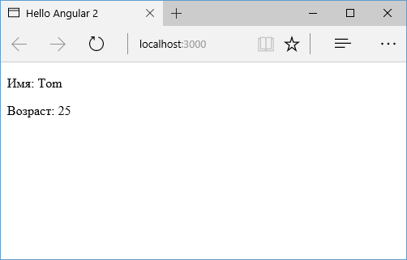

# Привязка данных

Angular поддерживает механизм привязки, благодаря которому различные части шаблона могут быть привязаны к некоторым значениям, определенным в компоненте.

В Angular есть четыре формы **привязки данных**:

1.&nbsp;Привязка элемента DOM к значению компонента (односторонняя). В двойных фигурных скобках указывается выражение, к которому идет привязка: `{{выражение}}`. Например:

```html
<h1>Добро пожаловать {{name}}!</h1>
```

2.&nbsp;Привязка свойства элемента html к значению компонента (односторонняя). Например:

```html
<input type="text" [value]="name" />
```

3.&nbsp;Привязка метода компонента к событию в DOM (генерация события в DOM вызывает метод на компоненте) (односторонняя). Например:

```html
<button (click)="addItem(text, price)">Добавить</button>
```

4.&nbsp;Двусторонняя привязка, когда элемент DOM привязан к значению на компоненте, при этом изменения на одном конце привязки сразу приводят к изменениям на другом конце. Например:

```html
<input [(ngModel)]="name" placeholder="name" />
```

Первый вид привязки заключается в использовании фигурных скобок, в которые передается значение из компонента. Например, пусть у нас будет определен следующий компонент:

```typescript
import { Component } from '@angular/core'

@Component({
  selector: 'my-app',
  template: `
    <p>Имя: {{ name }}</p>
    <p>Возраст: {{ age }}</p>
  `,
})
export class AppComponent {
  name = 'Tom'
  age = 25
}
```

И при запуске приложения выражения типа `{{name}}` будут автоматически заменяться соответствующими значениями, определенными в компоненте:



И если в процессе работы приложения свойства `name` и `age` в компоненте изменят свое значение, то также изменится значение в разметке html, которая привязана к этим свойствам.

## Привязка свойств элементов html

Мы можем привязать значение к свойству элемента html. В этом случае свойство указывается в квадратных скобках:

```typescript
import { Component } from '@angular/core'

@Component({
  selector: 'my-app',
  template: ` <input type="text" [value]="name" /> `,
})
export class AppComponent {
  name = 'Tom'
}
```

Хотя в данном случае мы могли бы написать и так:

```typescript
template: `<input type="text" value="{{name}}" />`
```

Но важно понимать, что здесь идет привязка не к атрибуту, а именно к свойству элемента в javascript, который представляет данный элемент html. Например, мы могли бы привязать некоторое значение к текстовому содержимому элемента:

```typescript
template: `<p [textContent]="name"></p>`
```

У html-элемента `<p>` нет атрибута `textContent`. Зато у интерфейса `Node`, который представляет данный элемент DOM, есть свойство `textContent`, к которому мы можем осуществить привязку.

## Привязка к событию

Привязка к событию позволяет связать с событием элемента метод из компонента:

```typescript
import { Component } from '@angular/core'

@Component({
  selector: 'my-app',
  template: `
    <p>Количество кликов {{ count }}</p>
    <button (click)="increase()">Click</button>
  `,
})
export class AppComponent {
  count: number = 0
  increase(): void {
    this.count++
  }
}
```

В шаблоне определен элемент `button`, у которого есть событие `click`. Для обработки этого события в классе `AppComponent` определен метод `increase()`, который увеличивает количество условных кликов. В итоге при нажатии на кнопку сработает данный метод:


В качестве альтернативы мы могли бы установить привязку к событию так:

```typescript
template: `<p>Количество кликов {{count}}</p>
                <button on-click="increase()">Click</button>`
```

После префикса `on` через дефис идет название события.

Мы также можем передавать информацию о событии через объект `$event`:

```typescript
import { Component } from '@angular/core'

@Component({
  selector: 'my-app',
  template: `
    <p>Количество кликов {{ count }}</p>
    <button (click)="increase($event)">Click</button>
  `,
})
export class AppComponent {
  count: number = 0
  increase($event): void {
    this.count++
    console.log($event)
  }
}
```

**`$event`** — это встроенный объект, через который Angular передает информацию о событии.

## Двусторонняя привязка

Двусторонняя привязка позволяет динамически менять значения на одном конце привязки при изменениях на другом конце. Как правило, двусторонняя привязка применяется при работе с элементами ввода, например, элементами типа input. Например:

```typescript
import { Component } from '@angular/core'

@Component({
  selector: 'my-app',
  template: `
    <p>Привет {{ name }}</p>
    <input type="text" [(ngModel)]="name" /> <br /><br />
    <input type="text" [(ngModel)]="name" />
  `,
})
export class AppComponent {
  name: string = 'Tom'
}
```

Здесь к свойству `name` класса `AppComponent` привязаны сразу три элемента: параграф и два текстового поля. Тектовые поля связаны со свойством `name` двусторонней привязкой. Для ее создания применяется выражение `[(ngModel)]="выражение"`.

В итоге изменения в текстовом поле будут сказываться на тексте во втором текстовом поле и параграфе:


