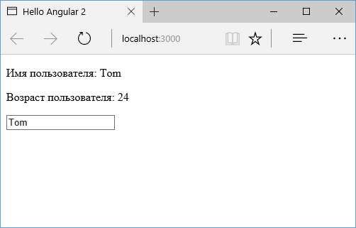

# Взаимодействие между компонентами

В прошлой теме было рассмотрено, как вызывать компонент из главного компонента. Однако по умолчанию эти компоненты никак не взаимодействуют, они независимы. Каждый компонент определяет свои выражения привязки. Однако что, если мы хотим свойства дочернего компонента привязать к свойствам из главного компонента? Для этого определим следующий дочерний компонент:

```typescript
import { Input, Component } from '@angular/core'

@Component({
  selector: 'child-comp',
  template: `
    <p>Имя пользователя: {{ userName }}</p>
    <p>Возраст пользователя: {{ userAge }}</p>
  `,
})
export class ChildComponent {
  @Input() userName: string
  @Input() userAge: number
}
```

Ключевым моментом здесь является определение входных свойств с помощью декоратора `@Input()`. И естественно чтобы использовать декоратор, его надо импортировать:

```typescript
import { Input } from '@angular/core'
```

Ключевой особенностью таких входных свойств является то, что они могут устанавливаться извне, например, из главного компонента.

Теперь изменим код главного компонента:

```typescript
import { Component } from '@angular/core'

@Component({
  selector: 'my-app',
  template: `
    <child-comp
      [userName]="name"
      [userAge]="age"
    ></child-comp>
    <input type="text" [(ngModel)]="name" />
  `,
})
export class AppComponent {
  name: string = 'Tom'
  age: number = 24
}
```

Поскольку свойство `userName` в дочернем компоненте определено как входное с декоратором `Input`, то в главном компоненте мы можем его использовать как атрибут и фактически применить привязку свойств:

```html
<child-comp [userName]="name" [userAge]="age"></child-comp>
```

То же самое касается и свойства `userAge`.

В итоге свойства `userAge` и `userName` будут привязаны к значениям из главного компонента:



## Привязка к сеттеру

Кроме привязки к свойству мы можем установить привязку к сеттеру дочернего компонента. Это может быть необходимо, когда в дочернем компоненте надо осуществлять проверку или даже модификацию значения, получаемого от главного компонента.

Например, пусть в главном компоненте устанавливается возраст пользователя:

```typescript
import { Component } from '@angular/core'

@Component({
  selector: 'my-app',
  template: `
    <child-comp
      [userName]="name"
      [userAge]="age"
    ></child-comp>
    <input type="number" [(ngModel)]="age" />
  `,
})
export class AppComponent {
  name: string = 'Tom'
  age: number = 24
}
```

А в дочернем компоненте будем получать переданный возраст через сеттер:

```typescript
import { Input, Component } from '@angular/core'

@Component({
  selector: 'child-comp',
  template: `
    <p>Имя пользователя: {{ userName }}</p>
    <p>Возраст пользователя: {{ userAge }}</p>
  `,
})
export class ChildComponent {
  @Input() userName: string
  _userAge: number

  @Input()
  set userAge(age: number) {
    if (age < 0) this._userAge = 0
    else if (age > 100) this._userAge = 100
    else this._userAge = age
  }
  get userAge() {
    return this._userAge
  }
}
```

В главном компоненте мы можем ввести любое значение в поле ввода, в том числе и отрицательные числа. В дочернем компоненте через сеттер проверяем введенное значение и при необходимости корректируем его.
