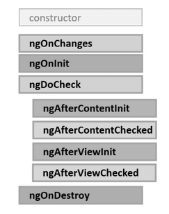
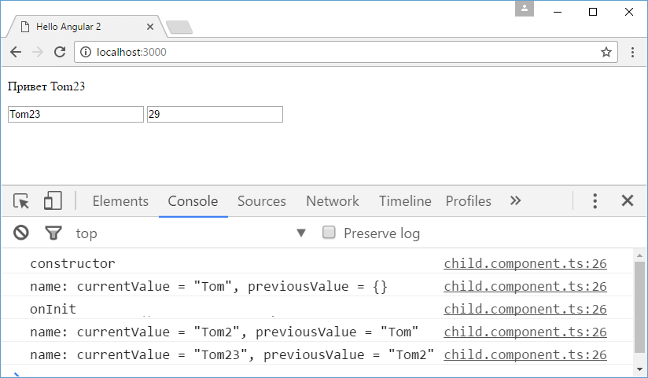
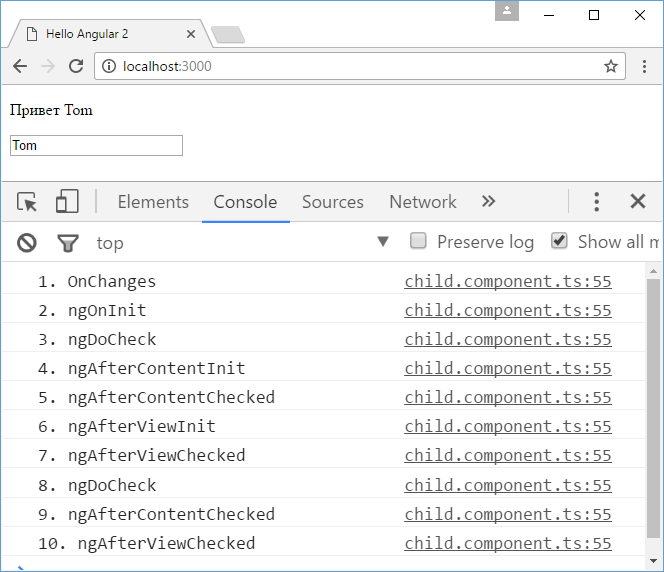

# Жизненный цикл компонента

После создания компонента фреймворк Angular вызывает у этого компонента ряд методов, которые представляют различные этапы **жизненного цикла**:



- **`ngOnChanges`**: вызывается до метода `ngOnInit()` при начальной установке свойств, которые связаны механизмом привязки, а также при любой их переустановке или изменении их значений. Данный метод в качестве параметра принимает объект класса `SimpleChanges`, который содержит предыдущие и текущие значения свойства.
- **`ngOnInit`**: вызывается один раз после установки свойств компонента, которые участвуют в привязке. Выполняет инициализацию компонента
- **`ngDoCheck`**: вызывается при каждой проверке изменений свойств компонента сразу после методов `ngOnChanges` и `ngOnInit`
- **`ngAfterContentInit`**: вызывается один раз после метода `ngDoCheck()` после вставки содержимого в представление компонента кода html
- **`ngAfterContentChecked`**: вызывается фреймворком Angular при проверке изменений содержимого, которое добавляется в представление компонента. Вызывается после метода `ngAfterContentInit()` и после каждого последующего вызова метода `ngDoCheck()`.
- **`ngAfterViewInit`**: вызывается фреймворком Angular после инициализации представления компонента, а также представлений дочерних компонентов. Вызывается только один раз сразу после первого вызова метода `ngAfterContentChecked()`
- **`ngAfterViewChecked`**: вызывается фреймворком Angular после проверки на изменения в представлении компонента, а также проверки представлений дочерних компонентов. Вызывается после первого вызова метода `ngAfterViewInit()` и после каждого последующего вызова `ngAfterContentChecked()`
- **`ngOnDestroy`**: вызывается перед тем, как фреймворк Angular удалит компонент.

Каждый такой метод определен в отдельном интерфейсе, который называется по имени метода без префикса `ng`. Например, метод `ngOnInit` определен в интерфейсе `OnInit`. Поэтому, если мы хотим отслеживать какие-то этапы жизненного цикла компонента, то класс компонента должен применять соответствующие интерфейсы:

```typescript
import { Component, OnInit, OnDestroy } from '@angular/core'

@Component({
  selector: 'my-app',
  template: ` <p>Hello Angular 2</p> `,
})
export class AppComponent implements OnInit, OnDestroy {
  name: string = 'Tom'

  constructor() {
    this.log(`constructor`)
  }
  ngOnInit() {
    this.log(`onInit`)
  }

  ngOnDestroy() {
    this.log(`onDestroy`)
  }

  private log(msg: string) {
    console.log(msg)
  }
}
```

## ngOnInit

Метод `ngOnInit()` применяется для какой-то комплексной инициализации компонента. Здесь можно выполнять загрузку данных с сервера или из других источников данных.

`ngOnInit()` не аналогичен конструктору. Конструктор также может выполнять некоторую инициализацию объекта, в то же время что-то сложное в конструкторе делать не рекомендуется. Конструктор должен быть по возможности простым и выполнять самую базовую инициализацию. Что-то более сложное, например, загрузку данных с сервера, которая может занять продолжительное время, лучше делать в методе `ngOnInit`.

## ngOnDestroy

Метод `ngOnDestroy()` вызывается перед удалением компонента. И в этом методе можно освобождать те используемые ресурсы, которые не удаляются автоматически сборщиком мусора. Здесь также можно удалять подписку на какие-то события элементов DOM, останавливать таймеры и т. д.

## ngOnChanges

Метод `ngOnChanges()` вызывается перед методом `ngOnInit()` и при изменении свойств в привязке. С помощью параметра `SimpleChanges` в методе можно получить текущее и предыдущее значение измененного свойства. Например, пусть у нас будет следующий дочерний компонент:

```typescript
import {
  Component,
  Input,
  OnInit,
  OnChanges,
  SimpleChanges,
} from '@angular/core'

@Component({
  selector: 'child-comp',
  template: ` <p>Привет {{ name }}</p> `,
})
export class ChildComponent implements OnInit, OnChanges {
  @Input() name: string

  constructor() {
    this.log(`constructor`)
  }
  ngOnInit() {
    this.log(`onInit`)
  }

  ngOnChanges(changes: SimpleChanges) {
    for (let propName in changes) {
      let chng = changes[propName]
      let cur = JSON.stringify(chng.currentValue)
      let prev = JSON.stringify(chng.previousValue)
      this.log(
        `${propName}: currentValue = ${cur}, previousValue = ${prev}`
      )
    }
  }
  private log(msg: string) {
    console.log(msg)
  }
}
```

И пусть этот компонент используется в главном компоненте:

```typescript
import {
  Component,
  OnChanges,
  SimpleChanges,
} from '@angular/core'

@Component({
  selector: 'my-app',
  template: `
    <child-comp [name]="name"></child-comp>
    <input type="text" [(ngModel)]="name" />
    <input type="number" [(ngModel)]="age" />
  `,
})
export class AppComponent implements OnChanges {
  name: string = 'Tom'
  age: number = 25
  ngOnChanges(changes: SimpleChanges) {
    for (let propName in changes) {
      let chng = changes[propName]
      let cur = JSON.stringify(chng.currentValue)
      let prev = JSON.stringify(chng.previousValue)
      this.log(
        `${propName}: currentValue = ${cur}, previousValue = ${prev}`
      )
    }
  }

  private log(msg: string) {
    console.log(msg)
  }
}
```

То есть значение для свойства `name` передается в дочерний компонент `ChildComponent` из главного — `AppComponent`. Причем в главном компоненте тоже реализован метод `ngOnChanges()`.

И если мы запустим приложение, то сможем заметить, что при каждом изменении свойства `name` в главном компоненте вызывается метод `ngOnChanges`:



В то же время надо отметить, что данный метод вызывается только при изменении входных свойств с декоратором `@Input`. Поэтому изменение свойства `age` в `AppComponent` здесь не будет отслеживаться.

## Реализация всех методов

Определим следующий дочерний компонент:

```typescript
import {
  Component,
  Input,
  OnInit,
  DoCheck,
  OnChanges,
  AfterContentInit,
  AfterContentChecked,
  AfterViewChecked,
  AfterViewInit,
} from '@angular/core'

@Component({
  selector: 'child-comp',
  template: ` <p>Привет {{ name }}</p> `,
})
export class ChildComponent
  implements
    OnInit,
    DoCheck,
    OnChanges,
    AfterContentInit,
    AfterContentChecked,
    AfterViewChecked,
    AfterViewInit {
  @Input() name: string
  count: number = 1

  ngOnInit() {
    this.log(`ngOnInit`)
  }
  ngOnChanges() {
    this.log(`OnChanges`)
  }
  ngDoCheck() {
    this.log(`ngDoCheck`)
  }
  ngAfterViewInit() {
    this.log(`ngAfterViewInit`)
  }
  ngAfterViewChecked() {
    this.log(`ngAfterViewChecked`)
  }
  ngAfterContentInit() {
    this.log(`ngAfterContentInit`)
  }
  ngAfterContentChecked() {
    this.log(`ngAfterContentChecked`)
  }

  private log(msg: string) {
    console.log(this.count + '. ' + msg)
    this.count++
  }
}
```

И используем этот компонент в главном компоненте:

```typescript
import { Component } from '@angular/core'

@Component({
  selector: 'my-app',
  template: `
    <child-comp [name]="name"></child-comp>
    <input type="text" [(ngModel)]="name" />
  `,
})
export class AppComponent {
  name: string = 'Tom'
}
```

И при обращении к приложению мы получим следующую цепочку вызовов:


