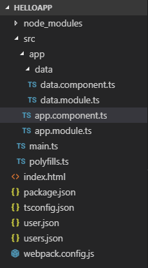
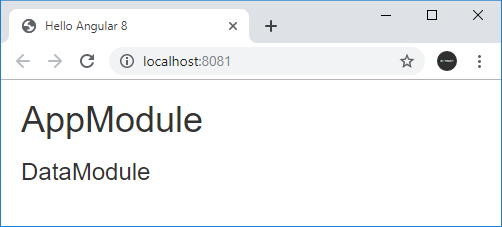

# Взаимодействие между модулями

В приложении Angular мы можем определять и использовать множество **модулей**. Нередко модуль создается для объединения компонентов и других классов, которые работают с каким-то одним аспектом приложения. И если приложение большое, то логично разбить его на модули, которые выполняют различные задачи. Однако в этой связи может возникнуть вопрос, как подключать и использовать одни модули в других.

Например, определим проект со следующей структурой:



В папке `src/app/data` создадим два файла `data.module.ts` и `data.component.ts`, которые будут представлять функциональность нового модуля.

В файле `data.component.ts` определим компонент `DataComponent`:

```ts
import { Component } from '@angular/core'

@Component({
  selector: 'data-comp',
  template: `
    <div>
      <h3>{{ message }}</h3>
    </div>
  `,
})
export class DataComponent {
  message: string = 'DataModule'
}
```

А в файле `data.module.ts` определим класс модуля `DataModule`:

```ts
import { NgModule } from '@angular/core'
import { BrowserModule } from '@angular/platform-browser'
import { FormsModule } from '@angular/forms'
import { DataComponent } from './data.component'
@NgModule({
  imports: [BrowserModule, FormsModule],
  declarations: [DataComponent],
  exports: [DataComponent], // экспортируем компонент
})
export class DataModule {}
```

В данном модуле мы можем подключать другие модули, которые мы собираемся использовать рамках текущего модуля и его компонентов и директив.

В секции `declarations` добавляем компонент `DataComponent`, который будет принадлежать данному модулю. Но чтобы этот компонент можно было подключать в других модулях, `DataComponent` также добавляется в секцию `exports`.

Теперь используем функционал `DataModule` в главном модуле `AppModule` в файле `app.module.ts`:

```ts
import { NgModule } from '@angular/core'
import { BrowserModule } from '@angular/platform-browser'
import { AppComponent } from './app.component'
import { DataModule } from './data/data.module'

@NgModule({
  imports: [BrowserModule, DataModule],
  declarations: [AppComponent],
  bootstrap: [AppComponent],
})
export class AppModule {}
```

Модули, которые определили мы сами, подключаются также, как и вс остальные модули в секции `imports`.

И после этого мы сможем использовать функциональность `DataModule` в компонентах, которые принадлежат `AppModule`. Например, используем `DataComponent` в компоненте `AppComponent` в файле `app.component.ts`:

```ts
import { Component } from '@angular/core'

@Component({
  selector: 'my-app',
  template: `
    <div>
      <h1>AppModule</h1>
      <data-comp></data-comp>
    </div>
  `,
})
export class AppComponent {}
```


