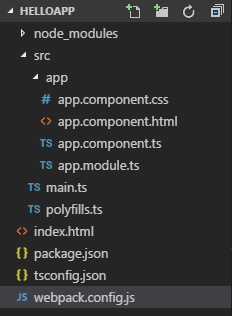

# Стили и шаблоны компонента

**Стилизация компонента** может производиться как с помощью установки стилей в самом компоненте, так и с помощью подключения внешних css-файлов.

Для установки стилей в директиве `@Component` определено свойство `styles`:

```typescript
import { Component } from '@angular/core'

@Component({
  selector: 'my-app',
  template: `
    <h1>Hello Angular 2</h1>
    <p>
      Angular 2 представляет модульную архитектуру
      приложения
    </p>
  `,
  styles: [
    `
      h1,
      h2 {
        color: navy;
      }
      p {
        font-size: 13px;
        font-family: Verdana;
      }
    `,
  ],
})
export class AppComponent {}
```

Параметр `styles` содержит набор стилей, которые будут использоваться компонентом:


При использовании стилей следует учитывать, что они применяются локально только к разметке, управляемой компонентом. Например, если на странице будут элементы вне области управления компонентом, то к ним уже не будут применяться стили. Например:

```html
<body>
  <my-app>Loading...</my-app>
  <h2>Подзаголовок</h2>
</body>
```

Если бы заголовок `h2` здесь располагался бы в шаблоне компонента, то к нему применялся бы стиль. А так он не будет стилизован:


## Селектор :host

Селектор `:host` ссылается на элемент, в котором хостится компонент. То есть в данном случае это элемент `<my-app></my-app>`. И селектор `:host` как раз позволяет применить стили к этому элементу:

```typescript
styles: [
  `
    h1, h2{color:navy;}
    p{font-size:13px;}
    :host {
        font-family: Verdana;
        color: #555;
    }
`,
]
```

## Подключение внешних файлов

Если стилей много, то код компонента может быть слишком раздут, и в этом случае их вынести в отдельный файл css. Так, создадим в одной папке с классом компонента (который по умолчанию располагается в папке app) новый файл `app.component.css` со следующим содержимым:

```css
h1,
h2 {
  color: navy;
}
p {
  font-size: 13px;
}
:host {
  font-family: Verdana;
  color: #555;
}
```

Затем изменим код компонента:

```typescript
import { Component } from '@angular/core'

@Component({
  selector: 'my-app',
  template: `
    <h1>Hello Angular 2</h1>
    <p>
      Angular 5 представляет модульную архитектуру
      приложения
    </p>
  `,
  styleUrls: ['./app.component.css'],
})
export class AppComponent {}
```

Параметр `styleUrls` позволяет указать набор файлов css, которые применяются для стилизации. В данном случае предполагается, что файл css располагается в проекте в папке `app`.

Похожим образом мы можем вынести шаблон в отдельный файл html. Также в папке app создадим новый файл `app.component.html` со следующим кодом:

```html
<h1>Hello Angular 7</h1>
<p>
  Angular 7 представляет модульную архитектуру приложения
</p>
```

То есть здесь определен весь тот же код, что ранее был в шаблоне компонента. И теперь изменим сам компонент:

```typescript
import { Component } from '@angular/core'

@Component({
  selector: 'my-app',
  templateUrl: './app.component.html',
  styleUrls: ['./app.component.css'],
})
export class AppComponent {}
```

За счет выноса кода css и html код самого компонента стал чище и проще. Однако если мы производим сборку приложения через webpack, то мы можем столкнуться с проблемами. Нам надо указать сборщику, как загружать эти файлы html и css. И для этого можно воспользоваться загрузчиками `html-loader` и `raw-loader`.

В частности, в начале необходимо загрузить пакеты загрузчиков в проект через `npm`. Для этого можно определить в файле `package.json` следующие пакеты:

```json
{
  "name": "helloapp",
  "version": "1.0.0",
  "description": "First Angular 7 Project",
  "author": "Eugene Popov <metanit.com>",
  "scripts": {
    "dev": "webpack-dev-server --hot --open",
    "build": "webpack"
  },
  "dependencies": {
    "@angular/common": "~7.0.0",
    "@angular/compiler": "~7.0.0",
    "@angular/core": "~7.0.0",
    "@angular/forms": "~7.0.0",
    "@angular/platform-browser": "~7.0.0",
    "@angular/platform-browser-dynamic": "~7.0.0",
    "@angular/router": "~7.0.0",
    "core-js": "^2.5.7",
    "rxjs": "^6.3.3",
    "zone.js": "^0.8.26"
  },
  "devDependencies": {
    "@types/node": "^10.12.0",
    "typescript": "^3.0.0",
    "webpack": "^4.21.0",
    "webpack-cli": "^3.1.2",
    "webpack-dev-server": "^3.1.9",
    "angular2-template-loader": "^0.6.2",
    "awesome-typescript-loader": "^5.2.1",
    "uglifyjs-webpack-plugin": "^2.0.0",
    "raw-loader": "0.5.1",
    "html-loader": "0.5.1"
  }
}
```

И после этого загрузить пакеты командой `npm install`.

И затем загрузчики `raw-loader` и `html-loader` надо применить в конфигурации webpack:

```javascript
var path = require('path')
var webpack = require('webpack')
var UglifyJSPlugin = require('uglifyjs-webpack-plugin') // плагин минимизации
module.exports = {
  entry: {
    polyfills: './src/polyfills.ts',
    app: './src/main.ts',
  },
  output: {
    path: path.resolve(__dirname, './public'), // путь к каталогу выходных файлов — папка public
    publicPath: '/public/',
    filename: '[name].js', // название создаваемого файла
  },
  resolve: {
    extensions: ['.ts', '.js'],
  },
  module: {
    rules: [
      //загрузчик для ts
      {
        test: /\.ts$/, // определяем тип файлов
        use: [
          {
            loader: 'awesome-typescript-loader',
            options: {
              configFileName: path.resolve(
                __dirname,
                'tsconfig.json'
              ),
            },
          },
          'angular2-template-loader',
        ],
      },
      {
        test: /\.html$/,
        loader: 'html-loader',
      },
      {
        test: /\.css$/,
        include: path.resolve(__dirname, 'src/app'),
        loader: 'raw-loader',
      },
    ],
  },
  plugins: [
    new webpack.ContextReplacementPlugin(
      /angular(\\|\/)core/,
      path.resolve(__dirname, 'src'), // каталог с исходными файлами
      {} // карта маршрутов
    ),
    new UglifyJSPlugin(),
  ],
}
```


