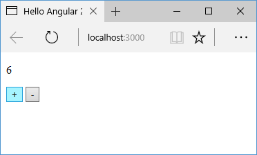

# Шаблонные переменные, ViewChild и ContentChild

**Шаблонные переменные** позволяют определить некоторые переменные внутри шаблона компонента и затем ссылаться к этим переменным из этого же шаблона. Для определения подобных переменных применяется знак решетки (`#`). Например, определим шаблонную переменную `userName` в компоненте:

```typescript
import { Component } from '@angular/core'

@Component({
  selector: 'my-app',
  template: `
    <p #userName>{{ name }}</p>
    <p>{{ userName.textContent }}</p>
    <input type="text" [(ngModel)]="name" />
  `,
})
export class AppComponent {
  name: string = 'Tom'
}
```

Определение переменной выглядит следующим образом:

```html
<p #userName>{{name}}</p>
```

Определение переменной userName в элементе параграфа означает, что она будет представлять данный параграф, то есть элемент `p` разметки html. И далее мы можем обращаться к этому параграфу через данную переменную. Например, через свойство `userName.textContent` можно получить текстовое содержимое параграфа. При этом, если привязанное к параграфу значение переменной `name` изменится, то соответственно изменится и значение `userName.textContent`:


При этом данную переменную мы можем использовать только внутри шаблона.

Использование шаблонных переменных открывает нам дополнительный способ взаимодействия между родительским и дочерним компонентом. Например, определим следующий дочерний компонент `ChildComponent`:

```typescript
import { Component } from '@angular/core'

@Component({
  selector: 'child-comp',
  template: ` <p>{{ counter }}</p> `,
})
export class ChildComponent {
  counter: number = 0
  increment() {
    this.counter++
  }
  decrement() {
    this.counter--
  }
}
```

В этом компоненте определяется переменная счетчика `counter`. Для ее увеличения или уменьшения применяются методы `increment` и `decrement`.

В коде главного компонента будем вызывать дочерний компонент:

```typescript
import { Component } from '@angular/core'

@Component({
  selector: 'my-app',
  template: `
    <child-comp #counter></child-comp>
    <button (click)="counter.increment()">+</button>
    <button (click)="counter.decrement()">-</button>
  `,
})
export class AppComponent {}
```

В данном случае шаблонная переменная `counter`, определенная внутри тега `<child-comp>`, поэтому она будет представлять компонент `ChildComponent`.

Соответственно далее мы можем ссылаться к компоненту `ChildComponent` через эту переменную, например, установить для событий кнопок привязку к методам `ChildComponent`. В итоге по нажатию на кнопки в главном компоненте будут вызываться методы из дочернего компонента:



## ViewChild

Однако шаблонные переменные имеют свои ограничения: они не могут применяться вне шаблона, даже в коде класса компонента. Например, мы не можем написать так:

```typescript
import { Component } from '@angular/core'

@Component({
  selector: 'my-app',
  template: `
    <child-comp #counter></child-comp>
    <button (click)="increment()">+</button>
    <button (click)="decrement()">-</button>
  `,
})
export class AppComponent {
  increment() {
    this.counter++
  }
  decrement() {
    this.counter--
  }
}
```

Здесь для класса `AppComponent` свойства `this.counter` не существует — оно существует только для шаблона.

Чтобы все таки иметь возможность обращаться к методам и прочей функциональности дочернего компонента, надо использовать декоратор `ViewChild`. Так, изменим главный компонент следующим образом:

```typescript
import { Component, ViewChild } from '@angular/core'
import { ChildComponent } from './child.component'

@Component({
  selector: 'my-app',
  template: `
    <child-comp></child-comp>
    <button (click)="increment()">+</button>
    <button (click)="decrement()">-</button>
  `,
})
export class AppComponent {
  @ViewChild(ChildComponent)
  private counterComponent: ChildComponent

  increment() {
    this.counterComponent.increment()
  }
  decrement() {
    this.counterComponent.decrement()
  }
}
```

С помощью применения к нему декоратора `ViewChild` к свойству `counterComponent` мы устанавливаем, что это свойство будет содержать объект дочернего компонента, который внедряется через элемент `<child-comp></child-comp>`. И в этом случае мы уже можем не использовать шаблонные переменные в шаблоне.

## Привязка ViewChild к шаблонным переменным

Несмотря на то, что выше мы не использовали переменные, тем не менее с помощью декоратора `ViewChild` также можно связать свойство и переменную из шаблона. Так, изменим код главного компонента:

```typescript
import {
  Component,
  ViewChild,
  ElementRef,
} from '@angular/core'

@Component({
  selector: 'my-app',
  template: `
    <p #nameText>{{ name }}</p>
    <p>{{ nameText.textContent }}</p>
    <button (click)="change()">Изменить</button>
  `,
})
export class AppComponent {
  @ViewChild('nameText')
  nameParagraph: ElementRef

  name: string = 'Tom'

  change() {
    console.log(
      this.nameParagraph.nativeElement.textContent
    )
    this.nameParagraph.nativeElement.textContent = 'hell'
  }
}
```

Здесь в шаблоне определяется переменная `nameText`, которая представляет код параграфа. А в декоратор `ViewChild` передается имя этой переменной. Поэтому свойство `nameParagraph`, к которому применяется декоратор, будет указывать на эту переменную `nameText`. Причем свойство `nameParagraph` представляет тип `ElementRef`, который используется для ссылки на элементы html.

По нажатию на кнопку выводится и изменяется текстовое содержимое этой переменной.

## ContentChild

Кроме `ViewChild` для связи с шаблонными переменными мы можем применять другой декоратор — `ContentChild`. В какой ситуации он может понадобится? Допустим, в родительском компоненте определен следующий код:

```typescript
import { Component } from '@angular/core'

@Component({
  selector: 'my-app',
  template: `
    <child-comp>
      <h3 #headerContent>Добро пожаловать {{ name }}!</h3>
    </child-comp>
  `,
})
export class AppComponent {
  name: string = 'Tom'
}
```

Здесь определена переменная `#headerContent`, которая указывает на элемент заголовка `h3`.

Причем поскольку данные из родительского компонента передаются в дочерний напрямую, то для получения этих данных в дочернем компоненте будет использоваться элемент `ng-content`:

```typescript
import {
  Component,
  ContentChild,
  ElementRef,
} from '@angular/core'

@Component({
  selector: 'child-comp',
  template: `
    <ng-content></ng-content>
    <button (click)="change()">Изменить</button>
  `,
})
export class ChildComponent {
  @ContentChild('headerContent')
  header: ElementRef

  change() {
    console.log(this.header)
    this.header.nativeElement.textContent = 'Hell to world!'
  }
}
```

И как раз чтобы получить переменные, которые передаются с кодом через `ng-content`, дочерний компонент применяет декоратор `ContentChild`. В этот декоратор также передается название переменной. Само свойство декоратора также представляет объект `ElementRef`. И далее мы можем манипулировать этим объектом.
