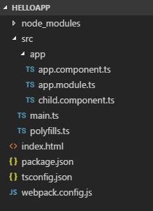

# Работа с компонентами

Кроме основных компонентов в приложении, мы также можем определять какие-то вспомогательные компоненты, которые управляют каким-то участком разметки html. Более того в приложении на странице может быть ряд разных блоков с какой-то определенной задачей. И для каждого такого блока можно создать отдельный компонент, чтобы упростить управление блоками на странице.

Добавим в проект второй компонент. Для этого добавим в папку `src/app` новый файл `child.component.ts`. В итоге весь проект будет выглядеть следующим образом:



Определим в файле `child.component.ts` следующий код:

```typescript
import { Component } from '@angular/core'

@Component({
  selector: 'child-comp',
  template: ` <h2>Добро пожаловать {{ name }}!</h2> `,
  styles: [
    `
      h2,
      p {
        color: red;
      }
    `,
  ],
})
export class ChildComponent {
  name = 'Евгений'
}
```

Здесь определен класс `ChildComponent`. Опять же чтобы сделать этот класс компонентом, необходимо применить декоратор `@Component`.

Компонент будет управлять разметкой html, которая будет вставляться в элемент `child-comp`.

Шаблон представления будет просто выводить заголовок. В заголовке выводится имя, заданное через переменную `name`.

И кроме того, здесь определены стили для элементов `h2` и `p`.

Теперь изменим код компонента `AppComponent` в файле `app.component.ts`:

```typescript
import { Component } from '@angular/core'

@Component({
  selector: 'my-app',
  template: `
    <child-comp></child-comp>
    <p>Привет {{ name }}</p>
  `,
  styles: [
    `
      h2,
      p {
        color: #333;
      }
    `,
  ],
})
export class AppComponent {
  name = 'Петр'
}
```

Это основной компонент, который будет запускаться при загрузке приложения, и через него мы будем использовать остальные компоненты. Так, компонент `ChildComponent` будет загружаться в элемент `child-comp`. И в шаблоне компонента `AppComponent` как раз определен такой элемент.

Кроме того, компонент определяет стили для тех же элементов на странице, и также, как и `ChildComponent`, определяет свойство `name`, только с другим значением.

Чтобы использовать все определенные в проекте компоненты, они должны быть указаны в главном модуле приложения. Определим в файле `app.module.ts` следующий модуль:

```typescript
import { NgModule } from '@angular/core'
import { BrowserModule } from '@angular/platform-browser'
import { FormsModule } from '@angular/forms'
import { AppComponent } from './app.component'
import { ChildComponent } from './child.component'
@NgModule({
  imports: [BrowserModule, FormsModule],
  declarations: [AppComponent, ChildComponent],
  bootstrap: [AppComponent],
})
export class AppModule {}
```

Запустим проект:


Результат показывает, что несмотря на то, что один компонент как бы включен в другой с помощью тега `<child-comp>`, но тем не менее стили одного компонента не применяются к другому. Каждый компонент очерчивает свою область с помощью шаблона, свое представление, которым он и управляет.

Также каждый компонент использует свое значение свойства `name`. То есть компоненты фактически существуют относительно независимо.

Даже если мы уберем из `ChildComponent` определение свойства `name`:

```typescript
import { Component } from '@angular/core'

@Component({
  selector: 'child-comp',
  template: ` <h2>Добро пожаловать {{ name }}!</h2> `,
  styles: [
    `
      h2,
      p {
        color: red;
      }
    `,
  ],
})
export class ChildComponent {}
```

То родительский или главный компонент, все равно не окажет влияния на `ChildComponent`:


Хотя может показаться, что `ChildComponent` для выражения `{{name}}` в своем шаблоне должен использовать свойство `name` из родительского компонента `AppComponent`. Но это не так. Компоненты относительно независимы друг от друга.

## ng-content

Элемент `ng-content` позволяет внедрять родительским компонентам код html в дочерние компоненты. Так, изменим компонент `ChildComponent` следующим образом:

```typescript
import { Component } from '@angular/core'

@Component({
  selector: 'child-comp',
  template: `
    <ng-content></ng-content>
    <p>Привет {{ name }}</p>
  `,
  styles: [
    `
      h2,
      p {
        color: navy;
      }
    `,
  ],
})
export class ChildComponent {
  name = 'Евгений'
}
```

Вместо элемента `<ng-content>` извне можно будет передать любое содержимое.

И изменим код главного компонента AppComponent:

```typescript
import { Component } from '@angular/core'

@Component({
  selector: 'my-app',
  template: `
    <child-comp
      ><h2>Добро пожаловать {{ name }}!</h2></child-comp
    >
  `,
  styles: [
    `
      h2,
      p {
        color: #333;
      }
    `,
  ],
})
export class AppComponent {
  name = 'Tom'
}
```

В элемент `<child-comp>` здесь передается заголовок `<h2>Добро пожаловать {{name}}!</h2>`. Затем этот заголовок будет вставляться в дочерний компонент `ChildComponent` на место `<ng-content>`:


Причем управлять разметкой, которая вставляется в `<ng-content>`, будет `AppComponent`. Поэтому именно этот компонент задает стили и выражения привязки для вставляемого куска html.
