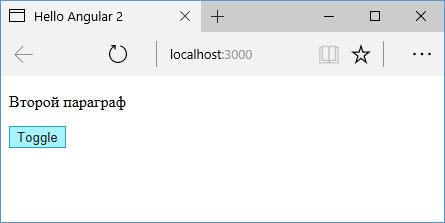

# Создание структурных директив

Создадим простейшую **структурную директиву**. Добавим в папку `src/app` новый файл `while.directive.ts`:


Этот файл будет содержать директиву. Определим в файле следующий код:

```typescript
import {
  Directive,
  Input,
  TemplateRef,
  ViewContainerRef,
} from '@angular/core'

@Directive({ selector: '[while]' })
export class WhileDirective {
  constructor(
    private templateRef: TemplateRef<any>,
    private viewContainer: ViewContainerRef
  ) {}

  @Input() set while(condition: boolean) {
    if (condition) {
      this.viewContainer.createEmbeddedView(
        this.templateRef
      )
    } else {
      this.viewContainer.clear()
    }
  }
}
```

Структурная директива должна применять декоратор `@Directive`, в который передается название селектора директивы в квадратных скобках. В данном случае селектор — `while`.

Для получения доступа к шаблону директивы применяется объект `TemplateRef`. Этот объект автоматически передается в конструктор через механизм внедрения зависимостей. Кроме этого объекта в конструктор также передается объект рендерера — `ViewContainerRef`. Ну и с помощью применения модификатора `private` для обоих этих параметров автоматически будут создаваться локальные переменные, к которым мы затем сможем обратиться.

```typescript
constructor(
	private templateRef: TemplateRef<any>,
    private viewContainer: ViewContainerRef
){ }
```

С помощью входного свойства-сеттера, к которому применяется декоратор `@Input`, мы будем получать из вне некоторые значения, которые могут использоваться при создании разметки html. В данном случае мы получаем извне некоторое булевое значение:

```typescript
@Input() set while(condition: boolean) {
    if (condition) {
        this.viewContainer.createEmbeddedView(this.templateRef);
    } else {
        this.viewContainer.clear();
    }
}
```

Если в данном случае `condition` равно `true`, то производим рендеринг шаблона через вызов `this.viewContainer.createEmbeddedView(this.templateRef);`. В итоге на веб-странице появится элемент, к которому применяется данная директива.

В обратном случае, если `condition` равно `false`, то, наоборот, удаляем элемент из разметки с помощью вызова `this.viewContainer.clear()`.

То есть по факту мы получили аналог директивы `ngIf`.

Далее применим директиву в главном компоненте `AppComponent`:

```typescript
import { Component } from '@angular/core'

@Component({
  selector: 'my-app',
  template: `
    <p *while="condition">Первый параграф</p>
    <p *while="!condition">Второй параграф</p>
    <button (click)="toggle()">Toggle</button>
  `,
})
export class AppComponent {
  condition: boolean = true
  toggle() {
    this.condition = !this.condition
  }
}
```

И далее задействуем директиву в главном модуле `AppModule`:

```typescript
import { NgModule } from '@angular/core'
import { BrowserModule } from '@angular/platform-browser'

import { AppComponent } from './app.component'
import { WhileDirective } from './while.directive'

@NgModule({
  imports: [BrowserModule],
  declarations: [AppComponent, WhileDirective],
  bootstrap: [AppComponent],
})
export class AppModule {}
```

И после запуска приложения с помощью этой директивы мы сможем регулировать добавление или удаление определенного блока веб-страницы:


