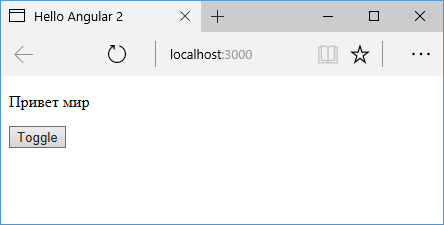

# Структурные директивы ngIf, ngFor, ngSwitch

**Структурные директивы** изменяют структуру DOM с помощью добавления или удаления html-элементов. Рассмотрим три структурных директивы: `ngIf`, `ngSwitch` и `ngFor`.

## ngIf

Директива **`ngIf`** позволяет удалить или, наоборот, отобразить элемент при определенном условии. Например, определим следующий компонент:

```typescript
import { Component } from '@angular/core'

@Component({
  selector: 'my-app',
  template: `
    <p *ngIf="condition">Привет мир</p>
    <p *ngIf="!condition">Пока мир</p>
    <button (click)="toggle()">Toggle</button>
  `,
})
export class AppComponent {
  condition: boolean = true

  toggle() {
    this.condition = !this.condition
  }
}
```

В зависимости от значения свойства `condition` будет отображаться либо первый, либо второй параграф.



Начиная с версии Angular 4.0 директива `ngIf` обогатилась новыми возможностями. В частности, мы можем задавать альтернативные выражения с помощью директивы `ng-template`. Так, предыдущий пример будет аналогичен следующему:

```typescript
import { Component } from '@angular/core'

@Component({
  selector: 'my-app',
  template: `
    <p *ngIf="condition; else unset">Привет мир</p>
    <ng-template #unset>
      <p>Пока мир</p>
    </ng-template>
    <button (click)="toggle()">Toggle</button>
  `,
})
export class AppComponent {
  condition: boolean = true

  toggle() {
    this.condition = !this.condition
  }
}
```

Выражение `*ngIf="condition;else unset"` указывает, что если `condition` равно `false`, то срабатывает блок `<ng-template #unset>`.

Либо можно определить более изощренную логику. Так, изменим шаблон компонента следующим образом:

```typescript
template: `
	<div *ngIf="condition; then thenBlock else elseBlock"></div>
  <ng-template #thenBlock>Then template</ng-template>  
  <ng-template #elseBlock>Else template</ng-template>
  <button (click)="toggle()">Toggle</button>
`
```

В данном случае, если `condition` равно `true`, то отображается блок `thenBlock`, иначе отображается блок `elseBlock`.

## ngFor

Директива **`ngFor`** позволяет перебрать в шаблоне элементы массива. Например:

```typescript
import { Component } from '@angular/core'

@Component({
  selector: 'my-app',
  template: `
    <ul>
      <li *ngFor="let item of items">{{ item }}</li>
    </ul>
  `,
})
export class AppComponent {
  items = [
    'Apple iPhone 7',
    'Huawei Mate 9',
    'Samsung Galaxy S7',
    'Motorola Moto Z',
  ]
}
```

В качестве значения директива принимает значение перебора аля-foreach: `let item of items`. Каждый перебираемый элемент помещается в переменную `item`, которую мы можем вывести на страницу.

При переборе элементов нам доступен текущий индекс элемента через переменную `index`, которую мы также можем использовать. Например:

```html
<div>
  <p *ngFor="let item of items; let i = index">
    {{i+1}}.{{item}}
  </p>
</div>
```

Надо учитывать, что индексация идет с нуля, поэтому, чтобы в данном случае отсчет шел с единицы, к переменной `i` прибавляется единица.

## Символ звездочки и синтаксический сахар

Можно заметить, что при использовании директив `ngFor` и `ngIf` перед ними ставится символ звездочка. По факту это не более чем синтаксический сахар, который упрощает применение директивы. Так, определение `ngIf`:

```html
<p *ngIf="condition">Привет мир</p>
<p *ngIf="!condition">Пока мир</p>
```

по факту будет представлять следующий код:

```html
<template [ngIf]="condition">
  <p>Привет мир</p>
</template>
<template [ngIf]="!condition">
  <p>Пока мир</p>
</template>
```

В итоге параграф и его текст перемещаются внутрь элемента `<template>`. Сама директива помещается в тег `<template>`, в котором применяется привязка свойства. Булевое значение привязанного свойство указывает, надо ли отображать соответствующий контент.

В итоге мы можем выбирать либо первый способ со звездочкой, который более компактный, либо второй способ с элементами `template`.

То же самое касается и директивы `ngFor`:

```html
<ul>
  <li *ngFor="let item of items">{{item}}</li>
</ul>
```

Этот код будет эквивалентен следующему:

```html
<ul>
  <template ngFor let-item [ngForOf]="items">
    <li>{{item}}</li>
  </template>
</ul>
```

## ngSwitch

С помощью директивы **`ngSwitch`** можно встроить в шаблон конструкцию switch..case и в зависимости от ее результата выполнения выводить тот или иной блок. Например:

```typescript
import { Component } from '@angular/core'

@Component({
  selector: 'my-app',
  template: `
    <div [ngSwitch]="count">
      <ng-template *ngSwitchCase="1">{{
        count * 10
      }}</ng-template>
      <ng-template *ngSwitchCase="2">{{
        count * 100
      }}</ng-template>
      <ng-template ngSwitchDefault>{{
        count * 1000
      }}</ng-template>
    </div>
  `,
})
export class AppComponent {
  count: number = 5
}
```

Директива `ngSwitch` в качестве значения принимает некоторое выражение. В данном случае это свойство `count`. В элемент `template` помещается инструкция **`ngSwitchCase`**, которая сравнивает значение выражения из `ngSwitch` с другим выражением. Если оба выражения равны, то используется данный элемент `template`. Иначе выполнение переходит к следующим инструкциям `ngSwitchCase`. Если же ни одна из инструкций `ngSwitchCase` не была выполнена, то вызывается инструкция `ngSwitchDefault`.
