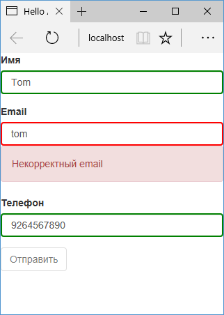

# Reactive Forms

В прошлых темах был описан подход `Template-Driven`, который концентрировался вокруг шаблона компонента: для работы с формой и ее элементами в шаблоне компонента к элементам html применялись директивы `NgModel` и `NgForm`, правила валидации задавались в тегах элементов с помощью атрибутов `required` и `pattern`. Но есть альтернативный подход — использование **реактивных форм** (Reactive Forms). Рассмотрим, в чем он заключается.

При подходе Reactive Forms для формы создается набор объектов `FormGroup` и `FormControl`. Сама форма и ее подсекции представляют класс `FormGroup`, а отдельные элементы ввода — класс `FormControl`. Например, базовое создание формы:

```typescript
myForm: FormGroup = new FormGroup()
```

Добавляем в форму элементы:

```typescript
myForm: FormGroup = new FormGroup({
  userName: new FormControl(),
  userEmail: new FormControl(),
})
```

Здесь определено два элемента: `userName` и `userEmail`.

Объект [FormControl](https://angular.io/api/forms/FormControl) может иметь различные формы определения. В частности, в качестве первого параметра можно передавать значение по умолчанию для элемента, а в качестве второго параметра — набор валидаторов:

```typescript
myForm: FormGroup = new FormGroup({
  userName: new FormControl('Tom', Validators.required),
  userEmail: new FormControl('', [
    Validators.required,
    Validators.pattern(
      '[a-zA-Z_]+@[a-zA-Z_]+?.[a-zA-Z]{2,3}'
    ),
  ]),
})
```

Здесь к элементу `userEmail` применяется валидатор `Validators.required`, который требует обязательного наличия значения. Если валидаторов несколько, то они заключаются в массив. Все встроенные валидаторы можно посмотреть в [документации](https://angular.io/api/forms/Validators).

Для привязки объекта `myForm` к конкретному элементу формы применяется атрибут `formGroup`:

```html
<form [formGroup]="myForm"></form>
```

Кроме того, необходимо связать объекты `FormControl` с элементами ввода с помощью атрибута `formControlName`:

```html
<input name="name" formControlName="userName" />
```

Данный элемент будет связан с объектом `"userName": new FormControl("Tom")`.

Теперь рассмотрим, как эти объекты будут взаимодействовать с шаблоном компонента. Для этого определим следующий компонент:

```typescript
import { Component } from '@angular/core'
import {
  FormGroup,
  FormControl,
  Validators,
} from '@angular/forms'

@Component({
  selector: 'my-app',
  styles: [
    `
      input.ng-touched.ng-invalid {
        border: solid red 2px;
      }
      input.ng-touched.ng-valid {
        border: solid green 2px;
      }
    `,
  ],
  template: `
    <form
      [formGroup]="myForm"
      novalidate
      (ngSubmit)="submit()"
    >
      <div class="form-group">
        <label>Имя</label>
        <input
          class="form-control"
          name="name"
          formControlName="userName"
        />

        <div
          class="alert alert-danger"
          *ngIf="
            myForm.controls['userName'].invalid &&
            myForm.controls['userName'].touched
          "
        >
          Не указано имя
        </div>
      </div>
      <div class="form-group">
        <label>Email</label>
        <input
          class="form-control"
          name="email"
          formControlName="userEmail"
        />

        <div
          class="alert alert-danger"
          *ngIf="
            myForm.controls['userEmail'].invalid &&
            myForm.controls['userEmail'].touched
          "
        >
          Некорректный email
        </div>
      </div>
      <div class="form-group">
        <label>Телефон</label>
        <input
          class="form-control"
          name="phone"
          formControlName="userPhone"
        />
      </div>
      <div class="form-group">
        <button
          class="btn btn-default"
          [disabled]="myForm.invalid"
        >
          Отправить
        </button>
      </div>
    </form>
  `,
})
export class AppComponent {
  myForm: FormGroup
  constructor() {
    this.myForm = new FormGroup({
      userName: new FormControl('Tom', Validators.required),
      userEmail: new FormControl('', [
        Validators.required,
        Validators.pattern(
          '[a-zA-Z_]+@[a-zA-Z_]+?.[a-zA-Z]{2,3}'
        ),
      ]),
      userPhone: new FormControl(),
    })
  }

  submit() {
    console.log(this.myForm)
  }
}
```

Для отображения ошибок валидации здесь используется блоки `div`, в которых определены выражения типа

```
*ngIf="myForm.controls['userName'].invalid && myForm.controls['userName'].touched">
```

С помощью выражений `myForm.controls['userName']` мы можем обратиться к нужному элементу формы и получить его состояние или значение. В данном случае если значение поля ввода невалидно, и при этом поле ввода уже получало фокус, то отображается ошибка валидации.

Но чтобы все это заработало, необходимо импортировать модуль `ReactiveFormsModule`. Для этого изменим модуль приложения `AppModule`:

```typescript
import { NgModule } from '@angular/core'
import { BrowserModule } from '@angular/platform-browser'
import { FormsModule } from '@angular/forms'
import { AppComponent } from './app.component'

import { ReactiveFormsModule } from '@angular/forms'
@NgModule({
  imports: [
    BrowserModule,
    FormsModule,
    ReactiveFormsModule,
  ],
  declarations: [AppComponent],
  bootstrap: [AppComponent],
})
export class AppModule {}
```



## Определение валидаторов

Кроме использования встроенных валидаторов мы также можем определять свои валидаторы. К примеру, определим в классе компонента валидатор:

```typescript
export class AppComponent {
  myForm: FormGroup
  constructor() {
    this.myForm = new FormGroup({
      userName: new FormControl('Tom', [
        Validators.required,
        this.userNameValidator,
      ]),
      userEmail: new FormControl('', [
        Validators.required,
        Validators.pattern(
          '[a-zA-Z_]+@[a-zA-Z_]+?.[a-zA-Z]{2,3}'
        ),
      ]),
      userPhone: new FormControl(),
    })
  }
  submit() {
    console.log(this.myForm)
  }
  // валидатор
  userNameValidator(
    control: FormControl
  ): { [s: string]: boolean } {
    if (control.value === 'нет') {
      return { userName: true }
    }
    return null
  }
}
```

По сути валидатор представляет обычный метод — в данном случае метод `userNameValidator`. В качестве параметра он принимает элемент формы, к которому этот валидатор применяется, а на выходе возвращает объект, где ключ — строка, а значение равно `true`.

В данном случае проверяем, если значение равно строке "нет", то возвращаем объект `{"userName": true}`. Значение `true` указывает, что элемент формы не прошел валидацию. Если же все нормально, то возвращаем `null`.

Затем этот валидатор добавляется к элементу:

```
"userName": new FormControl("Tom", [Validators.required, this.userNameValidator])
```

И в случае если в поле для ввода имени будет введено значение "нет", то данное поле не пройдет валидацию:


## Массивы элементов и FormArray

Некоторые элементы на форме могут относиться к одному и тому же признаку. Например, в анкете пользователя могут попросить указать номера телефоно, которыми он владеет. Их может быть несколько, но они будут представлять один и тот же признак — "номера телефонов". То есть логично было бы объединить все поля для ввода номеров телефонов в массив. И в Angular 2 мы легко можем реализовать подобную возможность с помощью класса `FormArray`.

Итак, изменим код компонента `AppComponent` следующим образом:

```typescript
import { Component } from '@angular/core'
import {
  FormGroup,
  FormControl,
  Validators,
  FormArray,
} from '@angular/forms'

@Component({
  selector: 'my-app',
  styles: [
    `
      input.ng-touched.ng-invalid {
        border: solid red 2px;
      }
      input.ng-touched.ng-valid {
        border: solid green 2px;
      }
    `,
  ],
  template: `
    <form
      [formGroup]="myForm"
      novalidate
      (ngSubmit)="submit()"
    >
      <div class="form-group">
        <label>Имя</label>
        <input
          class="form-control"
          name="name"
          formControlName="userName"
        />

        <div
          class="alert alert-danger"
          *ngIf="
            myForm.controls['userName'].invalid &&
            myForm.controls['userName'].touched
          "
        >
          Не указано имя
        </div>
      </div>
      <div class="form-group">
        <label>Email</label>
        <input
          class="form-control"
          name="email"
          formControlName="userEmail"
        />

        <div
          class="alert alert-danger"
          *ngIf="
            myForm.controls['userEmail'].invalid &&
            myForm.controls['userEmail'].touched
          "
        >
          Некорректный email
        </div>
      </div>
      <div formArrayName="phones">
        <div
          class="form-group"
          *ngFor="
            let phone of myForm.controls['phones'].controls;
            let i = index
          "
        >
          <label>Телефон</label>
          <input
            class="form-control"
            formControlName="{{ i }}"
          />
        </div>
      </div>
      <div class="form-group">
        <button
          class="btn btn-default"
          (click)="addPhone()"
        >
          Добавить телефон
        </button>
        <button
          class="btn btn-default"
          [disabled]="myForm.invalid"
        >
          Отправить
        </button>
      </div>
    </form>
  `,
})
export class AppComponent {
  myForm: FormGroup
  constructor() {
    this.myForm = new FormGroup({
      userName: new FormControl('Tom', [
        Validators.required,
      ]),
      userEmail: new FormControl('', [
        Validators.required,
        Validators.pattern(
          '[a-zA-Z_]+@[a-zA-Z_]+?.[a-zA-Z]{2,3}'
        ),
      ]),
      phones: new FormArray([
        new FormControl('+7', Validators.required),
      ]),
    })
  }
  addPhone() {
    ;(<FormArray>this.myForm.controls['phones']).push(
      new FormControl('+7', Validators.required)
    )
  }
  submit() {
    console.log(this.myForm)
  }
}
```

Теперь поля для ввода телефонных номеров представлют массив:

```
"phones": new FormArray([
        new FormControl("+7", Validators.required)
])
```

Массив или `FormArray` хранит набор объектов `FormControl`. И в данном случае добавляется один такой объект.

Чтобы можно было динамически при необходимости добавлять новые объекты, в классе компонента предусмотрен метод `addPhone()`:

```
addPhone(){
    (<FormArray>this.myForm.controls["phones"]).push(new FormControl("+7", Validators.required));
}
```

В этой сложной конструкции мы сначала получаем объект формы через выражение `this.myForm.controls["phones"]`, затем приводим его к типу `FormArray`. И далее как и в обычный массив добавляем через метод `push` новый элемент.

В коде html предусматриваем вывод объектов на форму с помощью директивы `ngFor`:

```html
<div formArrayName="phones">
  <div
    class="form-group"
    *ngFor="let phone of myForm.controls['phones'].controls; let i = index"
  >
    <label>Телефон</label>
    <input class="form-control" formControlName="{{i}}" />
  </div>
</div>
```

При этом контейнер всех элементов ввода имеет директиву `formArrayName="phones"`. А каждый элемент в качестве названия принимает его текущий индекс: `formControlName="{{i}}"`.

А кнопка "Добавить телефон" позволяет добавить на форму новое поле для ввода еще одного телефонного номера:


## FormBuilder

Класс `FormBuilder` представляет альтернативный подход к созданию форм:

```typescript
import { Component } from '@angular/core'
import {
  FormGroup,
  FormControl,
  Validators,
  FormArray,
  FormBuilder,
} from '@angular/forms'

@Component({
  selector: 'my-app',
  styles: [
    `
      input.ng-touched.ng-invalid {
        border: solid red 2px;
      }
      input.ng-touched.ng-valid {
        border: solid green 2px;
      }
    `,
  ],
  template: `
    <form
      [formGroup]="myForm"
      novalidate
      (ngSubmit)="submit()"
    >
      <div class="form-group">
        <label>Имя</label>
        <input
          class="form-control"
          name="name"
          formControlName="userName"
        />

        <div
          class="alert alert-danger"
          *ngIf="
            myForm.controls['userName'].invalid &&
            myForm.controls['userName'].touched
          "
        >
          Не указано имя
        </div>
      </div>
      <div class="form-group">
        <label>Email</label>
        <input
          class="form-control"
          name="email"
          formControlName="userEmail"
        />

        <div
          class="alert alert-danger"
          *ngIf="
            myForm.controls['userEmail'].invalid &&
            myForm.controls['userEmail'].touched
          "
        >
          Некорректный email
        </div>
      </div>
      <div formArrayName="phones">
        <div
          class="form-group"
          *ngFor="
            let phone of myForm.controls['phones'].controls;
            let i = index
          "
        >
          <label>Телефон</label>
          <input
            class="form-control"
            formControlName="{{ i }}"
          />
        </div>
      </div>
      <div class="form-group">
        <button
          class="btn btn-default"
          (click)="addPhone()"
        >
          Добавить телефон
        </button>
        <button
          class="btn btn-default"
          [disabled]="myForm.invalid"
        >
          Отправить
        </button>
      </div>
    </form>
  `,
})
export class AppComponent {
  myForm: FormGroup
  constructor(private formBuilder: FormBuilder) {
    this.myForm = formBuilder.group({
      userName: ['Tom', [Validators.required]],
      userEmail: [
        '',
        [
          Validators.required,
          Validators.pattern(
            '[a-zA-Z_]+@[a-zA-Z_]+?.[a-zA-Z]{2,3}'
          ),
        ],
      ],
      phones: formBuilder.array([
        ['+7', Validators.required],
      ]),
    })
  }
  addPhone() {
    ;(<FormArray>this.myForm.controls['phones']).push(
      new FormControl('+7', Validators.required)
    )
  }
  submit() {
    console.log(this.myForm)
  }
}
```

`FormBuilder` передается в качестве сервиса в конструктор. С помощью метода `group()` создается объект `FormGroup`. Каждый элемент передается в форму в виде обычного массива значений:

```
"userName": ["Tom", [Validators.required]]
```

Результат работы компонента будет аналогичным предыдущему.
