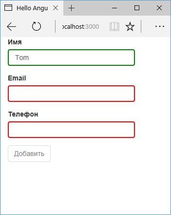

# Состояние модели и валидация

## Состояние модели

Применение директивы `ngModel` не только устанавливает привязку данных, но и позволяет отслеживать состояние элемента ввода. Для установки состояния Angular применяет к элементам ввода специальные классы CSS:

- Если элемент ввода еще не получал фокус, то устанавливается класс `ng-untouched`. Если же поле ввода уже получало фокус, то к нему применяется класс `ng-touched`. При этом получение фокуса не обязательно должно сопровождаться изменением значения в этом поле.
- Если первоначальное значение в поле ввода было изменено, то устанавливается класс `ng-dirty`. Если же значение не изменялось с момента загрузки страницы, то к элементу ввода применяется класс `ng-pristine`
- Если значение в поле ввода корректно, то применяется класс `ng-valid`. Если же значение некорректно, то применяется класс `ng-invalid`

Например, при запуске веб-страницы для элемента ввода:

```html
<input
  class="form-control"
  name="title"
  [(ngModel)]="title"
/>
```

Будет генерироваться следующая разметка html:

```html
<input
  class="form-control ng-untouched ng-pristine ng-valid"
  name="title"
  ng-reflect-name="title"
/>
```

## Валидация

Перед тем как отправить форму, нам надо удостовериться, что данная форма содержит корректные значения. Для проверки используется механизм валидации. В Angular 2 мы можем использовать валидацию HTML5, которая применяется в виде атрибутов:

- `required`: требует обязательного ввода значения
- `pattern`: задает регулярное выражение, которому должны соответствовать вводимые данные

Для использования валидации определим следующий компонент:

```typescript
import { Component } from '@angular/core'

export class User {
  name: string
  email: string
  phone: string
}

@Component({
  selector: 'my-app',
  template: `
    <div>
      <div class="form-group">
        <label>Имя</label>
        <input
          class="form-control"
          name="name"
          [(ngModel)]="user.name"
          #name="ngModel"
          required
        />
        <div
          [hidden]="name.valid || name.untouched"
          class="alert alert-danger"
        >
          Не указано имя
        </div>
      </div>
      <div class="form-group">
        <label>Email</label>
        <input
          class="form-control"
          name="email"
          [(ngModel)]="user.email"
          #email="ngModel"
          required
          pattern="[a-zA-Z_]+@[a-zA-Z_]+?.[a-zA-Z]{2,3}"
        />
        <div
          [hidden]="email.valid || email.untouched"
          class="alert alert-danger"
        >
          Некорректный email
        </div>
      </div>
      <div class="form-group">
        <label>Телефон</label>
        <input
          class="form-control"
          name="phone"
          [(ngModel)]="user.phone"
          #phone="ngModel"
          required
          pattern="[0-9]{10}"
        />
        <div
          [hidden]="phone.valid || phone.untouched"
          class="alert alert-danger"
        >
          Некорректный телефон
        </div>
      </div>
      <div class="form-group">
        <button class="btn btn-default" (click)="addUser()">
          Добавить
        </button>
      </div>
    </div>
  `,
})
export class AppComponent {
  user: User = new User()
  addUser() {
    console.log(this.user)
  }
}
```

Для работы с данными определен класс `User`. Каждое поле ввода связано с определенным свойством объекта `User`. И также для каждого поля определены правила валидации в виде атрибутов `required` и `pattern`. И рядом с каждым полем ввода определен специальный блок для вывода ошибки:

```html
<div
  [hidden]="email.valid || email.untouched"
  class="alert alert-danger"
>
  Некорректный email
</div>
```

Здесь проверяется валидность поля `email`. Для этого мы берем переменную `email`, которая представляет связанный с полем ввода объект `NgModel` (`#email="ngModel"`), и смотрим на свойства `valid` и `untouched` у этого объекта. Если хотя бы одно из этих свойств равно `true`, то атрибут `hidden` тоже равен `true`. А это значит, что блок `div` будет скрыт. То есть если поле для ввода `email` валидно, то блок скрывается. Иначе мы видим сообщение об ошибке.

В принципе для проверки корректности нам достаточно посмотреть на свойство `valid`. Однако не всегда может желательно сразу отображать ошибку при загрузке страницы. В данном же случае мы смотрим на валидность, если поле ввода уже получало фокус.

Для стилизации сообщений об ошибках применяются классы `bootstrap`:


В то же время несмотря на наличие ошибок валидации мы можем нажать на кнопку и выполнить метод `addUser()`, который обработает введенные данные. Однако поскольку данные некорректны, любая обработка будет бессмысленной. И в этом случае можно отключить кнопку. Для этого опять же можно применить проверку на валидность полей. Так, изменим код кнопки следующим образом:

```html
<button
  [disabled]="name.invalid || email.invalid || phone.invalid"
  class="btn btn-default"
  (click)="addUser()"
>
  Добавить
</button>
```

С помощью выражения `[disabled]="name.invalid || email.invalid || phone.invalid"` для атрибута `disabled` устанавливается значение `true`, то есть кнопка отключается, если хотя бы одно из полей не валидно.

## Стилизация ошибок валидации

Выше применялись стили `bootstrap` для стилизации отображения ошибок. Однако используя классы `ng-valid` и `ng-invalid`, мы можем задать дополнительные возможности по стилизации. В частности, изменим компонент следующим образом:

```typescript
import { Component } from '@angular/core'

export class User {
  name: string
  email: string
  phone: string
}

@Component({
  selector: 'my-app',
  styles: [
    `
      input.ng-touched.ng-invalid {
        border: solid red 2px;
      }
      input.ng-touched.ng-valid {
        border: solid green 2px;
      }
    `,
  ],
  template: `
    <div>
      <div class="form-group">
        <label>Имя</label>
        <input
          class="form-control"
          name="name"
          [(ngModel)]="user.name"
          #name="ngModel"
          required
        />
      </div>
      <div class="form-group">
        <label>Email</label>
        <input
          class="form-control"
          type="email"
          name="email"
          [(ngModel)]="user.email"
          #email="ngModel"
          required
          pattern="[a-zA-Z_]+@[a-zA-Z_]+?.[a-zA-Z]{2,3}"
        />
      </div>
      <div class="form-group">
        <label>Телефон</label>
        <input
          class="form-control"
          name="phone"
          [(ngModel)]="user.phone"
          #phone="ngModel"
          required
          pattern="[0-9]{10}"
        />
      </div>
      <div class="form-group">
        <button
          [disabled]="
            name.invalid || email.invalid || phone.invalid
          "
          class="btn btn-default"
          (click)="addUser()"
        >
          Добавить
        </button>
      </div>
    </div>
  `,
})
export class AppComponent {
  user: User = new User()
  addUser() {
    console.log(this.user)
  }
}
```



## Валидация email в Angular 4

Так как валидация `email` является довольно распространенной задачей, то начиная с версии Angular 4 был добавлен специальный валидатор `email`:

```html
<div class="form-group">
  <label>Email</label>
  <input
    class="form-control"
    type="email"
    name="email"
    [(ngModel)]="user.email"
    #email="ngModel"
    required
    email
  />
</div>
```
