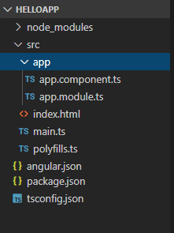
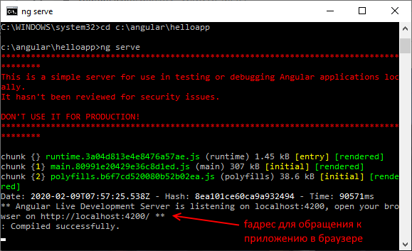
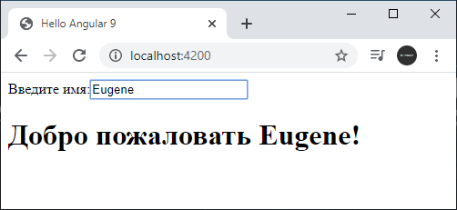

# Что такое Angular. Начало работы с фреймворком

Angular представляет фреймворк от компании Google для создания клиентских приложений. Прежде всего он нацелен на разработку SPA-решений (Single Page Application), то есть одностраничных приложений. В этом плане Angular является наследником другого фреймворка AngularJS. В то же время Angular это не новая версия AngularJS, а принципиально новый фреймворк.

Angular предоставляет такую функциональность, как двустороннее связывание, позволяющее динамически изменять данные в одном месте интерфейса при изменении данных модели в другом, шаблоны, маршрутизация и так далее.

Одной из ключевых особенностей Angular является то, что он использует в качестве языка программирования TypeScript.

Но мы не ограничены языком TypeScript. При желании можем писать приложения на Angular с помощью таких языков как Dart или JavaScript. Однако TypeScript все таки является основным языком для Angular.

Официальный репозиторий фреймворка на гитхабе: [https://github.com/angular/angular](https://github.com/angular/angular). Там вы можете найти сами исходные файлы, а также некоторую дополнительную информацию.

## Начало работы c Angular

Для работы с Angular необходимо установить сервер Node.js и пакетный менеджер npm, если они отсутствуют на рабочей машине. Для установки можно использовать [программу установки node.js](https://nodejs.org/en/). Вместе с сервером она также установит и npm. При этом особого какого-то знания для работы с NodeJS и npm не требуется.

После установки необходимых инструментов создадим простейшее приложение. Для этого определим на жестком диске папку приложения. Путь она будет называться `helloapp`. В этой папке создадим новый файл `package.json` со следующим содержимым:

```json
{
  "name": "helloapp",
  "version": "1.0.0",
  "description": "First Angular 9 Project",
  "author": "Eugene Popov <metanit.com>",
  "scripts": {
    "dev": "webpack-dev-server --hot --open",
    "build": "webpack"
  },
  "dependencies": {
    "@angular/common": "~9.0.0",
    "@angular/compiler": "~9.0.0",
    "@angular/core": "~9.0.0",
    "@angular/forms": "~9.0.0",
    "@angular/platform-browser": "~9.0.0",
    "@angular/platform-browser-dynamic": "~9.0.0",
    "@angular/router": "~9.0.0",
    "rxjs": "^6.5.4",
    "zone.js": "^0.10.2"
  },
  "devDependencies": {
    "@angular-devkit/build-angular": "~0.900.1",
    "@angular/cli": "~9.0.1",
    "@angular/compiler-cli": "~9.0.0",
    "@types/node": "^12.11.1",
    "typescript": "~3.7.5"
  }
}
```

Данный файл устанавливает пакеты и зависимости, которые будут использоваться проектом. В секции `dependencies` в основном определяются пакеты angular, которые необходимы приложению для работы. В секции `devDependencies` прописаны только те пакеты, которые будут использоваться для разработки. В частности, это пакеты для работы с языком typescript (так как мы будем писать код приложения на языке TypeScript), а также пакеты, необходимые для сборки приложения в один файл с помощью сборщика webpack.

Затем откроем командную строку (терминал) и перейдем в ней к папке проекта с помощью команды `cd`:

```bash
C:\WINDOWS\system32>cd C:\angular2\helloapp
```

И затем выполним команду `npm install`, которая установит все необходимые модули:

```bash
C:\angular2\helloapp>npm install
```

После выполнения этой команды в папке проекта должна появиться подпапка `node_modules`, которая содержит все используемые зависимости и пакеты.

Затем создадим в папке проекта подпапку, которую назовем `src` — она будет содержать все исходные файлы. И далее в папке `src` создадим подкаталог `app`.

## Создание компонента Angular

Компоненты представляют основные строительные блоки приложения Angular. Каждое приложение Angular имеет как минимум один компонент. Поэтому создадим в папке `src/app` новый файл, который назовем `app.component.ts` и в котором определим следующий код компонента:

```typescript
import { Component } from '@angular/core'

@Component({
  selector: 'my-app',
  template: `
    <label>Введите имя:</label>
    <input [(ngModel)]="name" placeholder="name" />
    <h1>Добро пожаловать {{ name }}!</h1>
  `,
})
export class AppComponent {
  name = ''
}
```

В начале файла определяется директива `import`, которая импортирует функциональность модуля `@angular/core`, предоставляя доступ к функции декоратора `@Component`.

Далее собственно идет функция-декоратор `@Component`, которая ассоциирует метаданные с классом компонента `AppComponent`. В этой функции, во-первых, определяется параметр `selector` или селектор `css` для HTML-элемента, который будет представлять компонент. Во-вторых, здесь определяется параметр `template` или шаблон, который указывает, как надо визуализировать компонент. В этом шаблоне задана двусторонняя привязка с помощью выражений `[(ngModel)]="name"` и `{{name}}` к некоторой модели `name`.

И в конце экспортируется класс компонента `AppComponent`, в котором как раз определяется модель `name` — в данном случае это пустая строка.

## Создание модуля приложения

Приложение Angular состоит из модулей. Модульная структура позволяет легко подгружать и задействовать только те модули, которые непосредственно необходимы. И каждое приложение имеет как минимум один корневой модуль. Поэтому создадим в папке `src/app` новый файл, который назовем `app.module.ts` со следующим содержимым:

```typescript
import { NgModule } from '@angular/core'
import { BrowserModule } from '@angular/platform-browser'
import { FormsModule } from '@angular/forms'
import { AppComponent } from './app.component'
@NgModule({
  imports: [BrowserModule, FormsModule],
  declarations: [AppComponent],
  bootstrap: [AppComponent],
})
export class AppModule {}
```

Этот модуль, который в данном случае называется `AppModule`, будет входной точкой в приложение.

С помощью директив `import` здесь импортируется ряд нужных нам модулей. Прежде всего, это модуль `NgModule`. Для работы с браузером также требуется модуль `BrowserModule`. Так как наш компонент использует элемент `input` или элемент формы, то также подключаем модуль `FormsModule`. И далее импортируется созданный ранее компонент.

## Запуск приложения

Теперь нам надо указать Angular, как запускать наше приложение. Для этого создадим в папке `src` (на уровень выше, чем расположены файлы `app.component.ts` и `app.module.ts`) файл `main.ts` со следующим содержимым:

```typescript
import { platformBrowserDynamic } from '@angular/platform-browser-dynamic'
import { AppModule } from './app/app.module'
const platform = platformBrowserDynamic()
platform.bootstrapModule(AppModule)
```

Этот код инициализирует платформу, которая запускает приложение, и затем использует эту платформу для загрузки модуля `AppModule`.

Также в папке `src` определим еще один файл, который назовем `polyfills.ts` со следующим кодом:

```typescript
import 'zone.js/dist/zone' // zone используется angular
```

Данный файл определяет полифилы — инструменты, которые необходимы для поддержки приложения на Angular старыми браузерами.

## Создание главной страницы

Далее определим в папке `src` главную страницу `index.html` приложения:

```html
<!DOCTYPE html>
<html>
  <head>
    <meta charset="utf-8" />
    <title>Hello Angular 9</title>
  </head>
  <body>
    <my-app>Загрузка...</my-app>
  </body>
</html>
```

А в элементе `body` определен элемент `<my-app>`, в который собственно и будет загружаться приложение.

## Определение конфигурации

Поскольку для определения кода приложения применяется язык TypeScript, поэтому также создадим в корневой папке проекта новый файл `tsconfig.json`:

```javascript
{
  "compileOnSave": false,
  "compilerOptions": {
    "baseUrl": "./",
    "sourceMap": true,
    "declaration": false,
    "downlevelIteration": true,
    "experimentalDecorators": true,
    "module": "esnext",
    "moduleResolution": "node",
    "target": "es2015",
    "typeRoots": [
      "node_modules/@types"
    ],
    "lib": [
      "es2018",
      "dom"
    ]
  },
    "files": [
        "src/main.ts",
        "src/polyfills.ts"
    ],
    "include": [
        "src/**/*.d.ts"
    ]
}
```

Данный файл определяет настройки для компилятора TypeScript. Опция "`compilerOptions`" устанавливает параметры компиляции. А опция "`files`" определяет компилируемые файлы. В нашем случае это файл приложения — `main.ts`, который подтягивает все остальные файлы приложения, и файл полифилов `polyfills.ts`.

## Angular.json

Для компиляции приложения мы будем использовать Angular CLI, поэтому нам надо описать поведение CLI с помощью файла `angular.json`. Итак, добавим в корневую папку проекта новый файл `angular.json` и определим в нем следующее содержимое:

```ts
{
  "version": 1,
  "projects": {
    "helloapp": {
      "projectType": "application",
      "root": "",
      "sourceRoot": "src",
      "architect": {
        "build": {
          "builder": "@angular-devkit/build-angular:browser",
          "options": {
            "outputPath": "dist/helloapp",
            "index": "src/index.html",
            "main": "src/main.ts",
            "polyfills": "src/polyfills.ts",
            "tsConfig": "tsconfig.json",
            "aot": true
          }
        },
        "serve": {
          "builder": "@angular-devkit/build-angular:dev-server",
          "options": {
            "browserTarget": "helloapp:build"
          }
        }
      }
    }},
  "defaultProject": "helloapp"
}
```

Вкратце пройдемся по структуре файле. Вначале определяется параметр `version`. Он определяет версию конфигурации проекта.

Далее идет секция `projects`, которая определяет настройки для каждого проекта. В нашем случае у нас только один проект, который называется по названию каталога проекта — `helloapp`.

Проект определяет следующие опции:

- `projectType`: тип проекта. Значение "`application`" указывает, что проект будет представлять приложение, которое можно будет запускать в браузере
- `root`: указывает на папку файлов проекта относительно рабочей среды. Пустое значение соответствует корневой папке проекта, так как в данном случае рабочая среда и каталог проекта совпадают
- `sourceRoot`: определяет корневую папку файлов с исходным кодом. В нашем случае это папка `src`, где собственно определены все файлы приложения
- `architect`: задает настройки для построения проекта. В файле `package.json` определены команды `build` и `serve`, и для каждой из этих команд в секции `architect` заданы свои настройки.

Для каждой команды задается параметр `builder`, который определяет инструмент для построения проекта. Так, для команды "`build`" задано значение "`@angular-devkit/build-angular:browser`" — данный билдер для построения использует сборщик пакетов webpack. А для команды "`serve`" задано значение "`@angular-devkit/build-angular:dev-server`" — данный билдер запускает веб-сервер и развертывает на нем скомпилированное приложение.

Параметр `options` задает параметры построения файлов. Для команды "`build`" здесь определены следующие опции:

- `outputPath`: путь, по которому будет публиковаться скомпилированное приложение
- `index`: путь к главной странице приложения
- `main`: путь к главному файлу приложения, где собственно запускается приложение Angular
- `polyfills`: путь к файлу полифилов
- `tsConfig`: путь к файлу конфигурации TypeScript
- `aot`: указывает, будет ли использоваться компиляция AOT (Ahead-Of-Head) (предварительная компиляция перед выполнением). В данном случае значение `true` означает, что она используется

Для команды "`serve`" указана только одна опцияя — `browserTarget`, которая содержит ссылку на конфигурацию для команды `build` — "`helloapp:build`". То есть по сути эта команда использует ту же конфигурацию, что и команда `build`.

Последняя опция `defaultProject` указывает на проект по умолчанию. В данном случае это наш единственный проект.

Если мы используем TypeScript для работы с Angular и Angular CLI для компиляции, то эти файлы `package.json`, `tsconfig.json` и `angular.json` фактически будут присутствовать в каждом проекте. И их можно переносить из проекта в проект с минимальными изменениями. Например, в файле `angular.json` вместо названия проекта "`helloapp`" будет соответствующее название проекта. В файле `package.json` можно будет задать какие-то другие версии пакетов, если предыдущие версии устарели. Можно будет изменить название проекта, версию. Можно подправить настройки TypeScript или Angular CLI, но в целом общая организация будет той же.

В итоге у нас получится следующая структура проекта:



## Запуск проекта

И теперь, когда все готово, мы можем запустить проект. Для этого в командной строке (терминале) перейдем к папке проекта с помощью команды `cd` и затем выполним команду `ng serve:`

```
C:\WINDOWS\system32>cd C:\angular\helloapp
C:\angular\helloapp>ng serve --open
```



Консольный вывод проинформирует нас, какие файлы какого размера созданы. Кроме того, мы сможем увидеть адрес, по которому запущен тестовый веб-сервер — по умолчанию это "`http://localhost:4200/`". Если мы передаем команде флаг `--open`, как в случае выше, то Angular CLI автоматически открывае браузер с запущенным приложением. И мы можем обратиться к приложению:



Введем в текстовое поле какое-нибудь имя, и оно тут же отобразится в заголовке.

Важно отметить, что пока приложение запущено, мы можем поменять код, и Angular CLI почти моментально перекомпилирует и перезапустит приложение.
