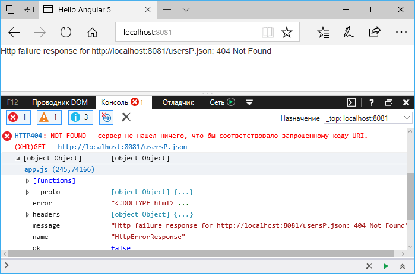

# Обработка ошибок

При работе с сетью и http нередко могут происходить ошибки, например, в момент запроса сеть стала недоступна, неправильно указан адрес и соответственно не найден ресурс, либо доступ к ресурсу ограничен, либо другие ошибки. **Перехват ошибок** позволит выяснить проблему и каким-то образом обработать их, например, вывести пользователю сообщение об ошибке.

Например, изменим код компонента `AppComponent`:

```typescript
import { Component, OnInit } from '@angular/core'
import { HttpService } from './http.service'
import { User } from './user'

@Component({
  selector: 'my-app',
  template: `
    <div>{{ error }}</div>
    <ul>
      <li *ngFor="let user of users">
        <p>Имя пользователя: {{ user?.name }}</p>
        <p>Возраст пользователя: {{ user?.age }}</p>
      </li>
    </ul>
  `,
  providers: [HttpService],
})
export class AppComponent implements OnInit {
  users: User[] = []
  error: any
  constructor(private httpService: HttpService) {}

  ngOnInit() {
    this.httpService.getUsers().subscribe(
      (data) => (this.users = data),
      (error) => {
        this.error = error.message
        console.log(error)
      }
    )
  }
}
```

Метод `subscribe()` в качестве второго параметра принимает обработчик, который вызывается в случае возникновения ошибки. В этом обработчике мы можем получить ошибку и обработать ее. Ошибка собственно представляет объект, из которого мы можем получить ряд данных. В частности, свойство `message` позволяет получить сообщение об ошибке, а свойство `statusCode` — статусный код ответа. И в данном случае в компоненте определена переменная для хранения сообщения об ошибке. И в шаблоне эта переменная выводится на веб-страницу. И например, при обащении к несуществующему файлу `json` мы получим следующую ошибку:



Кроме того, для перехвата ошибок к объекту `Observable`, который является результатом запроса, можно использовать функцию `catchError()`. Так, возьмем код сервиса из прошлой темы и добавим к нему обработку ошибок:

```typescript
import { Injectable } from '@angular/core'
import { HttpClient } from '@angular/common/http'
import { User } from './user'
import { Observable, throwError } from 'rxjs'
import { map, catchError } from 'rxjs/operators'

@Injectable()
export class HttpService {
  constructor(private http: HttpClient) {}

  getUsers(): Observable<User[]> {
    return this.http.get('usersP.json').pipe(
      map((data) => {
        let usersList = data['usersList']
        return usersList.map(function (user: any) {
          return { name: user.userName, age: user.userAge }
        })
      }),
      catchError((err) => {
        console.log(err)
        return throwError(err)
      })
    )
  }
}
```

Для имитации исключения здесь передается заведомо несуществующий адрес `usersP.json`. Для обработки ошибок в метод `pipe()` передается в качестве второго параметра функция для обработки ошибок. В качестве подобной функции используется функция `catchError()`. Она принимает объект ошибки, который затем выводится на консоль. С помощью вывода на консоль мы можем исследовать объект. Это тот же объект, который мы выше получаем в `AppComponent` в методе `subscribe`. С помощью метода `throwError()` возвращается результат — новый объект `Observable`, который содержит информацию об ошибке.
