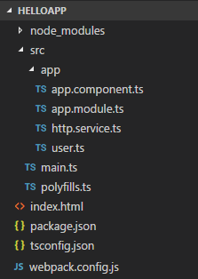
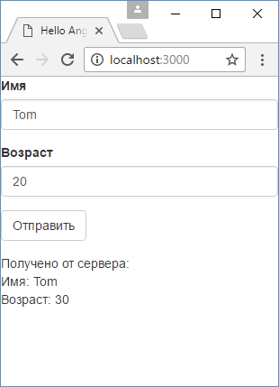

# POST-запросы

Кроме GET-запросов Angular позволяет отправлять остальные типы запросов: `POST`, `PUT`, `DELETE`. Рассмотрим, как выполнять POST-запросы.

Пусть у нас есть следующая структура проекта:



В файле `user.ts` определен класс `User`, который представляет отправляемые и получаемые данные:

```typescript
export class User {
  name: string
  age: number
}
```

Для тестирования обработки на сервере можно определить код, который получает post-запрос, каким-то образом обрабатывает и возвращает результат. Например, если применяется PHP, можно взять следующий скрипт:

```php
<?php
header('Access-Control-Allow-Origin: *');
header('Access-Control-Allow-Methods: GET, PUT, POST, DELETE, OPTIONS');
header('Access-Control-Allow-Headers: Origin, Content-Type, X-Auth-Token , Authorization');

$user = json_decode(file_get_contents('php://input'), true);

if(isset($user['name']) && isset($user['age']))
{
    $user['age'] = $user['age']+10;
    echo json_encode($user);
}
else
{
    echo "веденные данные некорректны";
}
?>
```

Если применяется ASP.NET WEB API, можно определить следующий контроллер:

```c#
using System.Web.Http;
using Newtonsoft.Json;
using Newtonsoft.Json.Serialization;
using System.Web.Http.Cors;

namespace TestAngularApp.Controllers
{
    [EnableCors(origins: "*", headers: "*", methods: "*")]
    public class ValuesController : ApiController
    {
        public IHttpActionResult Post([FromBody]User user)
        {
            if (user != null)
                user.Age += 10;

            return Json(user,
                new JsonSerializerSettings
                {
                    ContractResolver = new CamelCasePropertyNamesContractResolver()
                });
        }
    }
    public class User
    {
        public string Name { get; set; }
        public int Age { get; set; }
    }
}
```

Если используется Web API, то на стороне сервера надо подключить CORS.

Для имитации обработки в обоих случаях к возрасту пользователя добавляется число 10.

Можно взять какую-то другую технологию сервера.

Далее в файле `http.service.ts` определим сервис для отправки данных:

```typescript
import { Injectable } from '@angular/core'
import { HttpClient } from '@angular/common/http'
import { User } from './user'

@Injectable()
export class HttpService {
  constructor(private http: HttpClient) {}

  //http://localhost:60489/Home/PostUser  ASP.NET MVC 5
  //http://localhost:8080/angular/setUser.php     PHP
  // http://localhost:60820/api/values        ASP NET Wep API 2
  postData(user: User) {
    const body = { name: user.name, age: user.age }
    return this.http.post(
      'http://localhost:60820/api/values',
      body
    )
  }
}
```

Здесь определен метод `postUser`, который получает для отправки объект `User`. Сами отправляемые данные представляют объект `body`. Для отправки применяется метод `http.post()`, в который передается адрес сервера и отправляемый объект.

При отправке запроса из другого домена опять же следует не забывать про ограничения кроссдоменных запросов. Поэтому для тестирования вне зависимости от технологии сервера, для серверного приложения должна быть включена функциональность CORS. Иначе наше приложение на Angular не сможет получить результат обработки.

Применим сервис в коде компонента:

```typescript
import { Component } from '@angular/core'
import { HttpService } from './http.service'
import { User } from './user'

@Component({
  selector: 'my-app',
  template: `
    <div class="form-group">
      <label>Имя</label>
      <input
        class="form-control"
        name="username"
        [(ngModel)]="user.name"
      />
    </div>
    <div class="form-group">
      <label>Возраст</label>
      <input
        class="form-control"
        type="number"
        name="age"
        [(ngModel)]="user.age"
      />
    </div>
    <div class="form-group">
      <button
        class="btn btn-default"
        (click)="submit(user)"
      >
        Отправить
      </button>
    </div>
    <div *ngIf="done">
      <div>Получено от сервера:</div>
      <div>Имя: {{ receivedUser.name }}</div>
      <div>Возраст: {{ receivedUser.age }}</div>
    </div>
  `,
  providers: [HttpService],
})
export class AppComponent {
  user: User = new User() // данные вводимого пользователя

  receivedUser: User // полученный пользователь
  done: boolean = false
  constructor(private httpService: HttpService) {}
  submit(user: User) {
    this.httpService.postData(user).subscribe(
      (data: User) => {
        this.receivedUser = data
        this.done = true
      },
      (error) => console.log(error)
    )
  }
}
```

В шаблоне определена форма ввода. По нажатию на кнопку данные отправляются на сервер, а полученный ответ отображается под формой:



При получении данных с сервера следует учитывать регистр свойств. Как правило, для свойств класса в TypeScript применяется camelCase. В некоторых языках программирования, например, в C#, для названий свойств класса используется PascalCase. Поэтому либо на стороне сервера следует сериализовать объект, у которого названия свойств применяют camelCase, либо на стороне клиента при получении данных следует проводить постобработку результатов запроса для приведения их в нужную форму.

Выше предложенный способ подходит, если, скажем, нам надо отправлять не все данные из объекта `User` или если возникает необходимость вручную сконструировать отправляемый объект. Но также для отправки можно передать весь объект:

```typescript
import { Injectable } from '@angular/core'
import { HttpClient } from '@angular/common/http'
import { User } from './user'

@Injectable()
export class HttpService {
  constructor(private http: HttpClient) {}

  //http://localhost:60489/Home/PostUser  ASP.NET MVC
  //http://localhost:8080/angular/setUser.php     PHP
  // http://localhost:60820/api/values
  postData(user: User) {
    return this.http.post(
      'http://localhost:60820/api/values',
      user
    )
  }
}
```

Также при отправке мы можем устанавливать различные заголовки с помощью объекта `HttpHeaders`:

```typescript
import { Injectable } from '@angular/core'
import {
  HttpClient,
  HttpHeaders,
} from '@angular/common/http'
import { User } from './user'

@Injectable()
export class HttpService {
  constructor(private http: HttpClient) {}

  //http://localhost:60489/Home/PostUser  ASP.NET MVC
  //http://localhost:8080/angular/setUser.php     PHP
  // http://localhost:60820/api/post
  postData(user: User) {
    const myHeaders = new HttpHeaders().set(
      'Authorization',
      'my-auth-token'
    )

    return this.http.post(
      'http://localhost:60820/api/values',
      user,
      {
        headers: myHeaders,
      }
    )
  }
}
```
