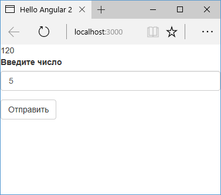

# Отправка данных в запросе

В прошлых темах были рассмотрены простейшие запросы к файлу `json`, который содержал некоторые данные. Однако нередко возникает необходимость обращаться с более сложными запросами к удаленному ресурсу, передавая ему некоторые параметры. Вначале рассмотрим, как передать параметры в get-запросе.

Допустим, на стороне сервера действует некоторый обработчик или скрипт, который принимает в качестве параметра некоторое число и вычисляет его факториал.

Например, в PHP мы могли бы определить следующий простейший скрипт `getFactorial.php`:

```php
<?php
if(isset($_GET['number']))
{
    $num = $_GET['number'];
    $result=1;
    for($i=1; $i<=$num; $i++){

        $result *= $i;
    }
    echo $result;
}
else
{
    echo "Введенные данные некорректны";
}
?>
```

В ASP.NET MVC это могло бы быть следующее действие контроллера:

```typescript
public class HomeController : Controller
{
    public ActionResult GetFactorial(int number)
    {
        int result = 1;
        for(int i =1; i<=number; i++)
        {
            result *= i;
        }

        return Json(result, JsonRequestBehavior.AllowGet);
    }
}
```

Это может быть какая-то другая технология сервера. Но вне зависимости от выбранной технологии следует учитывать ограничения на кроссдоменные запросы. В частности, если наше приложение на Angular запускается в одном домене, а сервер, обрабатывающий запросы, запущен на другом домене, то на сервере нам надо включить технологию CORS. В PHP для этого можно добавить заголовки в скрипт:

```php
<?php
header("Access-Control-Allow-Origin: *");
header("Access-Control-Allow-Methods: GET, PUT, POST, DELETE, OPTIONS");
header("Access-Control-Allow-Headers: Origin, Content-Type, X-Auth-Token , Authorization");

// остальное содержимое скрипта
```

В ASP.NET MVC это может быть добавление в файл конфигурации `web.config` следующего узла:

```xml
<system.webServer>
  <httpProtocol>
    <customHeaders>
      <clear />
      <add name="Access-Control-Allow-Origin" value="*" />
      <add
        name="Access-Control-Allow-Headers"
        value="Origin, X-Requested-With, Content-Type, Accept"
      />
      <add name="Access-Control-Allow-Methods" value="*" />
    </customHeaders>
  </httpProtocol>
  <!-- остальное содержимое узла system.webServer -->
</system.webServer>
```

В других технологиях могут применяться другие способы добавления CORS.

Для отправки запроса из Angular определим следующий сервис:

```typescript
import { Injectable } from '@angular/core'
import { HttpClient } from '@angular/common/http'

@Injectable()
export class HttpService {
  constructor(private http: HttpClient) {}

  //http://localhost:60489/Home/GetFactorial?number=  ASP.NET MVC
  //http://localhost:8080/angular/getFactorial.php?number=    PHP
  getFactorial(num: number) {
    return this.http.get(
      'http://localhost:60489/Home/GetFactorial?number=' +
        num
    )
  }
}
```

Поскольку данные передаются через запрос `GET`, то мы можем конкатенировать нужное число со строкой запроса.

И определим код компонента:

```typescript
import { Component, OnInit } from '@angular/core'
import { HttpService } from './http.service'
import { User } from './user'

@Component({
  selector: 'my-app',
  template: `
    <div *ngIf="done">{{ factorial }}</div>
    <div class="form-group">
      <label>Введите число</label>
      <input
        class="form-control"
        type="number"
        name="factorial"
        [(ngModel)]="num"
      />
    </div>
    <div class="form-group">
      <button class="btn btn-default" (click)="submit(num)">
        Отправить
      </button>
    </div>
  `,
  providers: [HttpService],
})
export class AppComponent {
  factorial: number
  done: boolean = false
  constructor(private httpService: HttpService) {}
  submit(num: number) {
    this.httpService
      .getFactorial(num)
      .subscribe((data: number) => {
        this.factorial = data
        this.done = true
      })
  }
}
```

По нажатию на кнопку отправляем введенное число на сервер, и поверх формы ввода отображаем полученный результат:



## HttpParams

Также для определения параметров в запросе можно использовать класс `HttpParams`. В частности, изменим сервис `HttpService` следующим образом:

```typescript
import { Injectable } from '@angular/core'
import {
  HttpClient,
  HttpParams,
} from '@angular/common/http'

@Injectable()
export class HttpService {
  constructor(private http: HttpClient) {}

  //http://localhost:60489/Home/GetFactorial?number=  ASP.NET MVC
  //http://localhost:8080/angular/getFactorial.php?number=    PHP
  getFactorial(num: number) {
    const params = new HttpParams().set(
      'number',
      num.toString()
    )
    return this.http.get(
      'http://localhost:60489/Home/GetFactorial',
      { params }
    )
  }
}
```

С помощью метода `set()` объекта `HttpParams` устанавливаются параметры, и затем этот объект передается в запрос. В итоге результат будет тот же, что и в примере выше.
