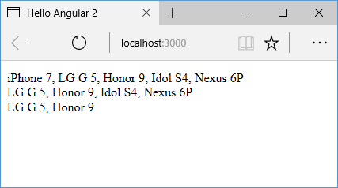

# Создание своих pipes

Если нам потребуется некоторая предобработка при выводе данных, мы можем для этой цели написать свои собственные `pipes`. К примеру, нам надо выводить факториал определенного числа. Для этого добавим в проект новый файл `factorial.pipe.ts`:

```typescript
import { Pipe, PipeTransform } from '@angular/core'

@Pipe({
  name: 'factorial',
})
export class FactorialPipe implements PipeTransform {
  transform(value: number, args?: any): number {
    if (value <= 0) return 0

    let result = 1
    for (let i = 1; i <= value; i++) {
      result = result * i
    }
    return result
  }
}
```

К кастомному `pipe` должен применяться декоратор `Pipe`. Этот декоратор определяет метаданные, в частности, название `pipe`, по которому он будет использоваться:

```
@Pipe({
    name: 'factorial'
})
```

Также класс реализует метод `transform()` интерфейса `PipeTransform`. Этот метод в качестве параметра принимает значение, к которому применяется `pipe`, а также опциональный набор параметров. А на выходе возвращается отформатированное значение.

Применим `FactorialPipe` в коде компонента:

```typescript
import { Component } from '@angular/core'

@Component({
  selector: 'my-app',
  template: `
    <div>
      Факториал числа {{ x }} равен {{ x | factorial }}
    </div>
  `,
})
export class AppComponent {
  x: number = 5
}
```

Но чтобы задействовать `FactorialPipe`, его надо добавить в главном модуле приложения `AppModule`:

```typescript
import { NgModule } from '@angular/core'
import { BrowserModule } from '@angular/platform-browser'
import { AppComponent } from './app.component'
import { FactorialPipe } from './factorial.pipe'

@NgModule({
  imports: [BrowserModule],
  declarations: [AppComponent, FactorialPipe],
  bootstrap: [AppComponent],
})
export class AppModule {}
```


## Передача параметров

Добавим еще один `pipe`, который будет принимать параметры. Пусть это будет класс, который из массива строк будет создавать строку, принимая начальный и конечный индексы для выборки данных из массива. Для этого добавим в проект новый файл `join.pipe.ts`, в котором определим следующее содержимое:

```typescript
import { Pipe, PipeTransform } from '@angular/core'

@Pipe({
  name: 'join',
})
export class JoinPipe implements PipeTransform {
  transform(array: any, start?: any, end?: any): any {
    let result = array
    if (start !== undefined) {
      if (end !== undefined) {
        result = array.slice(start, end)
      } else {
        result = array.slice(start, result.length)
      }
    }
    return result.join(', ')
  }
}
```

В метод `transform` класса `JoinPipe` первым параметром передается массив, второй необязательный параметр `start` представляет начальный индекс, с которого производится выборка, а третий параметр `end` — конечный индекс.

С помощью метода `slice()` получаем нужную часть массива, а с помощью метода `join()` соединяем массив в строку.

Применим `JoinPipe`:

```typescript
import { Component } from '@angular/core'

@Component({
  selector: 'my-app',
  template: `
    <div>{{ phones | join }}</div>
    <div>{{ phones | join: 1 }}</div>
    <div>{{ phones | join: 1:3 }}</div>
  `,
})
export class AppComponent {
  phones = [
    'iPhone 7',
    'LG G 5',
    'Honor 9',
    'Idol S4',
    'Nexus 6P',
  ]
}
```

Опять же подключим `JoinPipe` в модуле приложения:

```typescript
import { NgModule } from '@angular/core'
import { BrowserModule } from '@angular/platform-browser'
import { FormsModule } from '@angular/forms'
import { AppComponent } from './app.component'
import { FactorialPipe } from './factorial.pipe'
import { JoinPipe } from './join.pipe'
@NgModule({
  imports: [BrowserModule, FormsModule],
  declarations: [AppComponent, FactorialPipe, JoinPipe],
  bootstrap: [AppComponent],
})
export class AppModule {}
```

Результат работы:


