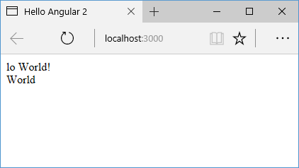
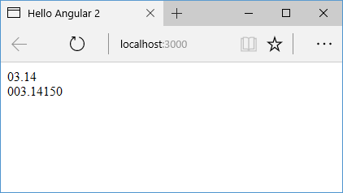

# Работа с pipes

**`Pipes`** представляют специальные инструменты, которые позволяют форматировать отображаемые значения. Например, нам надо вывести определенную дату:

```typescript
import { Component } from '@angular/core'

@Component({
  selector: 'my-app',
  template: `
    <div>Без форматирования: {{ myDate }}</div>
    <div>С форматированием: {{ myDate | date }}</div>
  `,
})
export class AppComponent {
  myDate = new Date(1961, 3, 12)
}
```

Здесь создается дата, которая дважды выводится в шаблоне. Во втором случае к дате применяется форматирование с помощью класса `DatePipe`.


## Встроенные pipes

В Angular 6 есть ряд встроенных `pipes`. Основные из них:

- `CurrencyPipe`: форматирует валюту
- `PercentPipe`: форматирует проценты
- `UpperCasePipe`: переводит строку в верхний регистр
- `LowerCasePipe`: переводит строку в нижний регистр
- `DatePipe`: форматирует дату
- `DecimalPipe`: задает формат числа
- `SlicePipe`: обрезает строку

При применении классов суффикс `Pipe` отбрасывается (за исключением `DecimalPipe` — для его применения используется название `number`):

```typescript
import { Component } from '@angular/core'

@Component({
  selector: 'my-app',
  template: `
    <div>{{ welcome | uppercase }}</div>
    <div>{{ welcome | lowercase }}</div>
    <div>{{ persentage | percent }}</div>
    <div>{{ persentage | currency }}</div>
  `,
})
export class AppComponent {
  welcome: string = 'Hello World!'
  persentage: number = 0.14
}
```


## Параметры в pipes

Pipes могут получать параметры. Например, пайп `SlicePipe`, который обрезает строку, может получать в качестве параметра, начальный и конечный индексы подстроки, которую надо вырезать:

```typescript
import { Component } from '@angular/core'

@Component({
  selector: 'my-app',
  template: `
    <div>{{ welcome | slice: 3 }}</div>
    <div>{{ welcome | slice: 6:11 }}</div>
  `,
})
export class AppComponent {
  welcome: string = 'Hello World!'
}
```

Все параметры в пайп передаются через двоеточие. В данном случае `slice:6:11` вырезает подстроку, начиная с 6 до 11 индекса. При этом, если начала выреза строки обязательно передавать, то конечный индекс необязателен. В этом случае в качестве конечного индекса выступает конец строки.



## Форматирование дат

`DatePipe` в качестве параметра может принимать шаблон даты:

```typescript
import { Component } from '@angular/core'

@Component({
  selector: 'my-app',
  template: `
    <div>{{ myDate | date: 'dd/MM/yyyy' }}</div>
  `,
})
export class AppComponent {
  myDate = Date.now()
}
```

## Форматирование чисел

`DecimalPipe` в качестве параметра принимает формат числа в виде шаблона:

```
{{ value | number [ : digitsInfo [ : locale ] ] }}
```

- `value`: само выводимое значение
- `digitsInfo`: строка в формате "minIntegerDigits.minFractionDigits-maxFractionDigits", где
  - `minIntegerDigits` — минимальное количество цифр в целой части
  - `minFractionDigits` — минимальное количество цифр в дробной части
  - `maxFractionDigits` — максимальное количество цифр в дробной части
- `locale`: код применяемой культуры

```typescript
import { Component } from '@angular/core'

@Component({
  selector: 'my-app',
  template: `
    <div>{{ pi | number: '2.1-2' }}</div>
    <div>{{ pi | number: '3.5-5' }}</div>
  `,
})
export class AppComponent {
  pi: number = 3.1415
}
```



## Форматирование валюты

`CurrencyPipe` может принимать ряд параметров:

```
{{ value | currency [ : currencyCode [ : display [ : digitsInfo [ : locale ] ] ] ] }}
```

- `value`: выводимая сумма
- `currencyCode`: код валюты согласно спецификации ISO 4217. Если не указан, то по умолчанию применяется USD
- `display`: указывает, как отображать символ валюты. Может принимать следующие значения:
  - `code`: отображает код валюты (например, USD)
  - `symbol` (значение по умолчанию): отображает символ валюты (например, \$)
  - `symbol-narrow`: некоторые страны используют в качестве символа валюты несколько символов, например, канадский доллар - CA$, данный параметр позволяет получить собственно символ валюты - $
  - `string`: отображает произвольную строку
- `digitsInfo`: формат числа, который применяется в DecimalPipe
- `locale`: код используемой локали

```typescript
import { Component } from '@angular/core'

@Component({
  selector: 'my-app',
  template: `
    <div>{{ money | currency: 'RUB':'code' }}</div>
    <div>{{ money | currency: 'RUB':'symbol-narrow' }}</div>
    <div>
      {{ money | currency: 'RUB':'symbol':'1.1-1' }}
    </div>
    <div>
      {{
        money
          | currency: 'RUB':'symbol-narrow':'1.1-1':'ru-RU'
      }}
    </div>
    <div>
      {{ money | currency: 'RUB':'тока седня по цене ' }}
    </div>
  `,
})
export class AppComponent {
  money: number = 23.45
}
```


## Цепочки pipes

Вполне возможно, что мы захотим применить сразу несколько `pipes` к одному значению, тогда мы можем составлять цепочки выражений, разделенные вертикальной чертой:

```typescript
import { Component } from '@angular/core'

@Component({
  selector: 'my-app',
  template: `
    <div>{{ message | slice: 6:11 | uppercase }}</div>
  `,
})
export class AppComponent {
  message = 'Hello World!'
}
```
