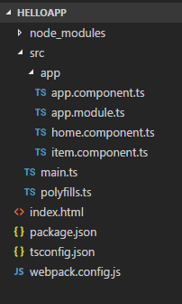
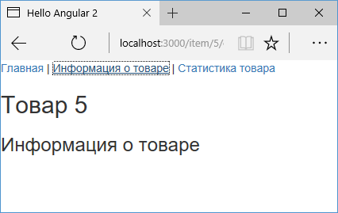

# Дочерние маршруты

В прошлых темах рассматривалась работа с обычными маршрутами. То есть система маршрутизации выбирает один из компонентов на основе `url` и помещает его в главный компонент `AppComponent`. Но что если выбранный компонент сам должен принимать в качестве внутреннего содержимого какой-то другой компонент в зависимости от запроса. В этому случае нам надо использовать дочерние маршруты (child route).

К примеру, возьмем проект из прошлых тем:



Добавим в папку `src/app` два простеньких компонента. Вначале добавим файл `item.details.component.ts`:

```typescript
import { Component } from '@angular/core'

@Component({
  selector: 'item-details',
  template: ` <h3>Информация о товаре</h3> `,
})
export class ItemDetailsComponent {}
```

И также добавим второй файл `item.stat.component.ts`:

```typescript
import { Component } from '@angular/core'

@Component({
  selector: 'item-stat',
  template: ` <h3>Статистика товара</h3> `,
})
export class ItemStatComponent {}
```

Итак, есть два компонента `ItemDetailsComponent` и `ItemStatComponent`, которые условно раскрывают различные стороны одно и того же товара. Логически они относятся к `ItemComponent`, который также связан с определенным товаром.

Мы бы могли определить прямые маршруты к этим компонентам типа:

```
{ path: 'item/:id/details', component: ItemDetailsComponent},
{ path: 'item/:id/stat', component: ItemStatComponent},
```

Где в данном случае `id` - также параметр маршрута, представляющий условный `id` товара.

Но такие маршруты будут миновать компонент `ItemComponent` и никак его не затрагивают. Поэтому нам надо использовать другую организацию маршрутов. Для этого изменим модуль `AppModule` следующим образом:

```typescript
import { NgModule } from '@angular/core'
import { BrowserModule } from '@angular/platform-browser'
import { Routes, RouterModule } from '@angular/router'
import { AppComponent } from './app.component'
import { HomeComponent } from './home.component'

import { ItemComponent } from './item.component'
import { ItemStatComponent } from './item.stat.component'
import { ItemDetailsComponent } from './item.details.component'

// определение дочерних маршрутов
const itemRoutes: Routes = [
  { path: 'details', component: ItemDetailsComponent },
  { path: 'stat', component: ItemStatComponent },
]

const appRoutes: Routes = [
  { path: 'item/:id', component: ItemComponent },
  {
    path: 'item/:id',
    component: ItemComponent,
    children: itemRoutes,
  },
  { path: '', component: HomeComponent },
]

@NgModule({
  imports: [BrowserModule, RouterModule.forRoot(appRoutes)],
  declarations: [
    AppComponent,
    HomeComponent,
    ItemComponent,
    ItemDetailsComponent,
    ItemStatComponent,
  ],
  bootstrap: [AppComponent],
})
export class AppModule {}
```

Каждый из дочерних маршрутов сопоставляется не совсем адресом `url`, а только с его частью. Далее чтобы применить такие маршруты, у маршрута для компонента `ItemComponent` применяется свойство `children`:

```
{ path: 'item/:id', component: ItemComponent, children: itemRoutes},
```

Теперь изменим `ItemComponent`:

```typescript
import { Component } from '@angular/core'
import { ActivatedRoute } from '@angular/router'
import { Subscription } from 'rxjs/Subscription'

@Component({
  selector: 'item-info',
  template: `
    <h2>Товар {{ id }}</h2>
    <router-outlet></router-outlet>
  `,
})
export class ItemComponent {
  private id: number
  private routeSubscription: Subscription

  constructor(private route: ActivatedRoute) {
    this.routeSubscription = route.params.subscribe(
      (params) => (this.id = params['id'])
    )
  }
}
```

Для вставки компонентов `ItemDetailsComponent` и `ItemStatComponent` здесь определен элемент `<router-outlet></router-outlet>`.

И изменим главный компонент `AppComponent`, добавив в него для тестирования ссылки на `ItemDetailsComponent` и `ItemStatComponent`:

```typescript
import { Component } from '@angular/core'

@Component({
  selector: 'my-app',
  template: `
    <div>
      <nav>
        <a routerLink="">Главная</a> |
        <a routerLink="/item/5/details"
          >Информация о товаре</a
        >
        |
        <a routerLink="/item/5/stat">Статистика товара</a>
      </nav>
      <router-outlet></router-outlet>
    </div>
  `,
})
export class AppComponent {}
```

При переходе по подобным ссылкам будет срабатывать маршрутизация к компоненту `ItemComponent` и ему будет передаваться параметр маршрута — `id`. И также будет срабатывать маршрутизация к `ItemDetailsComponent` или `ItemStatComponent`, если после `id` идет какой-нибудь сегмент `details` или `stat`:




