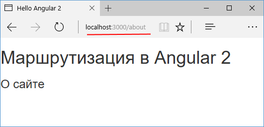

# Определение маршрутов

**Маршрутизация** позволяет сопоставлять запросы к приложению с определенными ресурсами внутри приложения.

Ключевым для работы маршрутизации является модуль `RouterModule`, который располагается в пакете `@angular/router`. Поэтому при работе с маршрутизацией этот пакет должен быть указан в списке зависимостей в файле `package.json`:

```json
{
  "name": "helloapp",
  "version": "1.0.0",
  "description": "First Angular 7 Project",
  "author": "Eugene Popov <metanit.com>",
  "scripts": {
    "dev": "webpack-dev-server --hot --open",
    "build": "webpack"
  },
  "dependencies": {
    "@angular/router": "~7.0.0"
    // остальные пакеты
  },
  "devDependencies": {
    // остальные пакеты
  }
}
```

Для определения маршрутов возьмем базовую структуру приложения:


Для работы с маршрутизацией в первую очередь стоит определить базовый адрес приложения. Для этого возьмем веб-страницу `index.html` и добавим в секцию `<head>` элемент `<base>`:

```html
<!DOCTYPE html>
<html>
  <head>
    <meta charset="utf-8" />
    <base href="/" />
    <title>Hello Angular 7</title>
    <link
      rel="stylesheet"
      href="https://maxcdn.bootstrapcdn.com/bootstrap/3.3.2/css/bootstrap.min.css"
    />
  </head>
  <body>
    <my-app>Загрузка...</my-app>
    <script src="public/polyfills.js"></script>
    <script src="public/app.js"></script>
  </body>
</html>
```

В качестве базового адреса будет рассматриваться корень приложения.

Каждый маршрут сопоставляется с определенным компонентом. Поэтому добавим в проект ряд компонентов. Так, добавим в папку `src/app` новый файл `home.component.ts`:

```typescript
import { Component } from '@angular/core'

@Component({
  selector: 'home-app',
  template: ` <h3>Главная</h3> `,
})
export class HomeComponent {}
```

Этот простенький компонент выводит обычный заголовок.

Далее добавим в папку `src/app` новый файл `about.component.ts`:

```typescript
import { Component } from '@angular/core'

@Component({
  selector: 'about-app',
  template: ` <h3>О сайте</h3> `,
})
export class AboutComponent {}
```

И также добавим еще один файл `not-found.component.ts`:

```typescript
import { Component } from '@angular/core'

@Component({
  selector: 'not-found-app',
  template: ` <h3>Страница не найдена</h3> `,
})
export class NotFoundComponent {}
```

## RouterModule и добавление маршрутов

Итак, кроме главного компонента `AppComponent` в проекте определено еще три компонента, каждый из которых просто выводит некоторый заголовок. Для каждого из этих компонентов мы можем определить свой маршрут. Для этого изменим код модуля `AppModule`:

```typescript
import { NgModule } from '@angular/core'
import { BrowserModule } from '@angular/platform-browser'

import { Routes, RouterModule } from '@angular/router'

import { AppComponent } from './app.component'
import { AboutComponent } from './about.component'
import { HomeComponent } from './home.component'
import { NotFoundComponent } from './not-found.component'

// определение маршрутов
const appRoutes: Routes = [
  { path: '', component: HomeComponent },
  { path: 'about', component: AboutComponent },
  { path: '**', component: NotFoundComponent },
]

@NgModule({
  imports: [BrowserModule, RouterModule.forRoot(appRoutes)],
  declarations: [
    AppComponent,
    HomeComponent,
    AboutComponent,
    NotFoundComponent,
  ],
  bootstrap: [AppComponent],
})
export class AppModule {}
```

Во-первых, здесь импортируются модуль маршрутизации `RouterModule` и класс `Routes`, представляющий коллекцию маршрутов:

```typescript
import { Routes, RouterModule } from '@angular/router'
```

Далее определяется сам набор маршрутов:

```typescript
const appRoutes: Routes = [
  { path: '', component: HomeComponent },
  { path: 'about', component: AboutComponent },
  { path: '**', component: NotFoundComponent },
]
```

Здесь определено три маршрута, каждый из которых будет обрабатываться отдельным компонентом. Для указания маршрута применяется параметр `path`. Например, путь `about` будет представлять запрос типа `http://localhost:3000/about` и будет обрабатываться классом `AboutComponent`.

Если запрос не содержит никаких сегментов, например, просто имя домена `http://localhost:3000/`, то такой запрос будет сопоставляться с путем "" (пустая строка) и будет обрабатываться компонентом `HomeComponent`.

Если приложение получит запрос, который не подходит ни под один из выше определенных маршрутов, то он будет сопоставляться с шаблоном `**`, где две звездочки представляют любой путь.

Чтобы применить маршруты, они передаются в метод `RouterModule.forRoot(appRoutes)`:

```typescript
imports: [ BrowserModule, RouterModule.forRoot(appRoutes)],
```

Метод `RouterModule.forRoot()` возвращает модуль, который содержит сконфигурированный сервис `Router`. Когда приложение загружается, `Router` выполняет начальную навигацию по текущему URL, который стоит в адресной строке браузера.

## RouterOutlet

Мы определили три разных компонента для разных маршрутов, однако в качестве главного компонента выступает `AppComponent`. Этот компонент выступает в качестве контейнера для остальных компонентов, которые будут обслуживать запросы к приложению.

Но чтобы можно было внедрить в `AppComponent` тот компонент, который обрабатывает запрос, необходимо использовать элемент `RouterOutlet`. Для этого изменим код `AppComponent`:

```typescript
import { Component } from '@angular/core'

@Component({
  selector: 'my-app',
  template: `
    <div>
      <h1>Маршрутизация в Angular 6</h1>
      <router-outlet></router-outlet>
    </div>
  `,
})
export class AppComponent {}
```

На место элемента `<router-outlet>` будет рендериться компонент, выбранный для обработки запроса.

Если при разработке применяется webpack, нужно определить в файле `webpack.config.js` следующую секцию:

```typescript
devServer: {
     historyApiFallback: true,
}
```

То есть файл `webpack.config.js` может выглядеть следующим образом:

```javascript
var path = require('path')
var webpack = require('webpack')
var UglifyJSPlugin = require('uglifyjs-webpack-plugin') // плагин минимизации
module.exports = {
  entry: {
    polyfills: './src/polyfills.ts',
    app: './src/main.ts',
  },
  output: {
    path: path.resolve(__dirname, './public'), // путь к каталогу выходных файлов — папка public
    publicPath: '/public/',
    filename: '[name].js', // название создаваемого файла
  },
  devServer: {
    historyApiFallback: true,
  },
  resolve: {
    extensions: ['.ts', '.js'],
  },
  module: {
    rules: [
      //загрузчик для ts
      {
        test: /\.ts$/, // определяем тип файлов
        use: [
          {
            loader: 'awesome-typescript-loader',
            options: {
              configFileName: path.resolve(
                __dirname,
                'tsconfig.json'
              ),
            },
          },
          'angular2-template-loader',
        ],
      },
    ],
  },
  plugins: [
    new webpack.ContextReplacementPlugin(
      /angular(\\|\/)core/,
      path.resolve(__dirname, 'src'), // каталог с исходными файлами
      {} // карта маршрутов
    ),
    new UglifyJSPlugin(),
  ],
}
```

Запустим приложение. По умолчанию приложение запускается без сегментов, поэтому запрос обрабатывает `HomeComponent`:


Перейдем по пути `localhost:xxxx/about`:



При переходе к любому другому адресу сработает компонент `NotFoundComponent`:


## URL Matching и порядок маршрутов

Когда будет выполняться переход по определенному пути, например, `/about`, система маршрутизации сопоставляет последовательно URL запроса с параметрами `path` у каждого маршрута. Данный процесс называется `url matching`. В частности, система маршрутизации сопоставит url `/about` с маршрутом `{ path: 'about', component: AboutComponent}`. И компонент `AboutComponent` будет выбран для обработки запроса по пути `/about`.

Но при определении маршрутов следует учитывать их порядок. Вполне возможно, что под определенный запрос будет соответствовать сразу несколько маршрутов. В этом случае запрос будет обрабатываться первым из них. Другие же маршруты не будут учитываться. Например, если мы изменим порядок маршрутов:

```typescript
const appRoutes: Routes = [
  { path: '**', component: NotFoundComponent },
  { path: '', component: HomeComponent },
  { path: 'about', component: AboutComponent },
]
```

То в этом случае запрос `/about` будет обрабатываться первым маршрутом, поскольку он соответствует запросу `/about` (путь `**` соответствует любому набору символов). Поэтому маршрут

```
{ path: '**', component: NotFoundComponent }
```

лучше определить последним — для всех тех запросов, которые не будут соответствовать ни одному из выше определенных маршрутов.

## Переадресация

Вполне возможно, что по какому-то маршруту мы захотим сделать переадресацию по другому пути. Например, в случае, если нужного маршрута для запроса не найдено, мы можем переадресовать на главную страницу:

```typescript
const appRoutes: Routes = [
  { path: '', component: HomeComponent },
  { path: 'about', component: AboutComponent },
  { path: '**', redirectTo: '/' },
]
```

Для переадресации указываем параметр `redirectTo`. Его значение представляет путь переадресации. В данном случае слеш указывает на первый маршрут или на главную страницу.

Также мы можем задать критерий соответствия строки запроса маршруту с помощью параметра `pathMatch`:

```typescript
const appRoutes: Routes = [
  { path: '', component: HomeComponent },
  { path: 'about', component: AboutComponent },
  {
    path: 'contact',
    redirectTo: '/about',
    pathMatch: 'full',
  },
  { path: '**', redirectTo: '/' },
]
```

Значение `pathMatch:'full'` указывает, что запрошенный адрес должен полностью соответствовать маршруту, то есть должно быть полное соответствие. Например, запрос `/contact` полностью соотвествует маршруту `{ path: 'contact', redirectTo: '/about', pathMatch:'full'}`, поэтому будет выполняться переадресация на адрес `/about`.

А запрос `/contact/5` не будет соответствовать этому маршруту, так как после `contact` идут другие сегменты.
