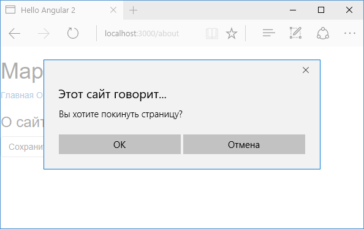

# Guards

**`Guards`** позволяют ограничить навигацию по определенным маршрутам. Например, если для доступа к определенному ресурсу требуется наличие аутентификации или наличие каких-то других условий, в зависимости от которых мы можем предоставить пользователю доступ, а можем и не предоставить. То есть guards защищают доступ к ресурсу, собственно поэтому данные элементы и названы так: "guards", что с английского можно перевести как "защитники".

## CanActivate

`CanActivate` представляет один из типов `guards`, который позволяет управлять доступом к ресурсу при маршрутизации. Так, возьмем для примера базовый проект приложения:


Добавим в папку `src/app` для примера пару компонентов. Первый компонент поместим в файл `home.component.ts`:

```typescript
import { Component } from '@angular/core'

@Component({
  selector: 'home-app',
  template: ` <h3>Главная</h3> `,
})
export class HomeComponent {}
```

И также добавим файл `about.component.ts`:

```typescript
import { Component } from '@angular/core'

@Component({
  selector: 'about-app',
  template: ` <h3>О сайте</h3> `,
})
export class AboutComponent {}
```

Допустим, мы хотим ограничить доступ к компоненту `AboutComponent`. Для этого добавим в папку `src/app` новый файл `about.guard.ts`:

```typescript
import {
  CanActivate,
  ActivatedRouteSnapshot,
  RouterStateSnapshot,
} from '@angular/router'
import { Observable } from 'rxjs'

export class AboutGuard implements CanActivate {
  canActivate(
    route: ActivatedRouteSnapshot,
    state: RouterStateSnapshot
  ): Observable<boolean> | boolean {
    return confirm('Вы уверены, что хотите перейти?')
  }
}
```

Класс `AboutGuard` реализует интерфейс `CanActivate`, а именно его метод `canActivate()`. Этот метод получает два параметра — объекты [`ActivatedRouteSnapshot`](https://angular.io/api/router/ActivatedRouteSnapshot) и `RouterStateSnapshot`, которые содержат информацию о запросе. `ActivatedRouteSnapshot` позволяет получить различную информацию из запроса, в том числе параметры маршрута и строки запроса. Например, если бы в маршруте использовался параметр `id`, то мы могли бы его здесь получить:

```typescript
canActivate(route: ActivatedRouteSnapshot, state: RouterStateSnapshot) : Observable<boolean> | boolean{

        // получаем id
        //console.log(route.params['id']);

        // остальной код
    }
```

Результат метода — логическое значение, либо логическое значение, обернутое в объект `Observable`. Если `AboutGuard` разрешает переход, то метод `canActivate()` должен возвращать `true`. Если доступ запрещен, то метод возвращает `false`.

Для тестирования обоих ситуаций здесь вызывается метод `confirm()`, который отображает диалоговое окно с выбором. Если пользователь нажмет на кнопку отмены, то метод `confirm` возвратит `false`. Если же пользователь подтвердит действие, то будет возвращено значение `true`.

Определим в файле `app.component.ts` ссылки для перехода к компонентам:

```typescript
import { Component } from '@angular/core'

@Component({
  selector: 'my-app',
  template: `
    <div>
      <h1>Маршрутизация в Angular 2</h1>
      <nav>
        <a routerLink="">Главная</a>
        <a routerLink="/about">О сайте</a>
      </nav>
      <router-outlet></router-outlet>
    </div>
  `,
})
export class AppComponent {}
```

А в главном модуле приложения установим маршруты:

```typescript
import { NgModule } from '@angular/core'
import { BrowserModule } from '@angular/platform-browser'

import { Routes, RouterModule } from '@angular/router'

import { AppComponent } from './app.component'
import { AboutComponent } from './about.component'
import { HomeComponent } from './home.component'
import { AboutGuard } from './about.guard'

// определение маршрутов
const appRoutes: Routes = [
  { path: '', component: HomeComponent },
  {
    path: 'about',
    component: AboutComponent,
    canActivate: [AboutGuard],
  },
]

@NgModule({
  imports: [BrowserModule, RouterModule.forRoot(appRoutes)],
  declarations: [
    AppComponent,
    HomeComponent,
    AboutComponent,
  ],
  providers: [AboutGuard],
  bootstrap: [AppComponent],
})
export class AppModule {}
```

Чтобы ограничить доступ по маршруту `/about`, в определении этого маршрута прописывается параметр `canActivate: [AboutGuard]`.

Кроме того, `AboutGuard` должен быть указан в списке провайдеров модуля:

```
providers: [AboutGuard]
```

В итоге при попытке перехода по маршруту `/about`, отобразится диалоговое окно с подтверждением перехода.


## CanDeactivate

`CanDeactivate` также позволяет управлять переходами. Он предназначен для таких, к примеру, случаев когда пользователь вводит какие-то данные. Однако не сохраняет их и покидает страницу. В этом случае мы могли бы выдать пользователю какое-либо предупреждение или окно с подтверждением перехода, чтобы избежать потери введенных данных.

То есть, если сравнивать с `CanActivate`, `CanActivate` проверяет возможность перехода на определенный компонент, а `CanDeactivate` проверяет возможность ухода с определенного компонента.

Для примера добавим в папку `src/app` новый файл `exit.about.guard.ts`:

```typescript
import { CanDeactivate } from '@angular/router'
import { Observable } from 'rxjs'

export interface ComponentCanDeactivate {
  canDeactivate: () => boolean | Observable<boolean>
}

export class ExitAboutGuard
  implements CanDeactivate<ComponentCanDeactivate> {
  canDeactivate(
    component: ComponentCanDeactivate
  ): Observable<boolean> | boolean {
    return component.canDeactivate
      ? component.canDeactivate()
      : true
  }
}
```

`ExitAboutGuard` должен реализовать метод `canDeactivate()` интерфейса `CanDeactivate`. Этот метод собственно и управляет уходом с компонента и переходом на другой компонент.

Для управления навигацией в этот метод передается компонент, с которого осуществляется переход. Благодаря этому мы можем учитывать состояние компонента при переходе. Но передаваемый параметр должен реализовать определенный интерфейс — в данном случае `ComponentCanDeactivate`. Выше определен этот интерфейс:

```typescript
export interface ComponentCanDeactivate {
  canDeactivate: () => boolean | Observable<boolean>
}
```

Название интерфейса не столь важно, главное, чтобы он определял метод `canDeactivate()`, который возвращает объект `boolean | Observable<boolean>`. Если нельзя осуществить переход, то возвращается значение `false`, иначе возвращается значение `true`. Это может быть просто логическое значение, либо же логическое значение, обернутое в объект `Observable`.

Допустим, мы хотим управлять навигацией с компонента `AboutComponent`. В этом случае класс `AboutComponent` должен реализовать интерфейс `ComponentCanDeactivate`:

```typescript
import { Component } from '@angular/core'
import { ComponentCanDeactivate } from './exit.about.guard'
import { Observable } from 'rxjs'

@Component({
  selector: 'about-app',
  template: `
    <h3>О сайте</h3>
    <button class="btn btn-default" (click)="save()">
      Сохранить
    </button>
    <a routerLink="">На главную</a>
  `,
})
export class AboutComponent
  implements ComponentCanDeactivate {
  saved: boolean = false
  save() {
    this.saved = true
  }

  canDeactivate(): boolean | Observable<boolean> {
    if (!this.saved) {
      return confirm('Вы хотите покинуть страницу?')
    } else {
      return true
    }
  }
}
```

Для имитации функционала в класс `AboutComponent` добавлено свойство `saved`, которое указывает, сохранены ли данные. С помощью метода `save()`, который вызывается по нажатию на кнопку, мы можем управлять значением этой переменной. К примеру, нажали на кнопку, значит данные сохранены, и свойство `saved` равно `true`.

Далее в классе `AboutComponent` реализуем метод `canDeactivate()`. Этот метод и будет вызываться в `ExitAboutGuard`. Поэтому в этом методе мы можем проверить состояние компонента и решить, стоит ли делать переход, надо ли выполнить какие-то дополнительные действия и т. д.

В данном случае, если `this.saved == false` (то есть условно, если данные не сохранены), то выводим диалоговое окно для подтверждения действия.

Чтобы задействовать `ExitAboutGuard`, изменим модуль `AppModule`:

```typescript
import { NgModule } from '@angular/core'
import { BrowserModule } from '@angular/platform-browser'

import { Routes, RouterModule } from '@angular/router'

import { AppComponent } from './app.component'
import { AboutComponent } from './about.component'
import { HomeComponent } from './home.component'
import { AboutGuard } from './about.guard'
import { ExitAboutGuard } from './exit.about.guard'

const appRoutes: Routes = [
  { path: '', component: HomeComponent },
  {
    path: 'about',
    component: AboutComponent,
    canActivate: [AboutGuard],
    canDeactivate: [ExitAboutGuard],
  },
]

@NgModule({
  imports: [BrowserModule, RouterModule.forRoot(appRoutes)],
  declarations: [
    AppComponent,
    HomeComponent,
    AboutComponent,
  ],
  providers: [AboutGuard, ExitAboutGuard],
  bootstrap: [AppComponent],
})
export class AppModule {}
```

Во-первых, в определении маршрута добавляется параметр

```
canDeactivate: [ExitAboutGuard]
```

Во-вторых, сам класс `ExitAboutGuard` добавляется в список провайдеров:

```
providers: [ AboutGuard, ExitAboutGuard],
```

И теперь при попытки ухода с компонента `AboutComponent` (если `saved == false`), мы увидим диалоговое окно для подтверждения перехода:


