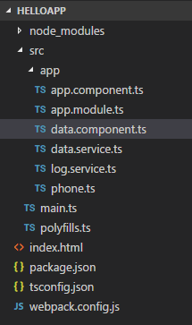
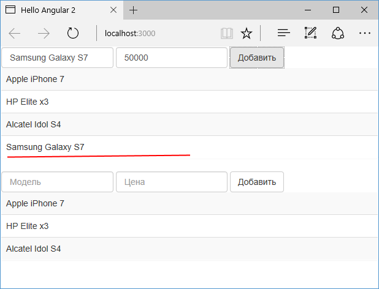

# Один сервис для всех компонентов

Вполне возможно, что в нашем приложении будет несколько различных компонентов, которые используют сервисы. При этом компоненты могут использовать одни и те же сервисы. Например, в прошлых темах был создан сервис `DataService`, который управляет данными. Определим специальный компонент для работы с данными. Для этого возьмем проект из прошлой темы и добавим в папку `src/app` новый файл `data.component.ts`:



Определим в этом файле следующий код:

```typescript
import { Component, OnInit } from '@angular/core'
import { DataService } from './data.service'
import { LogService } from './log.service'
import { Phone } from './phone'

@Component({
  selector: 'data-comp',
  template: `
    <div class="panel">
      <div class="form-inline">
        <div class="form-group">
          <input
            class="form-control"
            [(ngModel)]="name"
            placeholder="Модель"
          />
          <input
            type="number"
            class="form-control"
            [(ngModel)]="price"
            placeholder="Цена"
          />
          <button
            class="btn btn-default"
            (click)="addItem(name, price)"
          >
            Добавить
          </button>
        </div>
      </div>
      <table class="table table-striped">
        <tr *ngFor="let item of items">
          <td>{{ item.name }}</td>
        </tr>
      </table>
    </div>
  `,
  providers: [DataService, LogService],
})
export class DataComponent implements OnInit {
  items: Phone[] = []
  constructor(private dataService: DataService) {}

  addItem(name: string, price: number) {
    this.dataService.addData(name, price)
  }
  ngOnInit() {
    this.items = this.dataService.getData()
  }
}
```

`DataComponent` загружает и добавляет данные. Для работы с сервисами декоратор `Component` определяет секцию `providers`:

```typescript
providers: [DataService, LogService]
```

Используем этот компонент `DataComponent` в главном компоненте приложения `AppComponent`:

```typescript
import { Component } from '@angular/core'

@Component({
  selector: 'my-app',
  template: `
    <data-comp></data-comp> <data-comp></data-comp>
  `,
})
export class AppComponent {}
```

Этот компонент через элемент `data-comp` вызывает компонент `DataComponent`. Причем вызывает два раза. То есть для обработки каждого элемента будет создаваться свой объект `DataComponent`.

И соответственно изменим главный модуль приложения `AppModule`:

```typescript
import { NgModule } from '@angular/core'
import { BrowserModule } from '@angular/platform-browser'
import { FormsModule } from '@angular/forms'
import { AppComponent } from './app.component'
import { DataComponent } from './data.component'

@NgModule({
  imports: [BrowserModule, FormsModule],
  declarations: [AppComponent, DataComponent],
  bootstrap: [AppComponent],
})
export class AppModule {}
```

Теперь запустим приложение и попробуем добавить новый элемент:



Как видно на скриншоте, при добавлении в одном компоненте новый элемент будет добавляться только для этого компонента. Потому что у нас два отдельных компонента, и для каждого из них будет создаваться свой набор сервисов `DataService` и `LogService`.

Такое поведение не всегда может быть предпочтительным. Возможно, потребуется, чтобы компоненты использовали один и тот же объект сервиса, вместо создания разных сервисов для каждого компонента. Для этого мы можем зарегистрировать все сервисы не в компоненте, а в главном модуле приложения `AppModule`:

```typescript
import { NgModule } from '@angular/core'
import { BrowserModule } from '@angular/platform-browser'
import { FormsModule } from '@angular/forms'
import { AppComponent } from './app.component'
import { DataComponent } from './data.component'
import { DataService } from './data.service'
import { LogService } from './log.service'
@NgModule({
  imports: [BrowserModule, FormsModule],
  declarations: [AppComponent, DataComponent],
  providers: [DataService, LogService], // регистрация сервисов
  bootstrap: [AppComponent],
})
export class AppModule {}
```

В этом случае мы уже можем убрать регистрацию сервисов из компонента `DataComponent`:

```typescript
import { Component, OnInit } from '@angular/core'
import { DataService } from './data.service'
import { LogService } from './log.service'
import { Phone } from './phone'

@Component({
  selector: 'data-comp',
  template: `
    <div class="panel">
      <div class="form-inline">
        <div class="form-group">
          <input
            class="form-control"
            [(ngModel)]="name"
            placeholder="Модель"
          />
          <input
            type="number"
            class="form-control"
            [(ngModel)]="price"
            placeholder="Цена"
          />
          <button
            class="btn btn-default"
            (click)="addItem(name, price)"
          >
            Добавить
          </button>
        </div>
      </div>
      <table class="table table-striped">
        <tr *ngFor="let item of items">
          <td>{{ item.name }}</td>
        </tr>
      </table>
    </div>
  `,
})
export class DataComponent implements OnInit {
  items: Phone[] = []
  constructor(private dataService: DataService) {}

  addItem(name: string, price: number) {
    this.dataService.addData(name, price)
  }
  ngOnInit() {
    this.items = this.dataService.getData()
  }
}
```

После этого оба объекта `DataComponent` будут использовать один и тот же сервис `DataService`. Поэтому добавление объекта в одном компоненте автоматически отразится и на другом:


