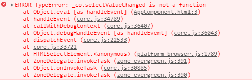
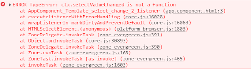

# Angular Ivy

**Angular Ivy** представляет собой абсолютно новый компилятор, который пришел на смену View Engine. Разработка Angular Ivy началась задолго до его официального релиза, и начиная с версии 8 он стал доступен в тестовом режиме, а стабильная версия появилась уже в Angular 9.

## Обзор

Преимущества Angular Ivy:

- Более быстрая [сборка](angular-deployment.md) за счет того, что зависимые [компоненты](angular-components.md) и [директивы](angular-directives.md) теперь не включаются в зависящий компонент, вместо этого в зависящем компоненте указываются ссылки на зависимости, Таким образом, при изменении одной из зависимостей нужно перекомпилировать только ее, а не весь использующий ее код;
- Меньший размер файлов сборки из-за преобразования всех декораторов в статические методы класса и большей подверженности файлов процессу под названием Tree Shaking;
- Усовершенствованная отладка;
- Использование динамической загрузки.

!!! note "Важно"

    Angular Ivy работает только с AoT-компиляцией и начиная с Angular 9 используется по умолчанию.

Для активации/деактивации Angular Ivy в уже созданном проекте, необходимо в файле `tsconfig.app.json` изменить значение параметра `enableIvy` в блоке `angularCompilerOptions`.

_tsconfig.app.json_

```json
{
  "angularCompilerOptions": {
    "enableIvy": true
  }
}
```

!!! note "Важно"

    Приложения, использующие Angular Ivy, могут беспрепятственно использовать библиотеки, скомпилированные с помощью View Engine.

## Отладка

Рассмотрим на примере, как в Angular Ivy изменился формат вывода ошибок.

_app.component.ts_

```ts
import { Component } from '@angular/core'

@Component({
  selector: 'app-root',
  templateUrl: './app.component.html',
})
export class AppComponent {
  title = 'Angular ivy'
}
```

_app.component.html_

```html
<h1>{{title}}</h1>

<select (change)="selectValueChanged($event)">
  <option value="1">Faster compilation</option>
  <option value="2">Small bundle size</option>
  <option value="3">Informative debugging</option>
</select>
```

Здесь на событие изменения значения выпадающего списка вызывается несуществующий метод `selectValueChanged()`, что инициирует возникновение ошибки.

Вывод ошибки с View Engine.



Вывод ошибки c Angular Ivy.



## Динамическая загрузка

Angular Ivy поддерживает динамический импорт ES6. В View Engine все [асинхронно подгружаемые модули](angular-asynchronous-routing.md) загружаются следующим образом.

```ts
const routes: Routes = [
  {
    path: ':lang',
    children: [
      {
        path: 'auth',
        loadChildren: './auth/auth.module#AuthModule',
      },
    ],
  },
]
```

Загрузка в Angular Ivy выглядит так.

```ts
const routes: Routes = [
  {
    path: ':lang',
    children: [
      {
        path: 'auth',
        loadChildren: () =>
          import('./auth/auth.module').then(
            ({ AuthModule }) => AuthModule
          ),
      },
    ],
  },
]
```

Динамический импорт также дает возможность загружать отдельные компоненты без их объявления в модуле.

_app.module.ts_

```ts
@NgModule({
  declarations: [AppComponent],
  imports: [BrowserModule],
  providers: [],
  bootstrap: [AppComponent],
})
export class AppModule {}
```

_app.component.ts_

```ts
import {
  Component,
  ɵrenderComponent,
  Injector,
} from '@angular/core'

import { ChildComponent } from './child.component'

@Component({
  selector: 'app-root',
  template: `
    <h1>Root component</h1>

    <button (click)="loadChild()">
      Load ChildComponent
    </button>
  `,
})
export class AppComponent {
  constructor(private injector: Injector) {}

  loadChild() {
    import('./child.component').then(
      ({ ChildComponent }) => {
        ɵrenderComponent(ChildComponent, {
          host: 'app-root',
          injector: this.injector,
        })
      }
    )
  }
}
```

_child.component.ts_

```ts
import { Component } from '@angular/core'

@Component({
  selector: 'app-child',
  template: `
    <h1>Dynamically loaded "ChildComponent"</h1>
  `,
})
export class ChildComponent {}
```

Для отображения загружаемого компонента используется функция `ɵrenderComponent()`, которая первым параметром принимает тип компонента, а вторым - объект конфигурации со следующими свойствами:

- `host` - селектор компонента, в который будет загружен подгруженный компонент;
- `injector` - экземпляр текущего объекта [injector](dependency-injection.md), который указывается, только если подгружаемый компонент имеет зависимости.
