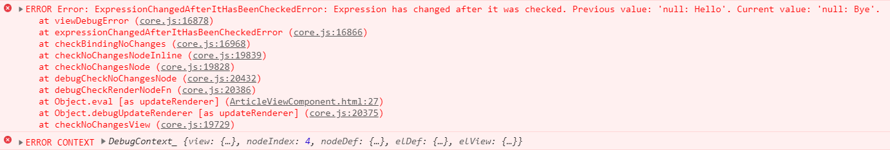
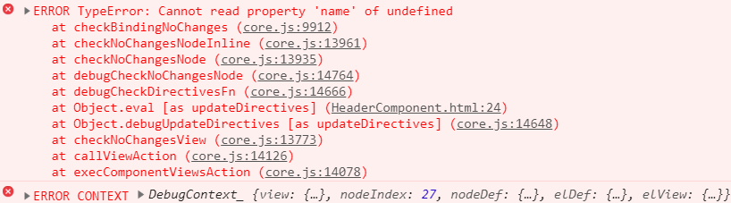

# Распространенные ошибки

Создание Angular приложения просто невозможно без ошибок. Но не всегда очевидно, в каком месте или даже в какой части кода она таится, а ее поиск порой может отнять немало времени.

Для предупреждения таких ситуаций ниже приведен перечень с подробным описание наиболее часто допускаемых разработчиками ошибок, знание о которых может значительно облегчить вам жизнь и сэкономить время.

## Использование private переменных в шаблоне

Все свойства компонента или сервиса, которые объявлены с модификатором `private`, должны использовать исключительно в пределах своего класса. Обращение к ним в шаблоне или другом сервисе или компоненте (в случае с сервисом) приведет к генерации исключения, но только в момент сборки приложения.

Воспроизведение ошибки.

```ts
@Component({
  selector: 'private-error',
  template: ` <div>{{ message }}</div> `,
})
export class PrivateErrorComponent {
  private message: string = 'Variable should be public'

  constructor() {}
}
```

Далее выполняем сборку.

```
ng build --prod
```

В результате в консоли должен быть следующий текст ошибки:

```
Property 'message' is private and only accessible within class 'PrivateErrorComponent'.
```

## Обращение сервисов друг к другу

При проектировании архитектуры приложения важно однонаправленное использование сервисов.

Например, имеется два сервиса: `ServiceA` и `ServiceB`. И если `ServiceA` использует `ServiceB`, то `ServiceB` уже не может обращаться к `ServiceA`.

Воспроизведение ошибки.

_example1.service.ts_

```ts
@Injectable({ providedIn: 'root' })
export class Example1Service {
  constructor(private ex2: Example2Service) {}
}
```

_example2.service.ts_

```ts
@Injectable({ providedIn: 'root' })
export class Example2Service {
  constructor(private ex1: Example1Service) {}
}
```

После того как изменения вступят в силу в консоли будет выведено предупреждение:

```
WARNING in Circular dependency detected:
src\app\services\example1.service.ts -> src\app\services\example2.service.ts ->
	src\app\services\example1.service.ts

WARNING in Circular dependency detected:
src\app\services\example2.service.ts -> src\app\services\example1.service.ts ->
	src\app\services\example2.service.ts
```

И хотя это только предупреждение и оно не ограничивает работу приложения, это считается грубой ошибкой проектирования.

## Объект в качестве значения @Input() свойства

Нередко в качестве значения компоненту через свойство [`@Input()`](https://angular.io/api/core/Input) передается объект, при этом в принимающем компоненте в `ngOnChanges()` определяется функция-обработчик, которая должна выполняться при любом изменении в объекте.

Но если изменить значение какого-либо свойства или же добавить новое свойство, то компонент не увидит изменений, поскольку в JavaScript передача объекта осуществляется по ссылке.

Воспроизведение ошибки.

_my-orders.component.ts_

```ts
@Component({
  selector: 'my-orders',
  template: ` <orders-item [order]="item"></orders-item> `,
})
export class MyOrdersComponent {
  item: any = {
    id: 1,
    name: 'Box',
    count: 3,
  }

  constructor() {
    setTimeout(() => (this.item.count = 4), 3000)
  }
}
```

_order-item.component.ts_

```ts
@Component({
  selector: 'order-item',
  template: `
    <div>
      <p>Name: {{ item?.name }}</p>
      <p>Count: {{ item?.count }}</p>
    </div>
  `,
})
export class OrderItemComponent implements OnChanges {
  @Input() item: any = null

  ngOnChanges(changes: SimpleChanges) {
    console.log(changes)
  }
}
```

Получается, что для вызова функции в `ngOnChanges()` нужно вернуть новый объект. Это можно сделать, например, так:

```ts
setTimeout(
  () => (this.item = { ...this.item, ...{ count: 4 } }),
  3000
)
```

## Дублирование подписчиков в RxJS

При определении создании нового подписчика для объекта `Observable` может случиться, что функция подписчика для обработки получаемого значения будет вызываться несколько раз.

Такое происходит, когда при разрушении компонента подписчик не отписывается от незавершенного `Observable`. То есть функция будет выполняться даже несмотря на то, что компонент уже не существует. Например, к этой категории относятся определения обработчиков событий смены маршрута.

Но самое интересное, что при следующем переходе на этот же компонент будет создан еще один подписчик. И когда от объекта `Observable` придет значение, функция-обработчик будет вызвана столько раз, сколько к этому моменту будет подписчиков.

Воспроизведение ошибки.

```ts
routeChangeSub: Subscription;

constructor(private router: Router){
	this.routeChangeSub = this.router.events.filter(ev => ev instanceof NavigationEnd)
		.subscribe(ev => console.log('Route changed'));
}
```

Часто бывает очень трудно выявить подобную ошибку, поэтому для избежания такой ситуации всегда вызывайте в `ngOnDestroy()` метод `unsubscribe()` у всех объектов `Subscription`.

```ts
ngOnDestroy(){
	this.routeChangeSub.unsubscribe();
}
```

## ExpressionChangedAfterItHasBeenCheckedError

Ошибка **Expression Changed After It Has Been Checked** одна из самых распространенных и непонятных в Angular и не всегда ее можно распознать сразу.

В консоли браузера она выглядит следующим образом:



или



Чтобы исправить такую ошибку, или лучше вовсе избежать ее, нужно понимать причину ее возникновения.

При каждом запуске цикла проверки изменений при первой его итерации Angular запоминает значения всех свойств всех компонентов, которые использовались для выполнения текущей операции. Эти значения хранятся в свойстве `oldValues` объекта представления (шаблона) в каждом компоненте.

Во время второй итерации идет сравнение текущих значений с теми, которые были запомнены на прошлом шаге. А именно Angular проверяет равны ли значения свойств, переданных дочернему компоненту, значениям свойств текущего компонента. Также сравниваются свойства, используемые для отображения в шаблоне. Вторая итерация повторяется для каждого дочернего компонента.

Интересно, что сравнение значений свойств выполняется только в режиме `development`.

`ExpressionChangedAfterItHasBeenCheckedError` возникает, когда в процессе проверки Angular видит, что хотя бы одно из запомненных ранее значений изменилось.

Воспроизведение ошибки.

```ts
@Component({
  selector: 'client-profile',
  template: `
    <div>
      <p>Client: {{ client?.name }}</p>
      <p>Address: {{ client?.address }}</p>
    </div>
  `,
})
export class ClientProfileComponent
  implements AfterViewInit {
  @Input() client: any = null

  ngAfterViewInit() {
    this.client.name = 'John Smith'
  }
}
```

Поскольку верификация значений затрагивает представление, следовательно, все изменения, сделанные до вызова `ngAfterViewInit()`, не инициируют возникновение ошибки.

Сама проверка необходима, чтобы убедиться в стабильности иерархической структуры. Все изменения родительского компонента, затрагивающие дочерние компоненты, должны быть синхронизированы и зафиксированы.

Но если вам действительно необходимо выполнить действие именно в момент верификации, то ситуация может быть разрешена либо с помощью отложенного выполнения, например, с помощью функции `setTimeout()`, либо принудительным запуском нового цикла проверки изменений (`ChangeDetection`)

```ts
ngAfterViewInit(){
	setTimeout(() => this.client.name = 'John Smith');
}
```
