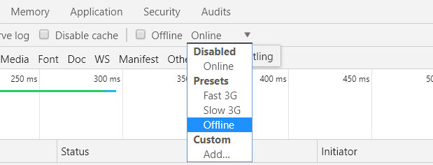
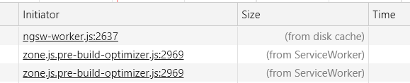

# Service Worker

Использование Service Worker является неотъемлемой частью любого Progressive Web Application (WPA). Главная особенность таких приложений это быстрая загрузка независимо от стабильности сетевого соединения за счет кэширования.

Angular **Service Worker** - это скрипт, который исполняется в браузере и управляет кэшированием приложения. Через скрипт проходят абсолютно все HTTP-запросы, включая запросы на получение статического контента.

Если запрос выполняется впервые, Service Worker дает ему дойти до сервера и сохраняет полученный ответ. При последующем таком запросе скрипт уже сам отдаст данные из кэша.

Причем данные остаются в кэше даже после того как пользователь закроет вкладку браузера.

Процесс кэширования полностью контролируется клиентской стороной и не использует никаких серверных HTTP-заголовков.

Загрузка WPA всегда начинается в первую очередь с загрузки Service Worker, который сразу же начинает обрабатывать исходящие запросы. Таким образом, приложение может быть полностью доступно даже при отсутствии сетевого соединения.

Начиная с версии 5.0.0 Angular предоставляет высокоуровневое API для работы с браузерными Service Worker, что избавляет от необходимости использовать низкоуровневое API браузера и тем самым позволяет избежать множества ошибок.

Но что, если версия приложения обновится? Пользователь будет продолжать получать старую версию? Конечно же, нет. Angular обо всем позаботится за вас.

При загрузке приложения из кэша Angular Service Worker запрашивает с сервера файл [`manifest.json`](/html/manifest/), который формируется Angular CLI в момент сборки приложения.

В `manifest.json` указаны контрольные суммы файлов текущей версии приложения. Service Worker сравнивает значения из файла загруженного в браузер приложения со значениями файла, полученного с сервера. Если контрольная сумма изменилась хотя бы для одного из файлов приложения, ServiceWorker загружает себе новую версию приложения, но не обновляет ее для пользователя. Пользователь продолжает работать с той версией, которая была загружена изначально.

При обновлении страницы или открытии приложения в новой вкладке, уже будет загружена обновленная версия. То есть в определенные моменты времени в кэше моут быть две разные версии приложения, которым Service Worker назначает каждому свой уникальный идентификатор, что позволяет избежать "смешения" версий.

Разберем интеграцию в приложение и инструменты, предоставляемые Angular Service Worker.

Сгенерируйте новый проект.

```
ng new my-sw-test
```

Затем установите в проект Service Worker с помощью команды Angular CLI:

```
ng add @angular/pwa --project my-sw-test
```

Выполнение команды

- добавляет к указанному проекту модуль `@angular/service-worker`;
- активирует поддержку Service Worker при сборке приложения;
- добавляет Service Worker в корневой модуль приложения;
- генерирует конфигурационный файл `ngsw-config.json`, в котором указываются настройки и задается поведение Service Worker;
- добавляет ссылку в `index.html` на `manifest.json`.

Теперь необходимо собрать приложение.

```
ng build --prod
```

!!! note ""

    Angular Service Worker не работает при запуске приложения с помощью команды `ng serve`. Для работы необходим отдельный HTTP-сервер, который будет "отдавать" собранное приложение. Можно использовать npm-модуль `http-server`.

После установки модуля выполните:

```
http-server -p 8080 -c-1 dist/<project-name>
```

где `p` - порт, на котором будет запущен HTTP-сервер, `с-1` - параметр, предотвращающий кэширование сервером.

Приложение должно открываться по адресу `http://localhost:8080`.

Теперь можно проверить работу Angular Service Worker в действии. В панели разработчика браузера Google Chrome во вкладке Network можно эмулировать отсутствие соединения выбрав значение Offline, как это указано на изображении ниже.



А теперь обновите страницу. Но предварительно откройте панель разработчика на вкладке Network, чтобы убедиться, что файлы отдаются именно Service Worker.



В кэш помещаются все статические файлы, необходимые для корректной работы приложения и его отображения.

Теперь обновим файл `app.component.html` и посмотрим на примере, как загружается новая версия приложения.

Вновь соберите приложение и откройте его в новой вкладке. Вы увидите "старую" версию, но Service Worker уже сравнил файлы `manifest.json` и загрузил себе обновления. А теперь откройте приложение еще в одной вкладке (или обновите предыдущую) и уже отобразится новая версия.

## Сервис SwUpdate

В модуле [`ServiceWorkerModule`](https://angular.io/api/service-worker/ServiceWorkerModule) предусмотрен механизм для управления и контроля кэширования - сервис [`SwUpdate`](https://angular.io/api/service-worker/SwUpdate).

Именно `SwUpdate` получает уведомление о наличии новой версии, а также уведомление о том, что Service Worker загрузил обновление в рамках текущей сессии. Представлено это двумя событиями типа Observable available и activated соответственно.

```ts
@Injectable()
export class AppService {
  constructor(sw: SwUpdate) {
    this.sw.available.subscribe((ev) => {
      console.log('Current version: ', ev.current);
      console.log('Available version :', ev.available);
    });
    this.sw.activated.subscribe((ev) => {
      console.log('Previous version: ', ev.previous);
      console.log('Current version: ', ev.current);
    });
  }
}
```

Объект события activated также имеет два свойства:

- `current` - текущая версия приложения;
- `available` - доступная версия приложения.

Объект события available имеет два свойства:

- `previous` - предыдущая версия приложения;
- `current` - текущая версия приложения.

Для большего контроля и гибкости работы с Angular Service Worker в сервисе `SwUpdate` имеются два метода:

- `checkForUpdate()` - проверяет, была ли загружена на сервер новая версия приложения;
- `activateUpdate()` - принудительно загружает в кэш браузера версию приложения с сервера.

Оба метода возвращают объекты `Promise()`.

Если на сервере находится более новая версия, то вызов метода `checkForUpdate()` инициирует возникновение события available.

Вызов метода `activateUpdate()` загрузит новую версию приложения в браузер, но пользователю она будет доступна только после перезагрузки страницы (или при открытии приложения в новой вкладке).

Пример использования.

```ts
import { interval } from 'rxjs/index';

@Injectable()
export class AppService {
  constructor(sw: SwUpdate) {
    interval(3600).subscribe(() => {
      this.sw.checkForUpdate();
    });

    this.sw.available.subscribe((event) => {
      this.sw
        .activateUpdate()
        .then(() => document.location.reload());
    });

    this.sw.activated.subscribe((ev) => {
      console.log('Previous version: ', ev.previous);
      console.log('Current version: ', ev.current);
    });
  }
}
```

Рассмотрим подробно. В момент создания сервиса `AppService` регистрируется функция вызова метода `checkForUpdate()` по истечении одного часа. Если обновление доступно, инициируется событие available, для которого указан обработчик, принудительно обновляющий версию приложения в кэше. Далее происходит перезагрузка страницы, чтобы далее пользователь работал с уже обновленной версией. После перезагрузки должно быть инициировано событие `activated`.

!!! note ""

    Принудительное обновление страницы без согласия пользователя - плохая практика. Используя описанный функционал, можно вывести информационное сообщение о наличии обновления и запросить от пользователя подтверждение на обновление страницы.

## Конфигурация ngsw-config.json

В `ngsw-config.json` задается конфигурация работы Angular Service Worker. Можно указать, какие файлы и URL должны сохраняться в кэше браузера и как должно происходить обновление кэшированных данных.

Пример файла.

```json
{
  "appData": {
    "version": "0.2.0",
    "description": "Version description"
  },
  "index": "/index.html",
  "assetGroups": [
    {
      "name": "app",
      "installMode": "prefetch",
      "resources": {
        "files": [
          "/favicon.ico",
          "/index.html",
          "/*.css",
          "/*.js"
        ]
      }
    },
    {
      "name": "assets",
      "installMode": "lazy",
      "updateMode": "prefetch",
      "resources": {
        "files": ["/assets/**"]
      }
    }
  ]
}
```

Рассмотрим подробно свойства объекта конфигурации.

**`appData`**. Может содержать любые данные, используемые для описания версии приложения. Указанные данные являются значением полей событий available и activated.

**`index`**. Путь к файлу `index.html`.

**`assetGroups`**. Поле содержит массив разделенных на группы статических файлов и описание параметров кэширования для каждой из групп. Параметры группы:

- `name` - имя группы, обязательно для заполнения и должно быть уникальным, поскольку используется для идентификации группы между различными версиями;
- `installMode`: (`prefetch` | `lazy`) - указывает, как должны изначально кэшироваться файлы группы; `prefetch` - скачивает и кэширует сразу все файлы группы, `lazy` - будет кэшировать файлы только в том случае, если они будут запрошены;
- `updateMode` - указывает поведение для файлов, которые уже в кэше, при обновлении версии приложения; `prefetch` - обновляет все файлы кэша, `lazy` - обновит файлы только тогда, когда они будут запрошены (будет работать только для installMode lazy);
- `resources` - содержит описание файлов, которые должны кэшироваться; имеет два свойства: `files` и `urls`; оба свойства в качестве значений принимают массив; в качестве элемента массива может быть как шаблон поиска (glob pattern), так и путь к любому из файлов; в `files` описываются правила для файлов, размещенных локально на сервере, в `urls` - правила для файлов, которые находятся на удаленных серверах (например, CDN).

**`dataGroups`**. В поле описываются правила кэширования данных, которые не изменяются с изменением версий. Обычно, это HTTP-запросы (данные API). Параметры группы:

- `name` - уникальное имя группы для ее идентификации;
- `urls` - массив URL, данные которых будут помещены в кэш; в качестве элемента массива также можно передавать шаблон поиска;
- `version` - свойство является необязательным и принимает только числовое значение; используется для указания, что формат ответа хотя бы одного API из группы сменился и данные нужно запросить с сервера; по умолчанию `version` равно 0, если в API произошли изменение, версия должна стать `1`, при следующем изменении `2` и т. д.;
- `cacheConfig` - параметры конфигурации кэширования. Имеет следующие параметры:
  - `maxSize` (обязательный) - максимальное количество запросов и ответов на них, которые должны храниться в кэше;
  - `maxAge` (обязательный) - время, в течении которого данные должны храниться в кэше; пример строки - `12h30m`; для задания интервала времени можно использовать: `d` - дни, `h` - часы, `m` - минуты, `s` - секунды, `u` - миллисекунды;
  - `timeout` (необязательный) - время, по истечении которого данные берутся из кэша, если от сервера не приходит ответ; работает только совместно с freshness strategy (см. след.);
  - `strategy` (`performance` | `freshness`) - задает поведение при смене версии группы; `performance` - запросит новые значения для всех URL в группе, `freshness` - обновит данные в кэше, если только они будут запрошены.

Остановимся подробно на шаблонах поиска. Шаблон поиска это своего рода регулярное выражение. Он осуществляет выборку файлов (директорий) по заданному условию.

Все шаблоны поиска начинаются с символа `/`, указывая, что поиск должен осуществляться от корня проекта и далее вниз по иерархии. Исключение составляют шаблоны, начинающиеся с префикса `!`.

Примеры:

- `/**/*.*` - все файлы;
- `/**/*.css` - все css-файлы;
- `!/**/*.css` - все файлы, кроме css-файлов;
- `/*.css` - все css-файлы в корневой директории.

Расшифровка:

- `**` - 0 и более путей любой вложенности;
- `*` - 0 и более любых символов за исключением `/`;
- `?` - один символ за исключением `/`;
- `!` - если указан перед шаблоном поиска, то означает "все, кроме того, что удовлетворяет шаблону".

## Ссылки

- [Angular service worker introduction](https://angular.io/guide/service-worker-intro)
