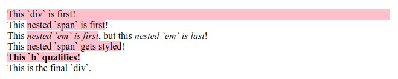

# :first-of-type

Псевдокласс **`:first-of-type`** находит первого потомка своего типа среди детей родителя.

## Синтаксис

```css
/* Selects any <p> that is the first element
	   of its type among its siblings */
p:first-of-type {
  color: red;
}
```

## Спецификации

- [Selectors Level 4](https://drafts.csswg.org/selectors-4/#first-of-type-pseudo)
- [Selectors Level 3](https://drafts.csswg.org/selectors-3/#first-of-type-pseudo)

## Описание и примеры

Этот пример показывает, как применится универсальный селектор, если простой селектор не написан.

```html tab="HTML"
<article>
  <div>This `div` is first!</div>
  <div>This <span>nested `span` is first</span>!</div>
  <div>
    This <em>nested `em` is first</em>, but this <em>nested `em` is last</em>!
  </div>
  <div>This <span>nested `span` gets styled</span>!</div>
  <b>This `b` qualifies!</b>
  <div>This is the final `div`.</div>
</article>
```

```css tab="CSS"
article :first-of-type {
  background-color: pink;
}
```

Результат


