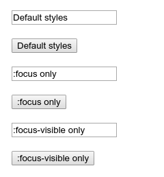

# :focus-visible

Псевдокласс **`:focus-visible`** применяется, в то время как элемент соответствует псевдоклассу [`:focus`](:focus.md), и UA определяет с помощью эвристики, что фокус должен быть сделан очевидным для элемента.

Этот селектор полезен для предоставления другого индикатора фокуса, основанного на модальности ввода пользователя (мышь против клавиатуры).

Обратите внимание, что Firefox поддерживает аналогичную функциональность через старый псевдокласс с префиксом `:-moz-focusring`.

## Синтаксис

```css
:focus-visible {
  /*  */
}
```

## Спецификации

- [Selectors Level 4](https://drafts.csswg.org/selectors-4/#the-focus-visible-pseudo)

## Полифил

Псевдокласс `:focus-visible` можно эмулировать с помощью [focus-visible.js](https://github.com/WICG/focus-visible).

## Пример

```css tab="CSS"
input,
button {
  margin: 10px;
}

.focus-only:focus {
  outline: 2px solid black;
}

.focus-visible-only:focus-visible {
  outline: 4px dashed darkorange;
}
```

```html tab="HTML"
<input value="Default styles" /><br />
<button>Default styles</button><br />
<input class="focus-only" value=":focus only" /><br />
<button class="focus-only">:focus only</button><br />
<input class="focus-visible-only" value=":focus-visible only" /><br />
<button class="focus-visible-only">:focus-visible only</button>
```

Результат:



## См. также

- [`:focus`](:focus.md)
- [`:focus-within`](:focus-within.md)

## Ссылки

- [:focus-visible](https://developer.mozilla.org/en-US/docs/Web/CSS/:focus-visible) на MDN
