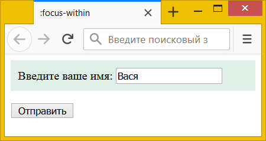

# :focus-within

Псевдокласс **`:focus-within`** определяет стиль элемента, когда он сам или элементы внутри него получают фокус. В отличие от [`:focus`](:focus.md), который применяется непосредственно к самому элементу, `:focus-within` работает для родителя. Это позволяет выделять цветом или другими методами всю форму или отдельные её части, когда пользователь работает с полями формы.

## Синтаксис

```css
*:focus-within {
  property: value;
}
```

## Сертификат

- [Selectors Level 4](https://drafts.csswg.org/selectors-4/#the-focus-within-pseudo)

## Пример

```html
<!DOCTYPE html>
<html>
  <head>
    <meta charset="utf-8" />
    <title>:focus-within</title>
    <style>
      div {
        padding: 10px; /* Поля вокруг текста */
      }
      div:focus-within {
        background: #def0e7; /* Цвет фона */
      }
    </style>
  </head>
  <body>
    <form action="/example/handler.php">
      <div>Введите ваше имя: <input name="user" /></div>
      <p><button>Отправить</button></p>
    </form>
  </body>
</html>
```

В данном примере меняется цвет фона у `<div>`, когда текстовое поле внутри него получает фокус (рис. 1).


