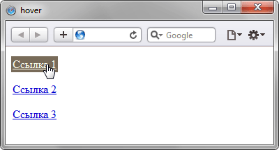
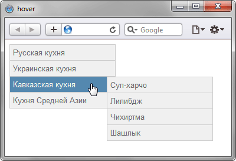

# :hover

Псевдокласс **`:hover`** срабатывает, когда пользователь наводит на элемент мышью, но не обязательно активирует его.

Этот стиль может переопределяться другими относящимися к ссылкам псевдоклассами, такими как [`:link`](:link.md), [`:visited`](:visited.md) и [`:active`](:active.md), появляющимися в соответствующем порядке. Чтобы стилизировать ссылки должным образом, вам нужно вставлять правило `:hover` до правил `:link` и `:visited`, но после `:active`, как определено в LVHA-порядке: `:link` — `:visited` — `:hover` — `:active`.

Псевдокласс `:hover` может применяться к любому псевдоэлементу.

Браузеры, такие как Firefox, Internet Explorer, Safari, Opera или Chrome, применяют соответствующий стиль, когда курсор (указатель мыши) наводится на элемент.

!!! info "Замечания по использованию"

    На сенсорных экранах `:hover` проблемный или не работает. В зависимости от браузера, псевдокласс `:hover` может никогда не сработать, или сработать на некоторое время после нажатия на элемента, или может продолжать действовать даже остаться после того, как пользователь коснулся элемента до нажатия на другой элемент. Так как сенсорные устройства очень распространены, то веб-разработчикам очень важно не иметь контент, доступный только при наведении, так как такой контент неудобно или невозможно использовать на таких устройствах.

## Синтаксис

```css
/* Selects any <a> element when "hovered" */
a:hover {
  color: orange;
}
```

## Спецификации

- [WHATWG HTML Living Standard](https://html.spec.whatwg.org/multipage/scripting.html#selector-hover)
- [Selectors Level 4](https://drafts.csswg.org/selectors-4/#the-hover-pseudo)
- [Selectors Level 3](https://drafts.csswg.org/selectors-3/#the-user-action-pseudo-classes-hover-act)
- [CSS Level 2 (Revision 1)](http://www.w3.org/TR/CSS2/selector.html#dynamic-pseudo-classes)

## Описание и примеры

### Пример 1. Выпадающее меню

С псевдоклассом `:hover` вы можете создавать сложные каскадные алгоритмы. Эта техника часто используется, например, чтобы создать выпадающие меню на чистом CSS (только на CSS, без использования JavaScript). Сущность этой техники — создание правил, типа следуюшего:

```css tab="CSS"
div.menu-bar ul ul {
  display: none;
}

div.menu-bar li:hover > ul {
  display: block;
}
```

```html tab="HTML"
<div class="menu-bar">
  <ul>
    <li>
      <a href="example.html">Меню</a>
      <ul>
        <li>
          <a href="example.html">Ссылка</a>
        </li>
        <li>
          <a class="menu-nav" href="example.html">Подменю</a>
          <ul>
            <li>
              <a class="menu-nav" href="example.html">Подменю</a>
              <ul>
                <li><a href="example.html">Ссылка</a></li>
                <li><a href="example.html">Ссылка</a></li>
                <li><a href="example.html">Ссылка</a></li>
                <li><a href="example.html">Ссылка</a></li>
              </ul>
            </li>
            <li><a href="example.html">Ссылка</a></li>
          </ul>
        </li>
      </ul>
    </li>
  </ul>
</div>
```

Смотрите полный [пример выпадающего меню](https://developer.mozilla.org/@api/deki/files/6238/=css_dropdown_menu.html), основанный на CSS.

### Пример 2. Галерея полноразмерных изображений и превью

Вы можете использовать псевдокласс `:hover`, чтобы создать галерею изображений с полноразмерными картинками, показываемыми при наведении на них мыши. Посмотрите это [демо](https://developer.mozilla.org/@api/deki/files/6247/=css-gallery.zip).

### Пример 3

```html
<!DOCTYPE html>
<html>
  <head>
    <meta charset="utf-8" />
    <title>hover</title>
    <style>
      a:link {
        color: #0000d0; /* Цвет ссылок */
        padding: 2px; /* Поля вокруг текста */
      }
      a:hover {
        background: #786b59; /* Цвет фона под ссылкой */
        color: #ffe; /* Цвет ссылки */
      }
    </style>
  </head>
  <body>
    <p><a href="1.html">Ссылка 1</a></p>
    <p><a href="2.html">Ссылка 2</a></p>
    <p><a href="3.html">Ссылка 3</a></p>
  </body>
</html>
```

В данном примере псевдокласс `:hover` применяется к ссылке (тегу `<a>`), при этом меняется цвет ссылки и фона под ней. Результат:



### Пример 4

```html
<!DOCTYPE html>
<html>
  <head>
    <meta charset="utf-8" />
    <title>hover</title>
    <style>
      ul {
        width: 180px; /* Ширина меню */
        list-style: none; /* Для списка убираем маркеры */
        margin: 0; /* Нет отступов вокруг */
        padding: 0; /* Убираем поля вокруг текста */
        font-family: Arial, sans-serif; /* Рубленый шрифт для текста меню */
        font-size: 10pt; /* Размер названий в пункте меню */
      }
      li ul {
        position: absolute; /* Подменю позиционируются абсолютно */
        display: none; /* Скрываем подменю */
        margin-left: 165px; /* Сдвигаем подменю вправо */
        margin-top: -2em; /* Сдвигаем подменю вверх */
      }
      li a {
        display: block; /* Ссылка как блочный элемент */
        padding: 5px; /* Поля вокруг надписи */
        text-decoration: none; /* Подчеркивание у ссылок убираем */
        color: #666; /* Цвет текста */
        border: 1px solid #ccc; /* Рамка вокруг пунктов меню */
        background-color: #f0f0f0; /* Цвет фона */
        border-bottom: none; /* Границу снизу не проводим */
      }
      li a:hover {
        color: #ffe; /* Цвет текста активного пункта */
        background-color: #5488af; /* Цвет фона активного пункта */
      }
      li:hover ul {
        display: block; /* При выделении пункта курсором мыши отображается подменю */
      }
      .brd {
        border-bottom: 1px solid #ccc; /* Линия снизу */
      }
    </style>
  </head>
  <body>
    <ul class="menu">
      <li>
        <a href="russian.html">Русская кухня</a>
        <ul>
          <li><a href="linkr1.html">Бефстроганов</a></li>
          <li><a href="linkr2.html">Гусь с яблоками</a></li>
          <li><a href="linkr3.html">Крупеник новгородский</a></li>
          <li><a href="linkr4.html" class="brd">Раки по-русски</a></li>
        </ul>
      </li>
      <li>
        <a href="ukrainian.html">Украинская кухня</a>
        <ul>
          <li><a href="linku1.html">Вареники</a></li>
          <li><a href="linku2.html">Жаркое по-харьковски</a></li>
          <li><a href="linku3.html">Капустняк черниговский</a></li>
          <li><a href="linku4.html" class="brd">Потапцы с помидорами</a></li>
        </ul>
      </li>
      <li>
        <a href="caucasus.html">Кавказская кухня</a>
        <ul>
          <li><a href="linkc1.html">Суп-харчо</a></li>
          <li><a href="linkc2.html">Лилибдж</a></li>
          <li><a href="linkc3.html">Чихиртма</a></li>
          <li><a href="linkc4.html" class="brd">Шашлык</a></li>
        </ul>
      </li>
      <li><a href="asia.html" class="brd">Кухня Средней Азии</a></li>
    </ul>
  </body>
</html>
```

В данном примере псевдокласс `:hover` добавляется к элементу списка (тег `<li>`) для создания двухуровневого меню. Результат:



## См. также

- [`:link`](:link.md)
- [`:visited`](:visited.md)
- [`:active`](:active.md)

## Ссылки

- [`:hover`](https://developer.mozilla.org/ru/docs/Web/CSS/:hover) на MDN
