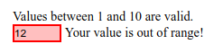

# :in-range

Псевдокласс **`:in-range`** представляет собой элемент [`<input>`](../html/input.md), текущее значение которого находится в пределах диапазона, заданных атрибутами `min` и `max`.

Этот псевдокласс полезен для предоставления пользователю визуальной информации о том, что текущее значение поля находится в допустимых пределах.

**Примечание.** Этот псевдокласс применяется только к элементам, которые могут принимать ограничение диапазона. В отсутствие такого ограничения элемент не может быть «в диапазоне» или «вне диапазона».

## Синтаксис

```css
/* Selects any <input>, but only when it has a range
	   specified, and its value is inside that range */
input:in-range {
  background-color: rgba(0, 255, 0, 0.25);
}
```

## Спецификации

- [HTML Living Standard](https://html.spec.whatwg.org/multipage/scripting.html#selector-in-range)
- [Selectors Level 4](https://drafts.csswg.org/selectors-4/#in-range-pseudo)

## Описание и примеры

```html tab="HTML"
<form action="" id="form1">
  <ul>
    Values between 1 and 10 are valid.
    <li>
      <input
        id="value1"
        name="value1"
        type="number"
        placeholder="1 to 10"
        min="1"
        max="10"
        value="12"
      />
      <label for="value1">Your value is </label>
    </li>
  </ul>
</form>
```

```css tab="CSS"
li {
  list-style: none;
  margin-bottom: 1em;
}

input {
  border: 1px solid black;
}

input:in-range {
  background-color: rgba(0, 255, 0, 0.25);
}

input:out-of-range {
  background-color: rgba(255, 0, 0, 0.25);
  border: 2px solid red;
}

input:in-range + label::after {
  content: 'okay.';
}

input:out-of-range + label::after {
  content: 'out of range!';
}
```

Результат


