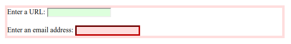

# :invalid

Псевдо-класс **`:invalid`** представляет любой элемент [`<input>`](../html/input.md) или другой [`<form>`](../html/form.md), содержимое которого не прошло проверку.

Этот псевдокласс полезен для выделения ошибок в полях ввода для пользователя.

## Синтаксис

```css
/* Selects any invalid <input> */
input:invalid {
  background-color: pink;
}
```

## Спецификации

- [HTML Living Standard](https://html.spec.whatwg.org/multipage/#selector-invalid)
- [HTML5](http://www.w3.org/TR/html5/#selector-invalid)
- [Selectors Level 4](https://drafts.csswg.org/selectors-4/#validity-pseudos)

## Описание и примеры

```html tab="HTML"
<form>
  <label for="url_input">Enter a URL:</label>
  <input type="url" id="url_input" />
  <br />
  <br />
  <label for="email_input">Enter an email address:</label>
  <input type="email" id="email_input" required />
</form>
```

```css tab="CSS"
input:invalid {
  background-color: #ffdddd;
}

form:invalid {
  border: 5px solid #ffdddd;
}

input:valid {
  background-color: #ddffdd;
}

form:valid {
  border: 5px solid #ddffdd;
}

input:required {
  border-color: #800000;
  border-width: 3px;
}

input:required:invalid {
  border-color: #c00000;
}
```

Результат


