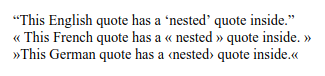

# :lang()

Псевдокласс **`:lang()`** сопоставляет элементы на основе языка, на котором они определены.

**Примечание.** В HTML язык определяется комбинацией атрибута `lang`, элемента [`<meta>`](../html/meta.md) и, возможно, информации из протокола (например, заголовков HTTP). Для других типов документов могут быть другие методы для определения языка.

## Синтаксис

```css
/* Selects any <p> in English (en) */
p:lang(en) {
  quotes: '\201C''\201D''\2018''\2019';
}
```

## Спецификации

- [Selectors Level 4](https://drafts.csswg.org/selectors-4/#lang-pseudo)
- [Selectors Level 3](https://drafts.csswg.org/selectors-3/#lang-pseudo)
- [CSS Level 2 (Revision 1)](http://www.w3.org/TR/CSS2/selector.html#lang)

## Описание и примеры

```css tab="CSS"
:lang(en) > q {
  quotes: '\201C''\201D''\2018''\2019';
}
:lang(fr) > q {
  quotes: '« ' ' »';
}
:lang(de) > q {
  quotes: '»' '«' '\2039''\203A';
}
```

```html tab="HTML"
<div lang="en">
  <q>This English quote has a <q>nested</q> quote inside.</q>
</div>
<div lang="fr">
  <q>This French quote has a <q>nested</q> quote inside.</q>
</div>
<div lang="de">
  <q>This German quote has a <q>nested</q> quote inside.</q>
</div>
```

Результат


