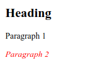
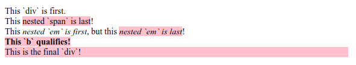

# :last-of-type

Псевдокласс **`:last-of-type`** находит последнего потомка с заданным тегом в списке детей родительского элемента.

## Синтаксис

```css
/* Selects any <p> that is the last element
	   of its type among its siblings */
p:last-of-type {
  color: lime;
}
```

## Спецификации

- [Selectors Level 4](https://drafts.csswg.org/selectors-4/#last-of-type-pseudo)
- [Selectors Level 3](https://drafts.csswg.org/selectors-3/#last-of-type-pseudo)

## Описание и примеры

### Пример 1

```html tab="HTML"
<h2>Heading</h2>
<p>Paragraph 1</p>
<p>Paragraph 2</p>
```

```css tab="CSS"
p:last-of-type {
  color: red;
  font-style: italic;
}
```

Результат



### Пример 2

```html tab="HTML"
<article>
  <div>This `div` is first.</div>
  <div>This <span>nested `span` is last</span>!</div>
  <div>This <em>nested `em` is first</em>, but this <em>nested `em` is last</em>!</div>
  <b>This `b` qualifies!</b>
  <div>This is the final `div`!</div>
</article>
```

```css tab="CSS"
article :last-of-type {
  background-color: pink;
}
```

Результат


