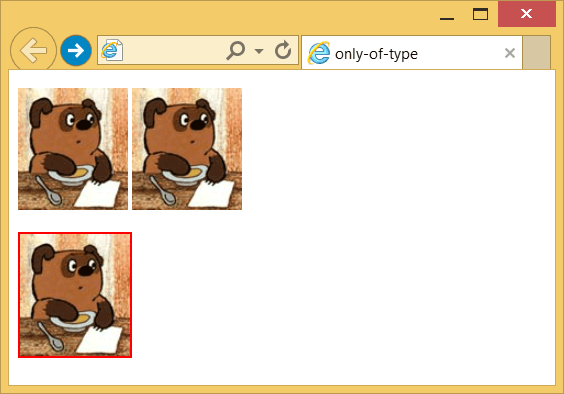

# :only-of-type

Псевдокласс **`:only-of-type`** применяется к дочернему элементу указанного типа, только если он единственный у родителя.

## Синтаксис

```css
/* Выбирает все <p>, которые являются */
/* единственным потомками типа <p> */
p:only-of-type {
  background-color: lime;
}
```

## Описание

В качестве примера рассмотрим следующий код HTML:

```html
<article>
  <h1>Роль цитокинов при дорсалгии</h1>
  <p>Автор: Гордон Фримен, канд. физ.-мат. наук</p>
  <p>Содержание статьи</p>
  <address>Почта: freemen@blackmesa.com</address>
  <p>Опубликовано: <time datetime="2018-11-27">27 ноября 2018</time></p>
</article>
```

Псевдокласс `:only-of-type` без указания селектора выберет все единственные элементы каждого типа внутри `<article>` и установит для них красный цвет текста. Здесь единственными являются элементы `<h1>`, `<address>` и `<time>`.

```css
article :only-of-type {
  color: red;
}
```

При добавлении селектора к `:only-of-type` сперва рассматривается указанный элемент, затем проверяется, является ли он единственным. Здесь красным цветом будет выделен заголовок, поскольку `<h1>` только один.

```css
article h1:only-of-type {
  color: red;
}
```

Если вместо `h1` использовать селектор `p`, то ничего выбрано не будет, поскольку внутри `<article>` встречается несколько абзацев и элемент `<p>` не является единственным.

```css
article p:only-of-type {
  color: red;
}
```

Вместо `:only-of-type` можно использовать комбинации `:first-of-type:last-of-type` или `:nth-of-type(1):nth-last-of-type(1)`.

## Спецификации

- [Selectors Level 4](https://drafts.csswg.org/selectors-4/#only-of-type-pseudo)
- [Selectors Level 3](https://drafts.csswg.org/selectors-3/#only-of-type-pseudo)

## Примеры

### Пример 1

```html tab="HTML"
<main>
  <div>Я `div` №1.</div>
  <p>Я тут единственный `p` елемент.</p>
  <div>Я `div` №2.</div>
  <div>
    Я `div` №3.
    <i>Я единственный потомок типа `i`.</i>
    <em>Я `em` №1.</em>
    <em>Я `em` №2.</em>
  </div>
</main>
```

```css tab="CSS"
main :only-of-type {
  color: red;
}
```

### Пример 2

```html
<!DOCTYPE html>
<html>
  <head>
    <meta charset="utf-8" />
    <title>only-of-type</title>
    <style>
      img:only-of-type {
        border: 2px solid red; /* Параметры рамки */
      }
    </style>
  </head>
  <body>
    <p>
      
      
    </p>

    <p></p>
  </body>
</html>
```

В примере псевдокласс `:only-of-type` применяется к селектору `img`, в правилах стиля которого задаётся рамка красного цвета для картинок. Сама рамка добавляется к изображениям, которые у своих родителей (в данном случае это `<p>`) встречаются только один раз. В первой строке повторяется два изображения, поэтому псевдокласс не действует, во второй строке вставлено одно изображение, для него `:only-of-type` и работает.



## См. также

- [:only-child](:only-child.md)
- [:nth-of-type](<:nth-of-type().md>)
- [:first-of-type](:first-of-type.md)
- [:last-of-type](:last-of-type.md)

## Ссылки

- [:only-of-type](https://developer.mozilla.org/ru/docs/Web/CSS/:only-of-type) на MDN
