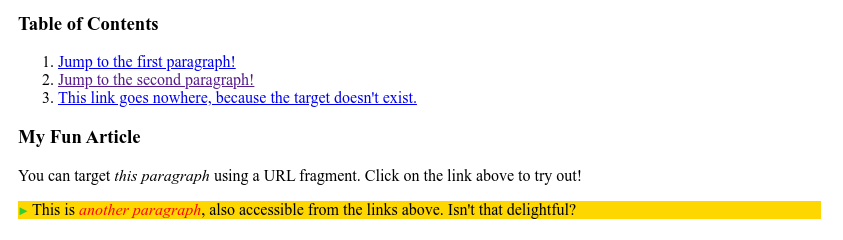
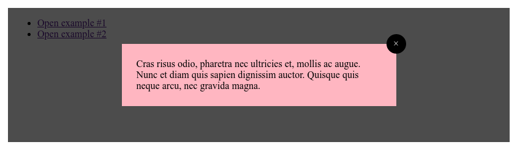

# :target

Для перехода к выбранному фрагменту документа, в адресе пишется символ `#` и указывается имя идентификатора. К примеру, в адресе `http://www.w3.org/TR/css3-selectors/#target-pseudo` происходит переход к элементу, атрибут `id` которого задан как `target-pseudo`. Такая запись адреса называется «целевой элемент». Псевдокласс **`:target`** применяется к целевому элементу, иными словами, к идентификатору, который указан в адресной строке браузера.

## Синтаксис

```css
/* Selects an element with an ID matching the current URL's fragment */
:target {
  border: 2px solid black;
}
```

## Спецификации

- [HTML Living Standard](https://html.spec.whatwg.org/multipage/semantics-other.html#selector-target)
- [Selectors Level 4](https://drafts.csswg.org/selectors-4/#the-target-pseudo)
- [Selectors Level 3](https://drafts.csswg.org/selectors-3/#target-pseudo)

## Примеры

### Пример 1

В данном примере целевой элемент выделяется цветом фона.

```html
<!DOCTYPE html>
<html>
  <head>
    <meta charset="utf-8" />
    <title>target</title>
    <style>
      h2:target {
        background: #fc0; /* Цвет фона */
        padding: 3px;
      }
    </style>
  </head>
  <body>
    <ul>
      <li><a href="#h1">История 1</a></li>
      <li><a href="#h2">История 2</a></li>
    </ul>
    <h2 id="h1">История 1</h2>
    <p>
      История о том, как необходимо было сделать могилу, ее начали копать, а
      потом закапывать, и что из этого получилось.
    </p>
    <h2 id="h2">История 2</h2>
    <p>
      История о том, как возле столовой появились загадочные розовые следы с
      шестью пальцами, и почему это случилось.
    </p>
  </body>
</html>
```

### Пример 2

Псевдокласс `:target` может быть использован для выделения части страницы, которая была связана, чтобы сформировать оглавление.

```html tab="HTML"
<h3>Table of Contents</h3>
<ol>
  <li><a href="#p1">Jump to the first paragraph!</a></li>
  <li><a href="#p2">Jump to the second paragraph!</a></li>
  <li>
    <a href="#nowhere"
      >This link goes nowhere, because the target doesn't exist.</a
    >
  </li>
</ol>

<h3>My Fun Article</h3>
<p id="p1">
  You can target <i>this paragraph</i> using a URL fragment. Click on the link
  above to try out!
</p>
<p id="p2">
  This is <i>another paragraph</i>, also accessible from the links above. Isn't
  that delightful?
</p>
```

```css tab="CSS"
p:target {
  background-color: gold;
}

/* Add a pseudo-element inside the target element */
p:target::before {
  font: 70% sans-serif;
  content: '►';
  color: limegreen;
  margin-right: 0.25em;
}

/* Style italic elements within the target element */
p:target i {
  color: red;
}
```

Результат:



### Пример 3

Вы можете использовать псевдокласс `:target` для создания лайтбокса без использования JavaScript. Этот метод основан на способности якорных ссылок указывать на элементы, которые изначально скрыты на странице. После нацеливания CSS изменяет свое отображение так, чтобы они отображались.

```html tab="HTML"
<ul>
  <li><a href="#example1">Open example #1</a></li>
  <li><a href="#example2">Open example #2</a></li>
</ul>

<div class="lightbox" id="example1">
  <figure>
    <a href="#" class="close"></a>
    <figcaption>
      Lorem ipsum dolor sit amet, consectetur adipiscing elit. Donec felis enim,
      placerat id eleifend eu, semper vel sem.
    </figcaption>
  </figure>
</div>

<div class="lightbox" id="example2">
  <figure>
    <a href="#" class="close"></a>
    <figcaption>
      Cras risus odio, pharetra nec ultricies et, mollis ac augue. Nunc et diam
      quis sapien dignissim auctor. Quisque quis neque arcu, nec gravida magna.
    </figcaption>
  </figure>
</div>
```

```css tab="CSS"
/* Unopened lightbox */
.lightbox {
  display: none;
}

/* Opened lightbox */
.lightbox:target {
  position: absolute;
  left: 0;
  top: 0;
  width: 100%;
  height: 100%;
  display: flex;
  align-items: center;
  justify-content: center;
}

/* Lightbox content */
.lightbox figcaption {
  width: 25rem;
  position: relative;
  padding: 1.5em;
  background-color: lightpink;
}

/* Close button */
.lightbox .close {
  position: relative;
  display: block;
}

.lightbox .close::after {
  right: -1rem;
  top: -1rem;
  width: 2rem;
  height: 2rem;
  position: absolute;
  display: flex;
  z-index: 1;
  align-items: center;
  justify-content: center;
  background-color: black;
  border-radius: 50%;
  color: white;
  content: '×';
  cursor: pointer;
}

/* Lightbox overlay */
.lightbox .close::before {
  left: 0;
  top: 0;
  width: 100%;
  height: 100%;
  position: fixed;
  background-color: rgba(0, 0, 0, 0.7);
  content: '';
  cursor: default;
}
```

Результат:



## Ссылки

- [:target](https://developer.mozilla.org/en-US/docs/Web/CSS/:target) на MDN
