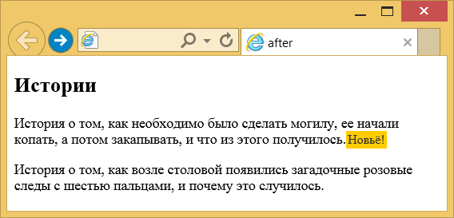

# ::after

Псевдо-элемент **`::after`** соответствует виртуальному последнему дочернему элементу выбранного элемента.

Он обычно используется для добавления косметического контента к элементу с использованием свойства CSS содержимого. По умолчанию этот элемент [`inline`](display.md).

## Синтаксис

```css
/* Синтаксис CSS2 */
element:after {
  /* свойства */
}

/* Синтаксис CSS3 */
element::after {
  /* свойства */
}
```

## Спецификации

- [CSS Pseudo-Elements Level 4](https://drafts.csswg.org/css-pseudo-4/#selectordef-after)
- [CSS Transitions](https://drafts.csswg.org/css-transitions/#animatable-properties)
- [CSS Animations](https://drafts.csswg.org/css-animations/)
- [Selectors Level 3](https://drafts.csswg.org/selectors-3/#gen-content)
- [CSS Level 2 (Revision 1)](https://www.w3.org/TR/CSS2/generate.html#before-after-content)

## Поддержка браузерами

<p class="ciu_embed" data-feature="css-gencontent" data-periods="future_1,current,past_1,past_2">
  <a href="http://caniuse.com/#feat=css-gencontent">Can I Use css-gencontent?</a> Data on support for the css-gencontent feature across the major browsers from caniuse.com.
</p>

## Примеры

### Пример 1

```html
<!DOCTYPE html>
<html>
  <head>
    <meta charset="utf-8" />
    <title>after</title>
    <style>
      p.new::after {
        content: 'Новьё!'; /* Добавляемый текст */
        color: #333; /* Цвет текста */
        background-color: #fc0; /* Цвет фона */
        font-size: 90%; /* Размер шрифта */
        padding: 2px; /* Поля вокруг текста */
      }
    </style>
  </head>
  <body>
    <h2>Истории</h2>
    <p class="new">
      История о том, как необходимо было сделать могилу, ее
      начали копать, а потом закапывать, и что из этого
      получилось.
    </p>
    <p>
      История о том, как возле столовой появились загадочные
      розовые следы с шестью пальцами, и почему это
      случилось.
    </p>
  </body>
</html>
```

В примере в конце текстового абзаца, помеченного классом `new`, выводится текст для привлечения внимания. Результат примера:



### Пример 2

=== "HTML"

    ```html
    <p>
      Here is the live example of the above code.<br />
      We have some
      <span data-descr="collection of words and punctuation">text</span> here with a
      few
      <span data-descr="small popups which also hide again">tooltips</span>.<br />
      Don't be shy, hover over to take a
      <span data-descr="not to be taken literally">look</span>.
    </p>
    ```

=== "CSS"

    ```css
    span[data-descr] {
      position: relative;
      text-decoration: underline;
      color: #00f;
      cursor: help;
    }

    span[data-descr]:hover::after {
      content: attr(data-descr);
      position: absolute;
      left: 0;
      top: 24px;
      min-width: 200px;
      border: 1px #aaaaaa solid;
      border-radius: 10px;
      background-color: #ffffcc;
      padding: 12px;
      color: #000000;
      font-size: 14px;
      z-index: 1;
    }
    ```

## См. также

- [`::before`](before.md)
- [`content`](content.md)

## Ссылки

- Псевдо-элемент [`::after (:after)`](https://developer.mozilla.org/ru/docs/Web/CSS/::after) <sup><small>MDN (рус.)</small></sup>
