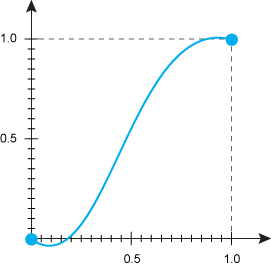

# animation-timing-function

Свойство **`animation-timing-function`** устанавливает, согласно какой функции времени должна происходить анимация каждого цикла между ключевыми кадрами.

Она представляет собой математическую функцию, показывающую, как быстро по времени меняется значение свойства. Начальная точка имеет координаты 0.0, 0.0, конечная — 1.0, 1.0, при этом функция по оси ординат может превышать эти значения в большую или меньшую сторону (рис. 1).



## Синтаксис

```css
/* Keyword values */
animation-timing-function: ease;
animation-timing-function: ease-in;
animation-timing-function: ease-out;
animation-timing-function: ease-in-out;
animation-timing-function: linear;
animation-timing-function: step-start;
animation-timing-function: step-end;

/* Function values */
animation-timing-function: cubic-bezier(0.1, 0.7, 1, 0.1);
animation-timing-function: steps(4, end);
animation-timing-function: frames(10);

/* Multiple animations */
animation-timing-function: ease, step-start, cubic-bezier(0.1, 0.7, 1, 0.1);

/* Global values */
animation-timing-function: inherit;
animation-timing-function: initial;
animation-timing-function: unset;
```

## Значения

`ease`
: Анимация начинается медленно, затем ускоряется и к концу движения опять замедляется. Аналогично `cubic-bezier(0.25,0.1,0.25,1)`.

`ease-in`
: Анимация медленно начинается, к концу ускоряется. Аналогично `cubic-bezier(0.42,0,1,1)`.

`ease-out`
: Анимация начинается быстро, к концу замедляется. Аналогично `cubic-bezier(0,0,0.58,1)`.

`ease-in-out`
: Анимация начинается и заканчивается медленно. Аналогично `cubic-bezier(0.42,0,0.58,1)`.

`linear`
: Одинаковая скорость от начала и до конца.

`step-start`
: Как таковой анимации нет. Стилевые свойства сразу же принимают конечное значение.

`step-end`
: Как таковой анимации нет. Стилевые свойства находятся в начальном значении заданное время, затем сразу же принимают конечное значение.

`steps`
: Ступенчатая функция, имеющая заданное число шагов.

: `animation-timing-function: steps(<число>, start | end)`

: Здесь: `<число>` — целое число больше нуля; `start` — задаёт полунепрерывную снизу функцию; `end` — задаёт полунепрерывную сверху функцию.

`cubic-bezier`
: Задаёт функцию движения в виде кривой Безье.

Значение по-умолчанию:

```css
animation-timing-function: ease;
```

Применяется ко всем элементам, к псевдоэлементам `::before` и `::after`

## Спецификации

- [CSS Animations](http://dev.w3.org/csswg/css-animations/#animation-timing-function)

## Поддержка браузерами

<p class="ciu_embed" data-feature="css-animation" data-periods="future_1,current,past_1,past_2">
  <a href="http://caniuse.com/#feat=css-animation">Can I Use css-animation?</a> Data on support for the css-animation feature across the major browsers from caniuse.com.
</p>

## Описание и примеры

```html
<!DOCTYPE html>
<html>
  <head>
    <meta charset="utf-8" />
    <title>animation-timing-function</title>
    <style>
      .progress {
        background: #333; /* Фон */
        border: 2px solid #333; /* Рамка */
        height: 20px; /* Высота */
        position: relative; /* Относительное позиционирование */
      }
      .progress::before {
        animation: progress 5s;
        animation-timing-function: linear;
        animation-duration: 5s;
        animation-fill-mode: forwards;
        -webkit-animation-name: progress;
        -webkit-animation-timing-function: linear;
        -webkit-animation-duration: 5s;
        -webkit-animation-fill-mode: forwards;
        content: '';
        position: absolute; /* Абсолютное позиционирование */
        height: 100%;
        background: #ffa600; /* Фон */
      }
      @-webkit-keyframes progress {
        from {
          width: 0;
        }
        to {
          width: 100%;
        }
      }
      @keyframes progress {
        from {
          width: 0;
        }
        to {
          width: 100%;
        }
      }
    </style>
  </head>
  <body>
    <div class="progress"></div>
  </body>
</html>
```

### Примечание

- Chrome, Safari и Android поддерживают свойство `-webkit-animation-timing-function`.
- Opera до версии 12.10 поддерживает свойство `-o-animation-timing-function`.
- Firefox до версии 16 поддерживает свойство `-moz-animation-timing-function`.
