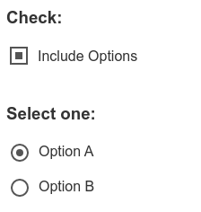

# appearance

Свойство **`-moz-appearance`** используется в Gecko (Firefox) для отображения элемента, используя базовые стили платформы на основе темы операционной системы.

Свойство `-webkit-appearance` используется в браузерах WebKit-based (например, Safari) и Blink-based (например, Chrome, Opera) для того же эффекта. Заметьте, что Firefox и Edge также поддерживают `-webkit-appearance`, для обеспечения совместимости.

## Синтаксис

```css
/* CSS модуль базового интерфейса 4 уровня, значения */
appearance: none;
appearance: auto;
appearance: button;
appearance: textfield;
appearance: searchfield;
appearance: textarea;
appearance: push-button;
appearance: button-bevel;
appearance: slider-horizontal;
appearance: checkbox;
appearance: radio;
appearance: square-button;
appearance: menulist;
appearance: menulist-button;
appearance: listbox;
appearance: meter;
appearance: progress-bar;

/* Частичный список доступных значений в Gecko */
-moz-appearance: scrollbarbutton-up;
-moz-appearance: button-bevel;

/* Частичный список доступных значений в WebKit/Blink (таких как Gecko и Edge) */
-webkit-appearance: media-mute-button;
-webkit-appearance: caret;
```

Свойство `-moz-appearance` может быть указано как одно значение, выбранное из списка ниже.

## Спецификация

- [CSS Basic User Interface Module Level 4](https://drafts.csswg.org/css-ui-4/#appearance-switching)

## Пример

```html tab="HTML"
<h3>Check:</h3>
<p><input type="checkbox"></input><label>Include Options</label></p>
<h3><br/>Select one:</h3>
<p><input type="radio" name="radio"></input><label>Option A</label></p>
<p><input type="radio" name="radio"></input><label>Option B</label></p>
```

```css tab="CSS"
input {
  -webkit-appearance: none;
  -moz-appearance: none;
  -ms-appearance: none;
  appearance: none;
  display: inline-block;
  vertical-align: middle;
}

input[type='checkbox'] {
  border: 2px solid #555;
  width: 20px;
  height: 20px;
  outline: none;
  padding: 4px;
}
input[type='checkbox']:checked {
  background: #555;
  background-clip: content-box;
}
input[type='radio'] {
  border: 2px solid #555;
  border-radius: 10px;
  width: 20px;
  height: 20px;
  outline: none;
  padding: 4px;
}
input[type='radio']:checked {
  background: #555;
  background-clip: content-box;
}
p,
h3 {
  color: #333;
  font-family: helvetica, arial;
}
label {
  display: inline-block;
  vertical-align: middle;
  margin: 0 0 -2px 8px;
}
```

Результат:



## Ссылки

- [appearance](https://developer.mozilla.org/ru/docs/Web/CSS/appearance) на MDN
