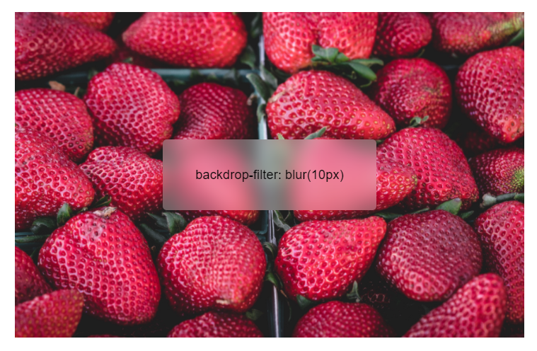

# backdrop-filter

Свойство **`backdrop-filter`** позволяет вам использовать визуальные эффекты - такие как размытие или смещение цвета фона - за элементом. Так как это применяется ко всему за элементом, чтобы увидеть эффект, вы должны сделать элемент или его фон по крайней мере частично прозрачными.

??? info "Изображения, фильтры, композиция"

    <div class="col3" markdown="1">

    - [image-orientation](image-orientation.md)
    - [image-rendering](image-rendering.md)
    - [image-resolution](image-resolution.md)
    - [object-fit](object-fit.md)
    - [object-position](object-position.md)

    </div>

    <div class="col3" markdown="1">

    - [linear-gradient()](linear-gradient.md)
    - [radial-gradient()](radial-gradient.md)
    - [repeating-linear-gradient()](repeating-linear-gradient.md)
    - [repeating-radial-gradient()](repeating-radial-gradient.md)
    - [conic-gradient()](conic-gradient.md)
    - [repeating-conic-gradient()](repeating-conic-gradient.md)
    - [url()](url.md)
    - [element()](element.md)
    - [image()](image.md)
    - [cross-fade()](cross-fade.md)

    </div>

    <div class="col3" markdown="1">

    - **backdrop-filter**
    - [filter](filter.md)

    </div>

    <div class="col3" markdown="1">

    - [background-blend-mode](background-blend-mode.md)
    - [isolation](isolation.md)
    - [mix-blend-mode](mix-blend-mode.md)

    </div>

## Синтаксис

```css
/* Keyword value */
backdrop-filter: none;

/* фильтр URL в SVG */
backdrop-filter: url(commonfilters.svg#filter);

/* значения <filter-function> */
backdrop-filter: blur(2px);
backdrop-filter: brightness(60%);
backdrop-filter: contrast(40%);
backdrop-filter: drop-shadow(4px 4px 10px blue);
backdrop-filter: grayscale(30%);
backdrop-filter: hue-rotate(120deg);
backdrop-filter: invert(70%);
backdrop-filter: opacity(20%);
backdrop-filter: sepia(90%);
backdrop-filter: saturate(80%);

/* Несколько фильтров */
backdrop-filter: url(filters.svg#filter) blur(4px);

/* Глобальные значения */
backdrop-filter: inherit;
backdrop-filter: initial;
backdrop-filter: unset;
```

## Значения

**`none`**
: Фильтр отключен для фона

`<filter-function-list>`
: Перечень фильтров, разделенных пробелами функций `<filter-function>` или SVG фильтра, которые применены для фона.

## Определение

|                    |                                                                                                     |
| ------------------ | --------------------------------------------------------------------------------------------------- |
| Начальное значение | `none`                                                                                              |
| Применяется к      | все элементы; в SVG это применяется к контейнерам, исключая элемент defs и все графические элементы |
| Наследуется        | нет                                                                                                 |
| Обработка значения | как указано                                                                                         |
| Тип анимации       | как список функций                                                                                  |

## Поддержка браузерами

<p class="ciu_embed" data-feature="mdn-css__properties__backdrop-filter" data-periods="future_1,current,past_1,past_2" data-accessible-colours="false"></p>

## Пример

=== "CSS"

    ```css
    .box {
      background-color: rgba(255, 255, 255, 0.3);
      border-radius: 5px;
      font-family: sans-serif;
      text-align: center;
      line-height: 1;
      backdrop-filter: blur(10px);
      max-width: 50%;
      max-height: 50%;
      padding: 20px 40px;
    }

    html,
    body {
      height: 100%;
      width: 100%;
    }

    body {
      background-image: url(https://picsum.photos/id/1080/6858/4574),
        linear-gradient(rgb(219, 166, 166), rgb(0, 0, 172));
      background-position: center center;
      background-repeat: no-repeat;
      background-size: cover;
    }

    .container {
      align-items: center;
      display: flex;
      justify-content: center;
      height: 100%;
      width: 100%;
    }
    ```

=== "HTML"

    ```html
    <div class="container">
      <div class="box">
        <p>backdrop-filter: blur(10px)</p>
      </div>
    </div>
    ```

=== "Результат"

    

## Ссылки

- Свойство [`backdrop-filter`](https://developer.mozilla.org/ru/docs/Web/CSS/backdrop-filter) <sup><small>MDN (рус.)</small></sup>
- [Filter Effects Module Level 2](https://drafts.fxtf.org/filter-effects-2/#BackdropFilterProperty) <sup><small>Spec (англ.)</small></sup>
