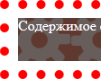

# background-clip

Свойство **`background-clip`** определяет, как цвет фона или фоновая картинка должна выводиться под границами.

Эффект заметен при прозрачных или пунктирных границах.

## Синтаксис

```css
/* Keyword values */
background-clip: border-box;
background-clip: padding-box;
background-clip: content-box;
background-clip: text;

/* Global values */
background-clip: inherit;
background-clip: initial;
background-clip: unset;
```

## Значения

`padding-box`
: Фон отображается внутри границ.

`border-box`
: Фон выводится под границами.

`content-box`
: Фон отображается только внутри контента.

`text`
: Фон отображается только внутри текста.

Значений может быть несколько (для каждого из множественных фоновых рисунков), при этом значения разделяются между собой запятой.

Результат использования значений свойства `background-clip` для элемента с пунктирной рамкой толщиной 10 пикселей показан на рис. 1.

<table markdown="1">
<caption>Значения background-clip</caption>
<tr>
<td></td>
<td></td>
<td></td>
</tr>
<tr><td>`padding-box`</td><td>`border-box`</td><td>`content-box`</td></tr>
</table>

Значение по-умолчанию:

```css
background-clip: border-box;
```

Применяется ко всем элементам

## Спецификации

- [CSS Backgrounds and Borders Module Level 3](http://dev.w3.org/csswg/css3-background/#the-background-clip)

## Поддержка браузерами

<p class="ciu_embed" data-feature="background-img-opts" data-periods="future_1,current,past_1,past_2">
  <a href="http://caniuse.com/#feat=background-img-opts">Can I Use background-img-opts?</a> Data on support for the background-img-opts feature across the major browsers from caniuse.com.
</p>

## Описание и примеры

```html
<!DOCTYPE html>
<html>
  <head>
    <meta charset="utf-8" />
    <title>background-clip</title>
    <style>
      .example {
        background: #5f392f url(/example/image/gear.png); /* Фоновый рисунок */
        border: 10px dotted red; /* Параметры рамки */
        background-clip: border-box; /* Фон под рамкой */
        padding: 10px; /* Поля */
        color: #fff; /* Цвет текста */
        min-height: 48px; /* Минимальная высота */
      }
    </style>
  </head>
  <body>
    <div class="example">Содержимое страницы</div>
  </body>
</html>
```

### Примечание

- Firefox до версии 4 поддерживает свойство `-moz-background-clip` и значения `padding` и `border`.
- В Chrome, Safari, Opera и Android значение `text` работает только со свойством `-webkit-background-clip`.
