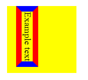

# border-block-color

Свойство **`border-block-color`** определяет цвет границ логического блока элемента, который отображается на физический цвет границы в зависимости от режима письма элемента, направленности и ориентации текста.

Он соответствует свойству [border-top-color](border-top-color.md) и [border-bottom-color](border-bottom-color.md) или [border-right-color](border-right-color.md) и [border-left-color](border-left-color.md) в зависимости от значений, определенных для [режима письма](writing-mode.md), [направления](direction.md) и [ориентации текста](text-orientation.md).

??? info "Логические границы"

    <div class="col3" markdown="1">

    - [border-block](border-block.md)
    - **border-block-color**
    - [border-block-end](border-block-end.md)
    - [border-block-end-color](border-block-end-color.md)
    - [border-block-end-style](border-block-end-style.md)
    - [border-block-end-width](border-block-end-width.md)
    - [border-block-start](border-block-start.md)
    - [border-block-start-color](border-block-start-color.md)
    - [border-block-start-style](border-block-start-style.md)
    - [border-block-start-width](border-block-start-width.md)
    - [border-block-style](border-block-style.md)
    - [border-block-width](border-block-width.md)
    - [border-inline](border-inline.md)
    - [border-inline-color](border-inline-color.md)
    - [border-inline-end](border-inline-end.md)
    - [border-inline-end-color](border-inline-end-color.md)
    - [border-inline-end-style](border-inline-end-style.md)
    - [border-inline-end-width](border-inline-end-width.md)
    - [border-inline-start](border-inline-start.md)
    - [border-inline-start-color](border-inline-start-color.md)
    - [border-inline-start-style](border-inline-start-style.md)
    - [border-inline-start-width](border-inline-start-width.md)
    - [border-inline-style](border-inline-style.md)
    - [border-inline-width](border-inline-width.md)
    - [border-start-start-radius](border-start-start-radius.md)
    - [border-start-end-radius](border-start-end-radius.md)
    - [border-end-start-radius](border-end-start-radius.md)
    - [border-end-end-radius](border-end-end-radius.md)

    </div>

## Синтаксис

```css
border-block-color: yellow;
border-block-color: #F5F6F7;
```

## Значения

`цвет`
: Цвет границы

## Определение

|                      |                | 
| -------------------- | -------------- |
| Начальное значение   | `currentcolor`             |
| Применяется ко       | всем элементам |
| Наследуется          | нет             |
| Вычисленное значение | как определено |
| Тип анимации         | дискретный     |

## Поддержка браузерами

<p class="ciu_embed" data-feature="mdn-css__properties__border-block-color" data-periods="future_1,current,past_1,past_2" data-accessible-colours="false"></p>

## Примеры

=== "HTML"

    ```html
    <div>
      <p class="exampleText">Example text</p>
    </div>
    ```

=== "CSS"

    ```css
    div {
      background-color: yellow;
      width: 120px;
      height: 120px;
    }
    
    .exampleText {
      writing-mode: vertical-lr;
      border: 10px solid blue;
      border-block-color: red;
    }
    ```

=== "Результат"

    

## Ссылки

- Свойство [`border-block-color`](https://developer.mozilla.org/ru/docs/Web/CSS/border-block-color) <sup><small>MDN (рус.)</small></sup>
- [CSS Logical Properties and Values Level 1](https://drafts.csswg.org/css-logical/#propdef-border-block-color) <sup><small>Spec (англ.)</small></sup>
