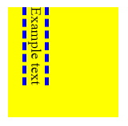

# border-block

Свойство **`border-block`** - это сокращенное свойство для установки значений свойств границы отдельного логического блока.

??? info "Логические границы"

    <div class="col3" markdown="1">

    - **border-block**
    - [border-block-color](border-block-color.md)
    - [border-block-end](border-block-end.md)
    - [border-block-end-color](border-block-end-color.md)
    - [border-block-end-style](border-block-end-style.md)
    - [border-block-end-width](border-block-end-width.md)
    - [border-block-start](border-block-start.md)
    - [border-block-start-color](border-block-start-color.md)
    - [border-block-start-style](border-block-start-style.md)
    - [border-block-start-width](border-block-start-width.md)
    - [border-block-style](border-block-style.md)
    - [border-block-width](border-block-width.md)
    - [border-inline](border-inline.md)
    - [border-inline-color](border-inline-color.md)
    - [border-inline-end](border-inline-end.md)
    - [border-inline-end-color](border-inline-end-color.md)
    - [border-inline-end-style](border-inline-end-style.md)
    - [border-inline-end-width](border-inline-end-width.md)
    - [border-inline-start](border-inline-start.md)
    - [border-inline-start-color](border-inline-start-color.md)
    - [border-inline-start-style](border-inline-start-style.md)
    - [border-inline-start-width](border-inline-start-width.md)
    - [border-inline-style](border-inline-style.md)
    - [border-inline-width](border-inline-width.md)
    - [border-start-start-radius](border-start-start-radius.md)
    - [border-start-end-radius](border-start-end-radius.md)
    - [border-end-start-radius](border-end-start-radius.md)
    - [border-end-end-radius](border-end-end-radius.md)

    </div>

`border-block` можно использовать для установки значений для одного или нескольких параметров [`border-block-width`](border-block-width.md), [`border-block-style`](border-block-style.md) и [`border-block-color`](border-block-color.md) одновременно в начале и в конце блока. Физические границы, которым он сопоставляется, зависят от режима письма элемента, направленности и ориентации текста. Он соответствует свойствам [`border-top`](border-top.md) и [`border-bottom`](border-bottom.md) или [`border-right`](border-right.md) и [`border-left`](border-left.md) в зависимости от значений, определенных для [`writing-mode`](writing-mode.md), [`direction`](direction.md) и [`text-orientation`](text-orientation.md).

Границы в другом измерении могут быть установлены с помощью [`border-inline`](border-inline.md), который устанавливает [`border-inline-start`](border-inline-start.md) и [`border-inline-end`](border-inline-end.md).

## Синтаксис

Это свойство является сокращением для следующих свойств CSS:

- [`border-block-color`](border-block-color.md)
- [`border-block-style`](border-block-style.md)
- [`border-block-width`](border-block-width.md)

```css
border-block: 1px;
border-block: 2px dotted;
border-block: medium dashed blue;
```

## Значения

border-block задается одним или несколькими из следующих элементов в любом порядке:

`border-width`
: Ширина границы.

`border-style`
: Стиль линии границы.

`color`
: Цвет границы.

## Определение

|                      |                                                                                                |
| -------------------- | ---------------------------------------------------------------------------------------------- |
| Начальное значение   | `border-top-width: medium`<br />`border-top-style: none`<br />`border-top-color: currentcolor` |
| Применяется ко       | всем элементам                                                                                 |
| Наследуется          | нет                                                                                            |
| Вычисленное значение | как определено                                                                                 |
| Тип анимации         | дискретный                                                                                     |

## Поддержка браузерами

<p class="ciu_embed" data-feature="mdn-css__properties__border-block" data-periods="future_1,current,past_1,past_2" data-accessible-colours="false"></p>

## Пример

=== HTML

    ```html
    <div>
      <p class="exampleText">Example text</p>
    </div>
    ```

=== CSS

    ```css
    div {
      background-color: yellow;
      width: 120px;
      height: 120px;
    }

    .exampleText {
      writing-mode: vertical-rl;
      border-block: 5px dashed blue;
    }
    ```

=== Результат

    

## Ссылки

- Свойство [`border-block`](https://developer.mozilla.org/ru/docs/Web/CSS/border-block) <sup><small>MDN (рус.)</small></sup>
- [CSS Logical Properties and Values Level 1](https://drafts.csswg.org/css-logical/#propdef-border-block) <sup><small>Spec (англ.)</small></sup>
