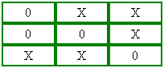
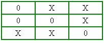

# border-collapse

Свойство **`border-collapse`** устанавливает, как отображать границы вокруг ячеек таблицы.

Это свойство играет роль, когда для ячеек установлена рамка, тогда в месте стыка ячеек получится линия двойной толщины (рис. 1а). Значение `collapse` заставляет браузер анализировать подобные места в таблице и убирать в ней двойные линии (рис. 1б). При этом между ячейками остаётся только одна граница, одновременно принадлежащая обеим ячейкам. То же правило соблюдается и для внешних границ, когда вокруг самой таблицы добавляется рамка.





## Синтаксис

```css
/* Keyword values */
border-collapse: collapse;
border-collapse: separate;

/* Global values */
border-collapse: inherit;
border-collapse: initial;
border-collapse: unset;
```

## Значения

`collapse`
: Линия между ячейками отображается только одна, также игнорируется значение атрибута `cellspacing`.

`separate`
: Вокруг каждой ячейки отображается своя собственная рамка, в местах соприкосновения ячеек показываются сразу две линии.

Значение по-умолчанию:

```css
border-collapse: separate;
```

Применяется к элементу [`<table>`](../html/table.md) или к элементам, у которых значение [`display`](display.md) установлено как `table` или `inline-table`.

## Спецификации

- [CSS Level 2 (Revision 1)](http://www.w3.org/TR/CSS2/tables.html#borders)

## Описание и примеры

```html
<!DOCTYPE html>
<html>
  <head>
    <meta charset="utf-8" />
    <title>border-collapse</title>
    <style>
      table {
        width: 100%; /* Ширина таблицы */
        border: 4px double black; /* Рамка вокруг таблицы */
        border-collapse: collapse; /* Отображать только одинарные линии */
      }
      th {
        text-align: left; /* Выравнивание по левому краю */
        background: #ccc; /* Цвет фона ячеек */
        padding: 5px; /* Поля вокруг содержимого ячеек */
        border: 1px solid black; /* Граница вокруг ячеек */
      }
      td {
        padding: 5px; /* Поля вокруг содержимого ячеек */
        border: 1px solid black; /* Граница вокруг ячеек */
      }
    </style>
  </head>
  <body>
    <table>
      <tr>
        <th></th>
        <th>2013</th>
        <th>2014</th>
        <th>2015</th>
      </tr>
      <tr>
        <td>Нефть</td>
        <td>43</td>
        <td>51</td>
        <td>79</td>
      </tr>
      <tr>
        <td>Золото</td>
        <td>29</td>
        <td>34</td>
        <td>48</td>
      </tr>
      <tr>
        <td>Дерево</td>
        <td>38</td>
        <td>57</td>
        <td>36</td>
      </tr>
    </table>
  </body>
</html>
```
