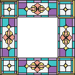
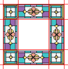
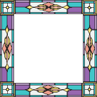
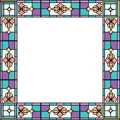
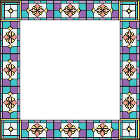

# border-image

Свойство **`border-image`** используется для отображения рисованной рамки вокруг элемента.

Толщина рамки задаётся свойством [`border`](border.md), при этом если указано `border: 0`, то рамка не выводится. При других значениях `border` рисунок всегда имеет приоритет. Фон, если он задан через свойство [`background`](background.md), отображается под рамкой.

## Синтаксис

```css
/* image-source | height | width | repeat */
border-image: url('/images/border.png') 30 30 repeat;
border-image: url('/images/border.png') 30 30 stretch;
```

## Значения

- `none` -- Не отображает рисованную рамку, используется установленный стиль границы.
- `URL` -- Путь к графическому файлу. Обязательный параметр.

Само изображение для создания рамки продемонстрировано на рис. 1 и состоит из девяти областей: четырёх уголков, верхней, правой, нижней, левой стороны и центральной части, в которой выводится содержимое элемента.



- `<число>` -- Одно, два, три или четыре значения, которые указывают размеры частей изображения в пикселях, задавая тем самым области деления. Сами единицы не пишутся, только число (10, а не 10px).На рис. 2 красными линиями выделены необходимые для создания рамки области.



Разрешается использовать одно, два, три или четыре значения, разделяя их между собой пробелом. Эффект зависит от количества значений и приведен в табл. 1.

<table>
<caption>Табл. 1. Зависимость от числа значений</caption>
<thead>
<tr><th>Число значений</th><th>Результат</th></tr>
</thead>
<tbody>
<tr><td>1</td><td>Устанавливает границы одинаковой толщины на каждой стороне рисунка.</td></tr>
<tr><td>2</td><td>Первое значение устанавливает высоту верхней и нижней границы, второе — левой и правой.</td></tr>
<tr><td>3</td><td>Первое значение определяет высоту верхней границы, второе — левой и правой, а третье — высоту нижней границы.</td></tr>
<tr><td>4</td><td>Поочерёдно устанавливается размеры верхней, правой, нижней и левой границы.</td></tr>
</tbody>
</table>

- `<проценты>` -- Аналогично `<числу>`, но значения задаются в процентах. Тот или другой параметр обязателен.
- `<толщина>` -- Через слэш пишется одно, два, три или четыре значения толщины границы на каждой стороне элемента. Является аналогом [`border-width`](border-width.md) и использует тот же синтаксис.
- `stretch` -- Растягивает рисунок границы до размеров элемента. Это значение используется по умолчанию.
- `repeat` -- Повторяет рисунок границы.
- `round` -- Повторяет рисунок и масштабирует его так, чтобы на стороне элемента оказалось целое число изображений.

Влияние этих параметров на вид рамки показано на рисунках.







Значение по-умолчанию:

```css
border-image: none;
```

Применяется к: Ко всем элементам, за исключением тех, у кого [`border-collapse`](border-collapse.md) задан как `collapse`

## Спецификации

- [CSS Backgrounds and Borders Module Level 3](http://dev.w3.org/csswg/css3-background/#border-image)

## Поддержка браузерами

<p class="ciu_embed" data-feature="border-image" data-periods="future_1,current,past_1,past_2">
  <a href="http://caniuse.com/#feat=border-image">Can I Use border-image?</a> Data on support for the border-image feature across the major browsers from caniuse.com.
</p>

## Описание и примеры

```html
<!DOCTYPE html>
<html>
  <head>
    <meta charset="utf-8" />
    <title>border-image</title>
    <style>
      div {
        border: 30px solid #40c4c8;
        padding: 20px;
        border-image: url(/example/image/bg-image.png) 30 round round;
      }
    </style>
  </head>
  <body>
    <div>Витраж представляет собой композицию сделанную из множества цветных стекол обрамлённых проволокой и наиболее эффектно смотрится при прохождении через него солнечного или искусственного света.</div>
  </body>
</html>
```

### Ссылки

- [генератор кода border-image](http://border-image.com/)
