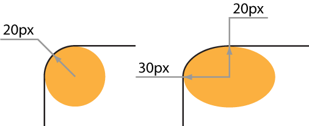

# border-radius

Свойство **`border-radius`** устанавливает радиус скругления уголков рамки.

Если рамка не задана, то скругление также происходит и с фоном.

??? info "Фон"

    <div class="col3" markdown="1">

    - [border](border.md)
    - [border-bottom](border-bottom.md)
    - [border-bottom-color](border-bottom-color.md)
    - [border-bottom-left-radius](border-bottom-left-radius.md)
    - [border-bottom-right-radius](border-bottom-right-radius.md)
    - [border-bottom-style](border-bottom-style.md)
    - [border-bottom-width](border-bottom-width.md)
    - [border-collapse](border-collapse.md)
    - [border-color](border-color.md)
    - [border-image](border-image.md)
    - [border-image-outset](border-image-outset.md)
    - [border-image-repeat](border-image-repeat.md)
    - [border-image-slice](border-image-slice.md)
    - [border-image-source](border-image-source.md)
    - [border-image-width](border-image-width.md)
    - [border-left](border-left.md)
    - [border-left-color](border-left-color.md)
    - [border-left-style](border-left-style.md)
    - [border-left-width](border-left-width.md)
    - **border-radius**
    - [border-right](border-right.md)
    - [border-right-color](border-right-color.md)
    - [border-right-style](border-right-style.md)
    - [border-right-width](border-right-width.md)
    - [border-style](border-style.md)
    - [border-top](border-top.md)
    - [border-top-color](border-top-color.md)
    - [border-top-left-radius](border-top-left-radius.md)
    - [border-top-right-radius](border-top-right-radius.md)
    - [border-top-style](border-top-style.md)
    - [border-top-width](border-top-width.md)
    - [border-width](border-width.md)
    - [box-shadow](box-shadow.md)

    </div>

## Синтаксис

```css
/* The syntax of the first radius allows one to four values */
/* Radius is set for all 4 sides */
border-radius: 10px;

/* top-left-and-bottom-right | top-right-and-bottom-left */
border-radius: 10px 5%;

/* top-left | top-right-and-bottom-left | bottom-right */
border-radius: 2px 4px 2px;

/* top-left | top-right | bottom-right | bottom-left */
border-radius: 1px 0 3px 4px;

/* The syntax of the second radius allows one to four values */
/* (first radius values) / radius */
border-radius: 10px 5% / 20px;

/* (first radius values) / top-left-and-bottom-right | top-right-and-bottom-left */
border-radius: 10px 5% / 20px 30px;

/* (first radius values) / top-left | top-right-and-bottom-left | bottom-right */
border-radius: 10px 5px 2em / 20px 25px 30%;

/* (first radius values) / top-left | top-right | bottom-right | bottom-left */
border-radius: 10px 5% / 20px 25em 30px 35em;

border-radius: inherit;
```

## Значения

Разрешается использовать одно, два, три или четыре значения, перечисляя их через пробел. Также допустимо писать два значения через слэш (`/`). В качестве значений указываются числа в любом допустимом для CSS формате. В случае применения процентов, отсчёт ведётся относительно ширины блока.

<table>
<caption> Табл. 1. Зависимость от числа значений</caption>
<thead>
<tr><th>Число значений</th><th>Результат</th></tr>
</thead>
<tbody>
<tr><td>1</td><td>Радиус указывается для всех четырех уголков.</td></tr>
<tr><td>2</td><td>Первое значение задаёт радиус верхнего левого и нижнего правого уголка, второе значение — верхнего правого и нижнего левого уголка.</td></tr>
<tr><td>3</td><td>Первое значение устанавливает радиус для верхнего левого уголка, второе — одновременно для верхнего правого и нижнего левого, а третье — для нижнего правого угол
ка.</td></tr>
<tr><td>4</td><td>По очереди устанавливает радиус для верхнего левого, верхнего правого, нижнего правого и нижнего левого уголка.</td></tr>
</tbody>
</table>

В случае задания двух параметров через слэш, то первый задаёт радиус по горизонтали, а второй по вертикали (эллиптические уголки). На рис. 1 показана разница между обычным скруглённым уголком и эллиптическим уголком.



Значение по-умолчанию:

```css
border-radius: 0;
```

Применяется ко всем элементам, за исключением таблиц с `border-collapse: collapse`

## Спецификации

- [CSS Backgrounds and Borders Module Level 3](http://dev.w3.org/csswg/css3-background/#border-radius)

## Поддержка браузерами

<p class="ciu_embed" data-feature="border-radius" data-periods="future_1,current,past_1,past_2">
  <a href="http://caniuse.com/#feat=border-radius">Can I Use border-radius?</a> Data on support for the border-radius feature across the major browsers from caniuse.com.
</p>

## Описание и примеры

```html
<!DOCTYPE html>
<html>
  <head>
    <meta charset="utf-8" />
    <title>border-radius</title>
    <style>
      .radius {
        background: #f0f0f0; /* Цвет фона */
        border: 1px solid black; /* Параметры рамки */
        padding: 15px; /* Поля вокруг текста */
        margin-bottom: 10px; /* Отступ снизу */
      }
    </style>
  </head>
  <body>
    <div
      style="border-radius: 50px 0 0 50px;"
      class="radius"
    >
      border-radius: 50px 0 0 50px;
    </div>
    <div style="border-radius: 40px 10px" class="radius">
      border-radius: 40px 10px;
    </div>
    <div style="border-radius: 10em/1em;" class="radius">
      border-radius: 13em/3em;
    </div>
    <div
      style="border-radius: 13em 0.5em/1em 0.5em;"
      class="radius"
    >
      border-radius: 13em 0.5em/1em 0.5em;
    </div>
    <div style="border-radius: 8px;" class="radius">
      border-radius: 8px;
    </div>
  </body>
</html>
```
