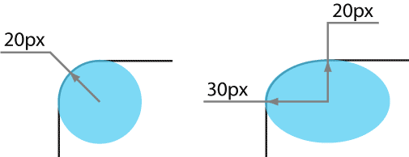

# border-top-left-radius

Свойство **`border-top-left-radius`** устанавливает радиус скругления левого верхнего уголка рамки.

Если рамка не задана, то скругление также происходит и с фоном.

## Синтаксис

```css
/* the corner is a circle */
/* border-top-left-radius: radius */
border-top-left-radius: 3px;

/* the corner is an ellipse */
/* border-top-left-radius: horizontal vertical */
border-top-left-radius: 0.5em 1em;

border-top-left-radius: inherit;
```

## Значения

В качестве радиуса указывается любое допустимое в CSS значение (px, cm, in, em и др.), а также проценты, в этом случае радиус скругления считается от ширины блока.

Необязательное второе значение предназначено для создания эллиптического уголка, первое значение при этом устанавливает радиус по горизонтали, а второе — радиус по вертикали (рис. 1).



Значение по-умолчанию:

```css
border-top-left-radius: 0;
```

Применяется к: Ко всем элементам

## Спецификации

- [CSS Backgrounds and Borders Module Level 3](http://dev.w3.org/csswg/css3-background/#border-top-left-radius)

## Поддержка браузерами

<p class="ciu_embed" data-feature="border-radius" data-periods="future_1,current,past_1,past_2">
  <a href="http://caniuse.com/#feat=border-radius">Can I Use border-radius?</a> Data on support for the border-radius feature across the major browsers from caniuse.com.
</p>

## Описание и примеры

```html
<!DOCTYPE html>
<html>
  <head>
    <meta charset="utf-8" />
    <title>border-top-left-radius</title>
    <style>
      .title {
        background: #000080; /* Цвет фона */
        color: #ffe; /* Цвет текста */
        padding: 7px; /* Поля вокруг текста */
        border-top-left-radius: 10px; /* Левый верхний уголок */
        border-top-right-radius: 10px; /* Правый верхний уголок */
      }
      .content {
        border: 1px solid #000080; /* Параметры рамки */
        background: #f0f0f0; /* Цвет фона */
        padding: 7px; /* Поля вокруг текста */
        border-bottom-left-radius: 10px; /* Левый нижний уголок */
        border-bottom-right-radius: 10px; /* Правый нижний уголок */
      }
    </style>
  </head>
  <body>
    <div class="title">Буквица</div>
    <div class="content">
      Буквица является художественным приемом оформления текста и представляет
      собой увеличенную первую букву, базовая линия которой ниже на одну или
      несколько строк базовой линии основного текста.
    </div>
  </body>
</html>
```
