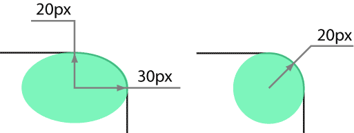

# border-top-right-radius

Свойство **`border-top-right-radius`** устанавливает радиус скругления правого верхнего уголка рамки.

Если рамка не задана, то скругление также происходит и с фоном.

## Синтаксис

```css
/* the corner is a circle */
/* border-top-right-radius: radius */
border-top-right-radius: 3px;

/* the corner is an ellipse */
/* border-top-right-radius: horizontal vertical */
border-top-right-radius: 0.5em 1em;

border-top-right-radius: inherit;
```

## Значения

В качестве радиуса указывается любое допустимое в CSS значение (px, cm, in, em и др.), а также проценты, в этом случае радиус скругления считается от ширины блока.

Необязательное второе значение предназначено для создания эллиптического уголка, первое значение при этом устанавливает радиус по горизонтали, а второе — радиус по вертикали (рис. 1).



Значение по-умолчанию:

```css
border-top-right-radius: 0;
```

Применяется ко всем элементам

## Спецификации

- [CSS Backgrounds and Borders Module Level 3](http://dev.w3.org/csswg/css3-background/#border-top-right-radius)

## Поддержка браузерами

<p class="ciu_embed" data-feature="border-radius" data-periods="future_1,current,past_1,past_2">
  <a href="http://caniuse.com/#feat=border-radius">Can I Use border-radius?</a> Data on support for the border-radius feature across the major browsers from caniuse.com.
</p>

## Описание и примеры

```html
<!DOCTYPE html>
<html>
  <head>
    <meta charset="utf-8" />
    <title>border-top-right-radius</title>
    <style>
      .radius {
        background: #f0f0f0;
        border: 1px dashed #000;
        padding: 15px;
        margin-bottom: 10px;
      }
    </style>
  </head>
  <body>
    <div
      style="border-top-right-radius: 10px"
      class="radius"
    >
      border-top-right-radius: 10px
    </div>
    <div
      style="border-top-right-radius: 70px 40px"
      class="radius"
    >
      border-top-right-radius: 70px 40px
    </div>
  </body>
</html>
```
