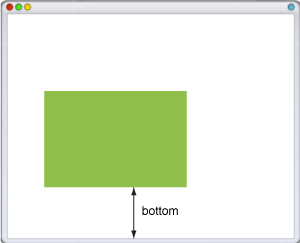
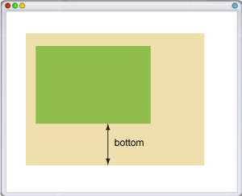

# bottom

Свойство **`bottom`** устанавливает положение нижнего края содержимого элемента без учёта толщины рамок и отступов.

Отсчёт координат зависит от свойства [`position`](position.md), оно обычно принимает значение `relative` (относительное положение) или `absolute` (абсолютное положение).

При относительном позиционировании элемента, отсчёт ведётся от нижнего края исходного положения элемента, а при абсолютном — относительно нижнего края окна браузера (рис. 1). Если для родительского элемента задано `position: relative`, то абсолютное позиционирование дочерних элементов определяет их положение от нижнего края родителя (рис. 2).





## Синтаксис

```css
/* <length> values */
bottom: 3px;
bottom: 2.4em;

/* <percentage>s of the height of the containing block */
bottom: 10%;

/* Keyword value */
bottom: auto;

/* Global values */
bottom: inherit;
bottom: initial;
bottom: unset;
```

## Значения

В качестве значений принимаются любые единицы длины, принятые в CSS — например, пиксели (px), дюймы (in), пункты (pt) и др. Значение свойства `bottom` может быть и отрицательным, в этом случае возможны наложения разных элементов друг на друга. При задании значения в процентах, положение элемента вычисляется в зависимости от высоты родительского элемента.

- `auto` - Не изменяет положение элемента.

Значение по-умолчанию:

```css
bottom: auto;
```

Применяется к: Ко всем элементам

## Спецификации

- [CSS Level 2 (Revision 1)](http://www.w3.org/TR/CSS2/visuren.html#choose-position)

## Описание и примеры

```html
<!DOCTYPE html>
<html>
  <head>
    <meta charset="utf-8" />
    <title>bottom</title>
    <style>
      p {
        background: #e2edc1;
        padding: 10px;
        position: fixed;
        bottom: 10px;
      }
      [data-title] {
        position: relative;
      }
      [data-title]:hover::before {
        position: absolute;
        content: attr(data-title);
        bottom: 15px;
        background: rgba(0, 113, 181, 0.6);
        color: #fff;
        padding: 10px;
        width: 200px;
      }
    </style>
  </head>
  <body>
    <p><span data-title="Интеграл Гамильтона, очевидно же">Интеграл Гамильтона</span>, исключая очевидный случай, в принципе программирует интеграл по ориентированной области.</p>
  </body>
</html>
```
