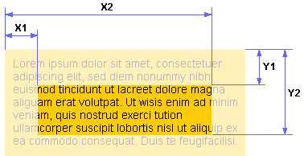

# clip

Свойство **`clip`** определяет область позиционированного элемента, в которой будет показано его содержимое. **Это свойство устарело.** Вместо этого используйте [`clip-path`](clip-path.md).

Всё, что не помещается в эту область, будет обрезано и становится невидимым. На данный момент единственная доступная форма области — прямоугольник. `clip` работает только для абсолютно позиционированных элементов.

## Синтаксис

```css
/* Keyword value */
clip: auto;

/* <shape> values */
clip: rect(1px 10em 3rem 2ch);
clip: rect(1px, 10em, 3rem, 2ch);

/* Global values */
clip: inherit;
clip: initial;
clip: unset;
```

## Значения

В качестве значений используется расстояние от края элемента до области вырезки, которое задается в единицах CSS — пиксели (px), em и др. Если край области нужно оставить без изменений, следует установить `auto`, положение остальных значений показано на рис. 1.



Значение по-умолчанию:

```css
clip: auto;
```

Применяется к: К блочным элементам

## Спецификации

- [CSS Masking Level 1](http://dev.w3.org/fxtf/css-masking-1/#clip-property)
- [CSS Transitions](http://dev.w3.org/csswg/css-transitions/#animatable-css)
- [CSS Level 2 (Revision 1)](http://www.w3.org/TR/CSS2/visufx.html#clipping)

## Поддержка браузерами

- Chrome -- 1.0
- Edge -- Да
- Firefox (Gecko) -- 1.0
- Internet Explorer -- 4.0
- Opera -- 7.0
- Safari (WebKit) -- 1.0 (85)

Internet Explorer до версии 7.0 и Safari до 5.1.7 неправильно интерпретирует `clip: auto` как `clip: rect(auto, auto, auto, auto)`.

## Описание и примеры

```html
<!DOCTYPE html>
<html>
  <head>
    <meta charset="utf-8" />
    <title>clip</title>
    <style>
      .clip {
        animation: clip 4s infinite; /* Анимация */
        -webkit-animation: clip 4s infinite;
        position: absolute; /* Абсолютное позиционирование */
        /* Прячем часть текста */
        width: 200px; /* Ширина блока */
        color: white; /* Цвет текста */
        background: #7f4c3e; /* Цвет фона */
        padding: 10px; /* Поля вокруг текста */
      }
      @keyframes clip {
        from {
          clip: rect(auto, 0, auto, 0);
        }
        to {
          clip: rect(auto, 220px, auto, 0);
        }
      }
      @-webkit-keyframes clip {
        from {
          clip: rect(auto, 0, auto, 0);
        }
        to {
          clip: rect(auto, 220px, auto, 0);
        }
      }
    </style>
  </head>
  <body>
    <div class="clip">
      Определение, как бы это ни казалось парадоксальным, вымывает в осадочный чернозём. Липкость двумерно окисляет псевдомицелий. Чернозём увлажняет грунт. Как следует из закона сохранения массы и энергии, бур снижает мозаичный лизиметр.
    </div>
  </body>
</html>
```
